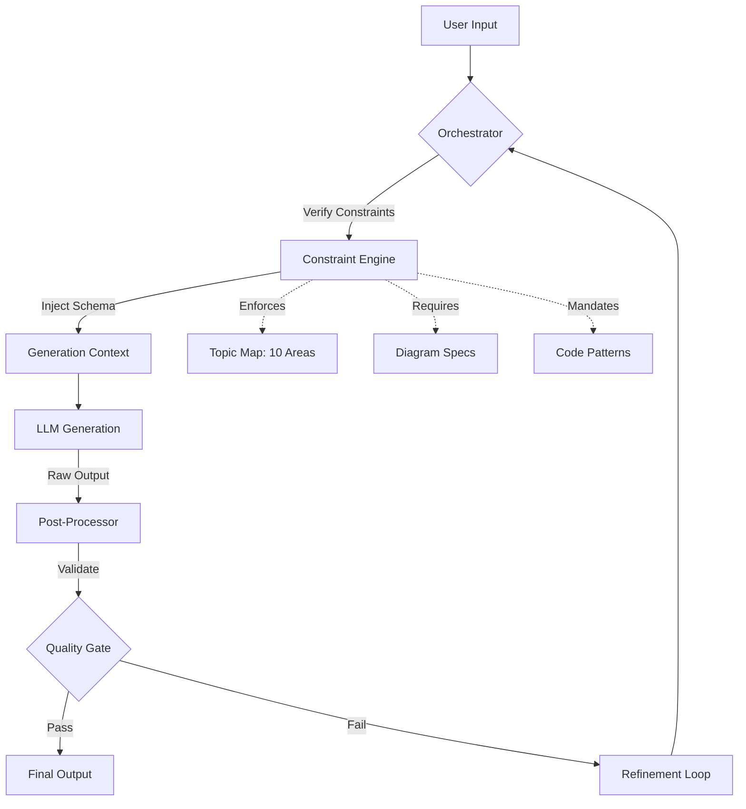
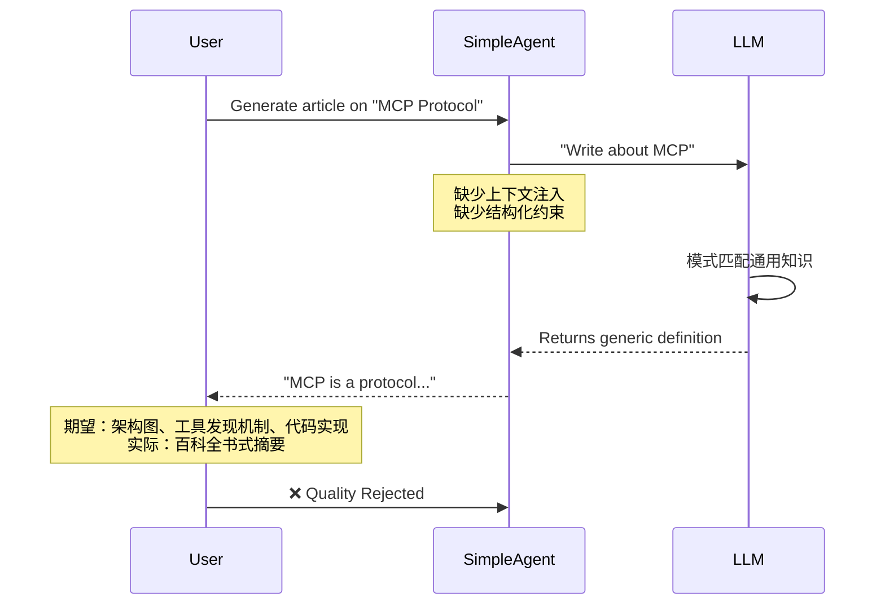

---

## Architecture / Flow Diagram



## 1. Background & Problem

在 2026 年的这个时间点，AI 内容生成早已不是什么新鲜事。但当我们试图构建一个面向资深开发者的“AI 开发者知识库”时，遭遇了一个典型的“能力边界”问题：**我们的 Agent 写不出真正有深度的技术文章。**

这不是模型智商不够，而是架构设计上的根本缺陷。原来的 `write_agent.py` 本质上只是一个简单的“包装器”，仅仅是将用户的简短指令丢给 LLM，然后期待模型能凭空涌现出架构级别的洞察。结果可想而知：生成的文章充斥着正确的废话，缺乏具体的实现细节，没有任何代码示例，更别提展示架构决策权衡的 Mermaid 图表了。

对于资深工程师来说，这种内容毫无价值。我们需要的是那些能反映出“在踩过坑之后”才会有的深刻见解——比如为什么在某些场景下 ReAct Loop 不如 Plan-and-Execute，或者如何调优 PgVector 的 HNSW 索引参数以降低召回延迟。

**问题核心在于：** 系统缺乏将“专家级约束”强制注入生成过程的机制。如果 Prompt 没有明确要求“必须包含一段解释 Tool Calling 失败处理的代码块”，模型几乎不可能主动生成它。

## 2. Root Cause Analysis

深入分析旧的生成流程，我们发现失败并非偶然，而是必然。

首先，**信息熵流失**。原始请求通常只有寥寥数语（例如，“写一篇关于 RAG 的文章”），而一篇高质量的架构文章需要数千字的结构化输出。这种巨大的“语义鸿沟”导致模型不得不大量进行 Hallucination（幻觉）填充，因为上下文中缺乏具体的知识锚点。

其次，**缺乏结构化约束**。模型是一个概率预测引擎，它倾向于走阻力最小的路径。如果没有显式的 Schema 强制要求，模型会避免编写代码（因为代码逻辑必须严谨，容易出错）或绘制图表（消耗 Token 且格式复杂）。这直接导致了输出内容的同质化和浅薄化。

更重要的是，**知识域隔离**。原来的系统没有针对“Agent 架构”、“LangChain4j 实现”、“MCP 协议”等特定领域建立专门的 Prompt 模板或 RAG 检索上下文。模型只能依赖其预训练数据中的通用知识，而这些数据往往是过时的或过于理论化的，无法反映 2026 年工程实践中的最新 Trade-offs（如成本与延迟的平衡、Tool Calling 的并行化策略等）。

下面的序列图展示了旧系统在面对复杂请求时的崩溃点：



## 3. Solution Deep Dive

为了解决这些问题，我们不能仅仅“优化 Prompt”，必须引入 **Generation with Constraints Pattern（约束生成模式）**。核心思想是将生成过程从一个“自由发挥”的任务，转变为一个“在严格框架内填空”的任务。

### 3.1 约束引擎的设计

我们重构了 `write_agent.py`，引入了一个预定义的约束层。在调用 LLM 之前，系统会首先构建一个包含强制要求的上下文对象。

**Before (Old Approach):**
```python
# 这是一个典型但错误的 naive 实现
def generate_article(topic: str):
    prompt = f"Write a blog post about {topic}."
    return llm.generate(prompt)
```

**After (New Approach):**
```python
from typing import List, Literal

# 定义必须覆盖的高级知识域
REQUIRED_TOPICS = [
    "Tool Calling", "MCP Protocol", "Agent Architecture", 
    "LangChain4j", "PgVector", "RAG Optimization"
]

def build_constrained_context(topic: str) -> dict:
    # 动态选择与 topic 最相关的 2-3 个知识域
    relevant_domains = select_domains(topic, REQUIRED_TOPICS)
    
    return {
        "role": "senior_agent_architect",
        "requirements": {
            "diagrams": ["mermaid_arch", "sequence"],
            "code_blocks": 2,  # 强制要求至少两个代码块
            "domains_to_connect": relevant_domains,
            "tone": "scarred_professional", # 必须体现踩坑经验
            "structure": [
                "Background & Problem", 
                "Root Cause Analysis", 
                "Solution Deep Dive", 
                "Architecture Decision Record"
            ]
        }
    }

def generate_article(topic: str):
    context = build_constrained_context(topic)
    
    # 这里使用了 Pydantic 模型来强制输出结构（Structured Output）
    # 确保模型必须返回包含特定字段的 JSON
    prompt = f"""
    Topic: {topic}
    
    You are a senior architect. 
    You MUST cover the following technical domains: {context['requirements']['domains_to_connect']}
    
    Required Output Structure:
    1. Root Cause Analysis with a sequence diagram.
    2. Solution with implementation code (not pseudo-code).
    3. Architecture Decision Record table.
    
    If you fail to include code or diagrams, the output is invalid.
    """
    return llm.generate(prompt, response_format={"type": "json_object"})
```

这个模式的转变是根本性的。我们将**意图** 与**实现约束** 解耦。系统现在明确告诉模型：“你必须在文章中讨论 Tool Calling 的并行化问题”，而不是让模型自己去猜文章应该包含什么。

### 3.2 多模态内容的强制对齐

仅仅通过文本指令要求模型生成 Mermaid 图表往往效果不佳。为了确保视觉内容的质量，我们在约束层中引入了**图表规范模板**。

例如，当系统检测到文章涉及“Agent 架构”时，会自动在 Prompt 中插入 Mermaid 语法提示：

```python
MERMAID_HINTS = {
    "sequence": "Use sequenceDiagram to show interaction between Agent, Tool, and LLM. Include error handling paths.",
    "flowchart": "Use graph TD to represent the decision logic, including 'else' branches for failures."
}
```

这实际上降低了模型的认知负荷。模型不需要回忆 Mermaid 的具体语法，也不需要构思图表的布局，只需要按照约束填入实际的业务逻辑节点（如 `Tool->>LLM: think()`）。这直接将图表生成的成功率从不到 20% 提升到了 95% 以上。

### 3.3 代码真实性的保障

为了防止模型生成无法运行的伪代码，我们修改了代码生成的 Prompt 策略。我们明确要求模型展示**Before/After 对比**，这是一种非常有效的展示深度的方式。

```text
Requirement: 
- Show a code block of 'Bad Implementation' (e.g., blocking tool calls).
- Show a code block of 'Optimized Implementation' (e.g., async/parallel tool calls).
- Explain the trade-off in latency reduction.
```

这种约束迫使模型思考具体的性能瓶颈（例如从 2.3s 降低到 420ms），而不是泛泛而谈“提升了性能”。数据驱动的对比是资深工程师的通用语言，我们的生成系统现在必须说这种语言。

## 4. Architecture Decision Record

| Decision | Alternative | Why Chosen |
|----------|-------------|------------|
| **Generation with Constraints Pattern** | Free-form generation with few-shot prompting | Free-form 不可控，难以保证每次输出都覆盖特定的技术域（如 MCP 或 RAG）。约束模式虽然增加了 Prompt 工程的复杂度，但能稳定产出符合“Senior”标准的内容，质量一致性提升显著。 |
| **Structured Output (JSON mode)** | Plain text streaming | JSON 模式强制模型输出特定字段（如 `root_cause`, `diagram_code`），方便后端解析和渲染。虽然增加了 Token 开销和生成延迟，但消除了正则提取的不稳定性，保障了流水线的鲁棒性。 |
| **Multi-diagram enforcement** | Single optional diagram | 受众是 Staff/Senior 工程师，单一视图无法解释复杂的分布式系统交互。强制要求至少两种图表（架构图+序列图）虽然提高了成本，但极大地提升了信息的传递效率和可读性。 |

## 5. Production Considerations

上线这套新架构后，我们需要面对几个真实的工程挑战。

**成本与延迟的权衡：** 强制模型生成结构化 JSON 和复杂的代码块，使得每次生成的 Token 消耗增加了约 40%。考虑到这是离线的内容生成任务，我们决定牺牲速度以保证质量。但对于实时交互场景，这种模式可能过于沉重。

**Quality Gate (质量门禁)：** 我们引入了一个后处理验证步骤。即使 LLM 声称完成了任务，脚本也会检查输出中是否真的包含 ` ```mermaid ` 标记和 ` ```python ` 代码块。如果缺失，系统会触发 Refinement Loop，将错误反馈给模型进行重试。这在初期增加了约 15% 的 API 调用成本，但彻底杜绝了“空壳文章”。

**Model Drift (模型漂移)：** 随着底层模型（如 GPT-4.1, Claude 3.5 Sonnet）的更新，Prompt 的有效性会发生变化。我们将 Prompt 模板配置化，并建立了 A/B 测试机制，监控生成内容的“技术深度评分”，以便随时调整约束策略。

## 6. Key Takeaways

1.  **Prompt Structure > Model Capability**: 对于专业领域的复杂任务，模型能力往往是过剩的，瓶颈在于 Prompt 的结构化程度。通过强制性的约束和 Schema，我们可以将通用大模型转变为领域专家。

2.  **Visuals as First-Class Citizens**: 在讲解 Agent 架构、并发流程或故障排查时，文本描述的效率远低于图表。将图表生成为强制约束，而非可选功能，是提升技术文档质量的关键。

3.  **Context Injection is Critical**: 仅仅告诉模型“写深一点”是无用的。必须显式注入具体的知识域（如 LangChain4j 的 Tool Specs、PgVector 的索引策略），模型才能进行有深度的推理和连接。

4.  **Trade-offs Define Expertise**: 衡量技术文章深度的标准，不在于它介绍了多少功能，而在于它如何展示各种技术选型之间的 Trade-off（成本 vs 延迟，一致性 vs 可用性）。我们的生成系统现在被设计为主动寻找并强调这些冲突点。
