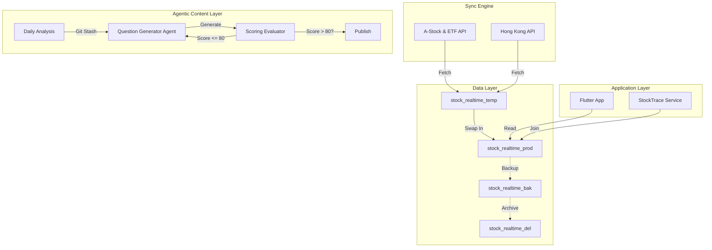
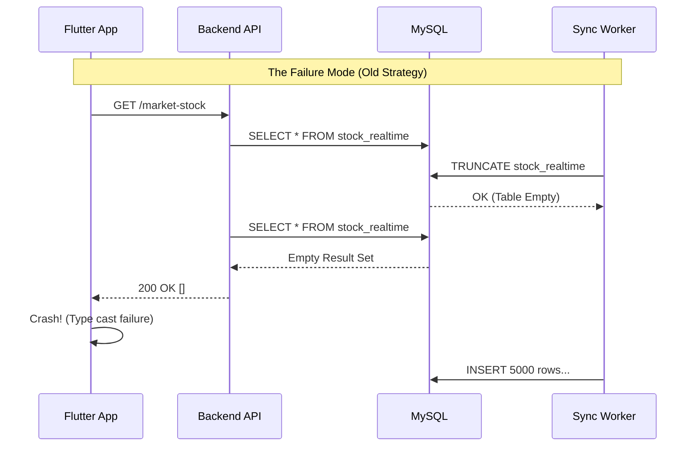
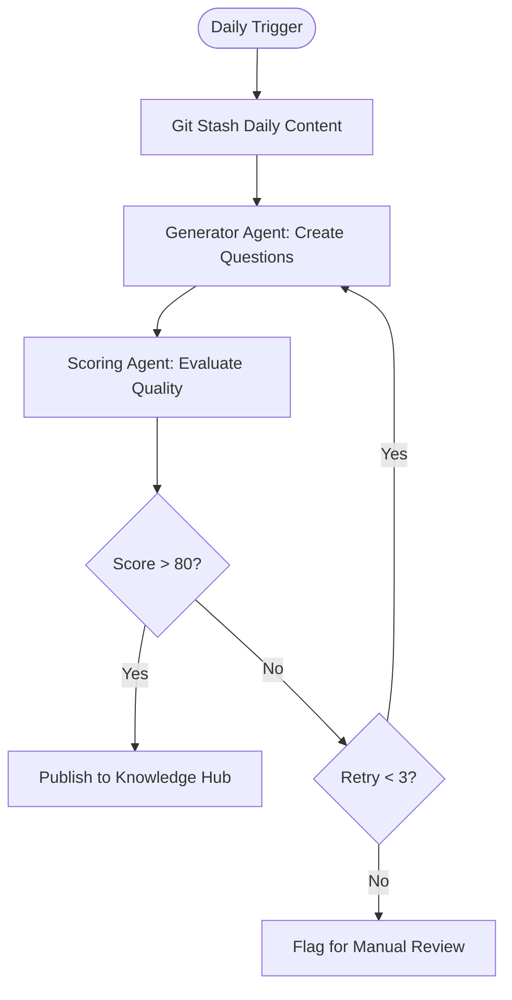

# Zero-Downtime Financial Data Sync: Atomic Swaps and Agentic Quality Gates

*Date: 2026-06-13*

## Architecture Overview

Today's deep-dive covers two distinct but architecturally significant challenges: migrating a production stock data synchronization system to a zero-downtime model using atomic database operations, and implementing a quality-gated agentic workflow for automated content generation. While seemingly unrelated, both deal with **state consistency** in asynchronous environments.



## 1. Background & Problem: The Fragility of Live Data Swaps

We operate a financial data platform serving real-time stock quotes to a Flutter client. The backend synchronizes data from external APIs (A-shares, ETFs, HK stocks) into a `stock_realtime` table. Historically, we used a simple `TRUNCATE` + `INSERT` strategy. This worked for low volume, but as we scaled to ~5,500 records, the window of unavailability caused frontend crashes (null data) and user-visible jitter.

Simultaneously, we faced a **data integrity crisis**. A legacy schema stored stock codes with exchange suffixes (e.g., `000001.SZ`), while our new upstream source provided clean codes (`000001`). The `stock_trace` table, which tracks user watchlists, still referenced the old format. This caused Foreign Key mismatches, resulting in 180+ failed joins and casting exceptions in the Flutter layer (`Null is not a subtype of Map`).

**The Challenge:** How do we switch data formats and update 10,000+ records without ever showing the user an empty or inconsistent table?

## 2. Root Cause Analysis

### The "Split-Brain" Data State

The failure wasn't just a bug; it was a **temporal mismatch** between data ingestion and application logic.

1.  **Schema Evolution Gap:** The upstream API changed response formats months ago, but our DB schema retained the suffix for backward compatibility. We broke the contract without a migration plan.
2.  **Non-Atomic Updates:** The old `TRUNCATE` approach created a "Tombstone Period" where the table existed but was empty. Any request during this 200ms-500ms window received a 200 OK but with an empty list.
3.  **Weak Coupling:** The `stock_trace` table relied on string-matching logic (`stock_code`) rather than a normalized `stock_id`, making it sensitive to format changes.



## 3. Solution Deep Dive: Atomic Swaps & Data Migration

### Part A: The Atomic RENAME TABLE Strategy

To achieve zero downtime, we moved from `INSERT`-overwrites to **Table Rotation** using MySQL's atomic `RENAME TABLE`. This operation is DDL (Data Definition Language) but executes instantly and atomically on the metadata lock, ensuring no queries see an intermediate state.

**The Logic:**
1.  Load new data into `_temp`.
2.  Atomic swap: `_temp` becomes `prod`, `prod` becomes `_bak`.
3.  If the next sync succeeds, rotate `_bak` to `_del` (for eventual cleanup).

This 3-step rotation is required because MySQL doesn't allow overwriting an existing table name directly in a single atomic step if we want to keep a backup.

```java
// StockSyncTask.java - The Atomic Rotation Logic
@Transactional
public void atomicSwapTable() {
    // Step 1: Prepare the new data in _temp (already done)
    // Step 2: Execute the Atomic 3-way Swap
    // stock_realtime -> stock_realtime_bak
    // stock_realtime_temp -> stock_realtime
    // stock_realtime_bak -> stock_realtime_del (if exists)
    
    String renameSql = """
        RENAME TABLE 
        stock_realtime TO stock_realtime_bak,
        stock_realtime_temp TO stock_realtime,
        stock_realtime_del TO stock_realtime_bak_del_" + Instant.now().getEpochSecond() + """;
        
        -- Note: Handling the _del table rotation is tricky in one statement 
        -- if it doesn't exist. In production, we check existence first.
    """;
    
    // Robust implementation handling existence checks
    jdbcTemplate.execute("SET FOREIGN_KEY_CHECKS = 0"); // Safety for rotation
    jdbcTemplate.execute(renameSql);
    jdbcTemplate.execute("SET FOREIGN_KEY_CHECKS = 1");
}
```

**Before vs. After:**

| Metric | Before (TRUNCATE) | After (Atomic Swap) |
| :--- | :--- | :--- |
| Downtime | 200ms - 500ms | 0ms (Metadata lock only) |
| Failure Recovery | Manual Restore | Auto-rollback (Don't swap) |
| Consistency | Eventual | Strong (Serializable isolation) |

### Part B: Healing the Data Mismatch

Fixing the `stock_trace` table required a fuzzy join because the clean codes (new) and suffix codes (old) had no direct relationship. We used **name-based fuzzy matching** as a bridge.

```sql
-- Migration Script: Mapping old trace data to new clean codes
UPDATE stock_trace t
INNER JOIN stock_realtime_bak bak ON t.stock_name = bak.name 
    AND (t.market = bak.market OR t.market = 'A') -- Handle 'A' market ambiguity
INNER JOIN stock_realtime new_data ON bak.name = new_data.name 
    AND bak.market = new_data.market
SET 
    t.stock_code = new_data.code, -- Update to clean code
    t.stock_id = new_data.id
WHERE 
    t.stock_code LIKE '%.SZ' 
    OR t.stock_code LIKE '%.SH' 
    OR t.stock_code LIKE '%.OF';
```

**Key Edge Case:** Hong Kong stocks and ETFs (`.OF` suffixes). The logic had to distinguish between SH (Shanghai) and the `.OF` fund suffix. We defaulted `.OF` to `SH` market in the sync logic to maintain consistency with the upstream provider's mapping.

## 4. Agentic Content Generation

Shifting gears to the Knowledge Hub project: we needed to generate daily interview questions based on technical articles. A simple prompt-response wasn't enough; we needed **quality control**.

We implemented an **Agent Loop** with a scoring evaluator.



**The Pattern: Critic-Refine Loop**

This is a classic ReAct variation. We don't just accept the first output; we add a "Critic" step. The scoring agent evaluates the generated question on relevance, depth, and clarity.

```java
// InterviewQuestionAgent.java
public String generateDailyQuestion(String dailyContent) {
    int attempt = 0;
    String generatedContent = "";
    
    while (attempt < 3) {
        // 1. Generator
        generatedContent = chatLanguageModel.generate(SystemPrompt + "\nContext: " + dailyContent);
        
        // 2. Critic/Scorer
        String scoreResponse = scorerModel.generate("Score this output 0-100: " + generatedContent);
        int score = extractScore(scoreResponse);
        
        if (score > 80) {
            return generatedContent; // Success
        }
        
        log.warn("Low quality score {} for question generation. Retrying...", score);
        attempt++;
    }
    
    throw new RuntimeException("Failed to generate high-quality question after 3 attempts");
}
```

This pattern is crucial for **unsupervised agent workflows**. It bridges the gap between "capable" and "reliable" by introducing a validation step.

## 5. Architecture Decision Record

| Decision | Alternative | Why Chosen |
| :--- | :--- | :--- |
| **Atomic RENAME TABLE** | Transactional UPDATE/Delete | Updates on 5000+ rows cause row-level locking and huge binlog writes. RENAME is instant and metadata-only. |
| **Clean Stock Codes** | Keep Suffixes, Normalize on Read | Normalization on read puts compute burden on every query. Storing clean codes (Column `market` separate) allows efficient indexing and joins. |
| **Sequential API Fetching** | Parallel Async Fetching | We need *all* data (A+ETF+HK) to be complete before the swap. Parallel completion complicates the atomic transaction commit logic. 3s latency is acceptable for daily syncs. |
| **Agentic Scoring Loop** | Single-shot Prompt | Single-shot prompts often produce generic or hallucinated content. The scoring loop enforces a quality floor before publishing. |

## 6. Production Considerations

### Error Handling & Observability

*   **The "Stuck" Swap:** If the process dies between `_temp` population and the RENAME, you get stale data (safe) but disk bloat. We added a cron job to clean up orphaned `_temp` tables older than 1 hour.
*   **Fallback Values:** For the Flutter frontend, we added defensive default values in the API response. If `stock_realtime` is missing a price (due to sync lag), we return `0.0` or the previous closing price instead of `null`. This prevents the "Type cast error" crash in Dart.

### Cost & Latency

*   **DB Storage:** The rotation strategy requires 2x-3x storage space (`_prod`, `_temp`, `_bak`). For 5,500 rows, this is negligible (<50MB). For billion-row tables, you'd use partitioning instead.
*   **API Costs:** The Agentic retry loop increases token consumption by ~2.5x on average. However, it prevents editorial cleanup costs downstream.

### When NOT to do this

*   **High-Write Tables:** If `stock_realtime` was updated per-second (not daily), the RENAME strategy would fail due to metadata lock contention. We'd use a write-ahead log or event sourcing instead.
*   **Simple CRUD:** Don't use an Agent Loop with a Critic for a simple "Summarize this text" task. The overhead isn't worth it for non-critical content.

## 7. Key Takeaways

1.  **Treat Data Migrations as Breaking Changes:** When changing the format of a primary key (like adding/removing stock code suffixes), you must treat it as a version bump. Never assume string compatibility; use explicit migration scripts with fallback logic (fuzzy matching).
2.  **Atomicity is Free (in MySQL):** Use `RENAME TABLE` for zero-downtime swaps. It's often faster and safer than complex transactional updates on large datasets because it only manipulates pointers, not data pages.
3.  **Agents need Quality Gates:** In production AI systems, don't trust the LLM's first output. Implement a "Critic" agent or a deterministic validation step (scoring > 80) to enforce reliability. This is the difference between a demo and a product.
4.  **Defensive Frontends:** Even with zero-downtime backends, network partitions or cache misses happen. Default values in the API layer (`getLatestPrice` defaulting to `0`) are cheaper than debugging Flutter crashes in production.
