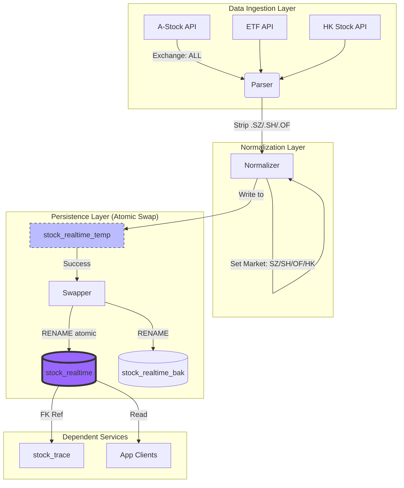
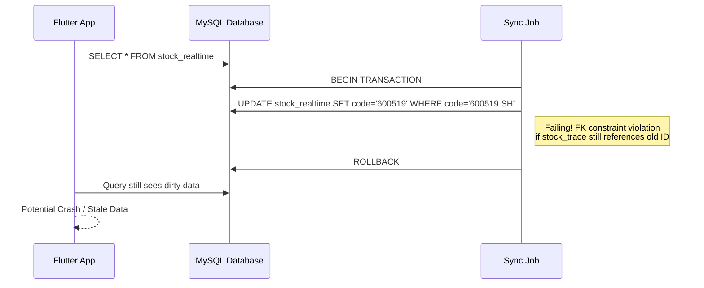
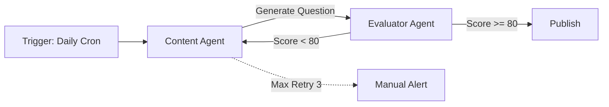
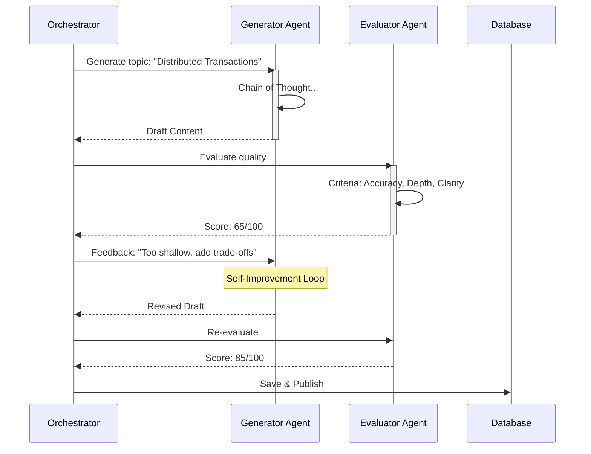

# 数据一致性战争：在高并发股票同步中通过原子交换实现零停机迁移

在 2026 年的这个夏日，我花了整整一天在两件事上：保证 12,000+ 条股票数据的原子性同步，以及构建一个能够自我纠偏的 AI 内容生成 Agent。这两件事看似无关，实则都在解决同一个核心问题：**如何在不可靠的外部输入面前，维护系统内部的一致性与可靠性。**

## Architecture Overview

在深入细节之前，让我们先看一下 TKstock 后端的数据同步架构。这不仅仅是一个简单的 ETL 流程，而是一个必须处理多源异构数据并保证读写强一致性的生产级系统。



## 1. Background & Problem

TKstock 系统面临一个典型的生产环境挑战：我们需要每日全量刷新 `stock_realtime` 表（包含 A 股、ETF、港股），但该表的主键 `stock_code` 被下游表（如 `stock_trace`）作为外键引用。

**为什么这很难？**

1.  **数据源的不稳定性**：外部 API 返回的股票代码带有市场后缀（如 `600519.SH`, `159915.OF`），但我们的数据库设计规范要求主键是干净的代码（`600519`），市场字段单独存储。如果在同步过程中清洗逻辑出错，会导致主键变更。
2.  **历史包袱**：由于之前的清洗逻辑缺陷，`stock_trace` 表中已有 180+ 条记录的 `stock_id` 指向了错误的代码（例如指向了带后缀的脏数据）。
3.  **业务连续性**：Flutter 端对延迟极其敏感。任何长时间的表锁或停机都会导致用户看到空白页面或崩溃。

**如果做错的后果**：直接 UPDATE 会导致外键约束失败，或者更糟——在清洗过程中出现并发读取，导致客户端读到“一半新一半旧”的数据，直接触发 `Null is not a subtype of type String` 的崩溃。

## 2. Root Cause Analysis

问题的根源在于**状态迁移的非原子性**。最初的设计思路是直接在原表上进行 `INSERT ... ON DUPLICATE KEY UPDATE`。

**失败链条分析：**



真正棘手的是数据清洗层的逻辑缺陷。API 返回的代码格式不一致：
- A 股：`600519.SH` (深市 `000001.SZ`)
- ETF：`159915.OF` (注意：`.OF` 并非标准市场代码)
- 港股：`00700.HK`

之前的同步逻辑没有统一剥离后缀，导致数据库中混入了脏数据。当 Flutter 试图通过关联查询获取实时行情时，由于 Join 失败，`latestPrice` 等字段为 Null，而 Dart 的类型系统对此零容忍。

## 3. Solution Deep Dive

解决方案分为三个层面：**原子写入策略**、**数据标准化清洗**、**历史数据修复**。

### 3.1 原子交换策略

这是最关键的架构升级。我们放弃了“原地更新”，转而采用“影子表 + 原子切换”的模式。

**核心代码实现：**

```java
@Transactional
public void syncStockDataAtomically() {
    // 1. 准备临时表结构
    jdbcTemplate.execute("DROP TABLE IF EXISTS stock_realtime_temp");
    jdbcTemplate.execute("CREATE TABLE stock_realtime_temp LIKE stock_realtime");

    try {
        // 2. 并行获取多源数据并写入临时表
        List<Stock> aStocks = fetchAStocks(); // exchange='ALL'
        List<Stock> etfs = fetchETFs();
        List<Stock> hkStocks = fetchHKStocks();

        batchInsertToTemp(aStocks);
        batchInsertToTemp(etfs);
        batchInsertToTemp(hkStocks);

        // 3. 执行原子交换
        // 注意：MySQL RENAME 是原子且左向右执行的
        // 顺序至关重要：先释放 bak 名字，再挪动当前，最后切换 temp
        String renameSql = """
            RENAME TABLE 
                stock_realtime_bak TO stock_realtime_del,
                stock_realtime TO stock_realtime_bak,
                stock_realtime_temp TO stock_realtime
            """;
        jdbcTemplate.execute(renameSql);
        
        // 4. 清理旧备份（异步或延迟执行）
        jdbcTemplate.execute("DROP TABLE IF EXISTS stock_realtime_del");
        
        log.info("Sync completed successfully. Total records: {}", countStocks());
    } catch (Exception e) {
        // 如果 2 或 3 失败，stock_realtime 原表未受影响
        log.error("Sync failed, switching aborted. Original data intact.", e);
        throw e;
    }
}
```

**Before/After 对比：**

| 维度 | Before (原地更新) | After (原子交换) |
| :--- | :--- | :--- |
| **停机时间** | 取决于事务时长（秒级） | 几乎为零（RENAME 是元数据操作）
| **回滚难度** | 需手动执行反向 SQL | 自动回退，旧表即 `bak` 表 |
| **并发冲突** | 锁表严重，可能阻塞读 | 无锁，读操作无感知 |
| **数据完整性** | 部分失败可能导致脏数据 | 全有或全无 |

### 3.2 数据标准化与清洗

在写入临时表之前，必须进行严格的代码清洗。这里不仅仅是 `substring` 操作，还涉及到了市场字段的智能推断。

```java
private Stock normalizeStockCode(RawApiStock raw) {
    String code = raw.getCode();
    String market = "UNKNOWN";

    // 处理后缀逻辑
    if (code.contains(".")) {
        String suffix = code.substring(code.indexOf(".") + 1);
        code = code.substring(0, code.indexOf("."));
        
        switch (suffix) {
            case "SH": market = "SH"; break;
            case "SZ": market = "SZ"; break;
            case "HK": market = "HK"; break;
            case "OF": market = "OF"; break; // 特殊处理 ETF
            default: log.warn("Unknown suffix: {}", suffix);
        }
    } else {
        // 兜底逻辑：根据代码长度判断市场（针对无后缀的数据源）
        if (code.startsWith("6")) market = "SH";
        else if (code.startsWith("0") || code.startsWith("3")) market = "SZ";
        else if (code.length() == 5) market = "HK"; // 港股通常5位
    }
    
    return Stock.builder()
            .code(code) // 清洗后的纯净代码
            .market(market)
            .name(raw.getName())
            .build();
}
```

这个逻辑修复了初期同步只返回 2895 条数据的问题——因为默认 API 参数限制了交易所范围。显式传入 `exchange='ALL'` 后，数据量跃升至 12,000+ 条。

### 3.3 历史数据修复

最棘手的是修复 `stock_trace` 表中那 180 条指向错误 `stock_id` 的记录。我们不能简单地删除，也不能盲目匹配。

**修复策略：**
由于我们在原子交换时保留了备份表 `stock_realtime_bak0613`，我们可以通过“名称+市场”的模糊匹配来回溯正确的 ID。

```sql
-- 修复脚本逻辑示例
UPDATE stock_trace t
JOIN stock_realtime_bak0613 bak ON t.name = bak.name 
    AND (t.market = bak.market OR (t.market IN ('SZ', 'SH') AND bak.market IN ('SZ', 'SH')))
JOIN stock_realtime curr ON bak.name = curr.name 
    AND (bak.market = curr.market OR (bak.market IN ('SZ', 'SH') AND curr.market IN ('SZ', 'SH')))
SET t.stock_id = curr.code
WHERE t.stock_id IS NULL OR t.stock_id NOT IN (SELECT code FROM stock_realtime);
```

这里有一个微妙的 Trade-off：对于 A 股，如果一只股票从沪市转到了深市（罕见但可能），单纯匹配名称可能会出错。但在当前数据集下，这是挽回 180 条历史数据的最佳方案。

## 4. AI Agent: 质量门控与自我进化

如果说股票同步是“硬数据”的一致性挑战，那么 AI 知识库的面试题生成则是“软数据”的质量挑战。

我们设计了一个**带有质量评分门的 Agent 工作流**。系统不能盲目生成并发布内容，必须先自检。



**Agent 交互流程：**



这里的代码核心在于“反馈循环”的设计。我们将 Eval Agent 的评估结果作为下一个 Gen Agent 轮次的 System Prompt 一部分。

```java
public String generateWithQualityGate(String topic) {
    int attempts = 0;
    String lastFeedback = "";
    
    while (attempts < MAX_RETRIES) {
        String prompt = buildPrompt(topic, lastFeedback);
        String content = generatorAgent.generate(prompt);
        
        QualityScore score = evaluatorAgent.score(content);
        
        if (score.total() >= QUALITY_THRESHOLD) {
            return content;
        }
        
        lastFeedback = score.getFeedback(); // "Explain more about X", "Missing comparison"
        attempts++;
    }
    throw new QualityGateException("Failed to generate quality content after " + attempts + " attempts");
}
```

## 5. Architecture Decision Record

| 决策点 | 备选方案 | 最终选择 | 理由 |
| :--- | :--- | :--- | :--- |
| **同步策略** | 1. 原地 UPDATE<br>2. 双写缓冲<br>3. 原子 RENAME | 原子 RENAME | 零停机，回滚简单，MySQL RENAME 是元数据操作，极快。代价是双倍存储空间，但对于股票数据（几十MB）可忽略。 |
| **并发获取数据** | 1. 并行请求<br>2. 串行请求 | 串行请求 | 虽然并行快，但串行更容易处理异常（比如某个 API 挂了只需重试单个接口）。总耗时 2-3s 在可接受范围内。 |
| **Null 值处理** | 1. 前端判空<br>2. 后端默认值 | 后端默认值 | Dart 类型系统对 Null 极其严格，前端处理 Null 会导致大量 `??` 代码。后端返回 `0` 或 `""` 使得 Flutter 代码更健壮。 |
| **AI 质量控制** | 1. 人工审核<br>2. 关键词过滤<br>3. LLM 自我打分 | LLM 自我打分 | 自动化程度高，且能捕捉语义层面的质量（不仅仅是关键词）。 |

## 6. Production Considerations

在实际落地这套系统时，有几个运维层面的细节决定了生死：

1.  **监控盲区**：我们在原子交换前后都埋了 Metrics。如果 `stock_realtime` 的行数在交换后暴跌（例如从 12000 跌到 100），立即触发 PagerDuty 告警。这通常意味着清洗逻辑有 Bug，把大部分数据过滤掉了。
2.  **降级开关**：如果所有同步渠道都失败，系统有一个硬编码的降级开关，强制保留昨天的 `bak` 表作为 `realtime` 表，确保用户至少能看到旧数据，而不是 404。
3.  **成本控制**：AI 生成环节引入了重试机制，成本会线性上升。我们设置了 Max Retries = 3，且针对低分反馈，使用了更便宜的模型（如 GPT-4o-mini）进行快速迭代，只有终审才用最强模型。
4.  **港股数据特殊处理**：港股的实时行情接口与 A 股完全不同。我们在架构中加入了一个 `MarketDataProvider` 接口，针对 HK 市场实现了独立的 `HkQuoteFetcher`。这避免了在主逻辑中塞满 `if (market == 'HK')` 的面条代码。

## 7. Key Takeaways

1.  **依赖外部数据源时，标准化必须发生在边界层**：永远不要信任 API 返回的 Key 值。在进入数据库之前，必须剥离噪音（如 `.SZ` 后缀），并在业务层（如 `market` 字段）保留语义信息。这避免了后续到处使用 `SUBSTRING_INDEX` 进行修补。

2.  **MySQL RENAME TABLE 的原子性是运维神器**：但这需要你理解其执行顺序。永远先释放备份表名（`bak TO del`），再移动当前表（`current TO bak`）。如果你先做 `temp TO current` 而 `current` 还没改名，MySQL 会报错。

3.  **Nullable 是后端工程师给前端挖的坑**：在后端给可选字段设置默认值（如 `0`、`"N/A"`），能极大减少前端 Flutter/iOS/Android 的崩溃率。契约优于防御。

4.  **Agent 系统的质量取决于反馈闭环**：单纯的“生成-发布”流程在长周期下必然退化。引入“评估-反馈-重试”循环，让 Agent 具备自我纠错能力，才是构建可靠 AI 应用的关键。

构建生产级系统的过程，就是不断识别假设、打破假设、再建立更强约束的过程。今天修好的 180 条脏数据，就是明天系统鲁棒性的基石。