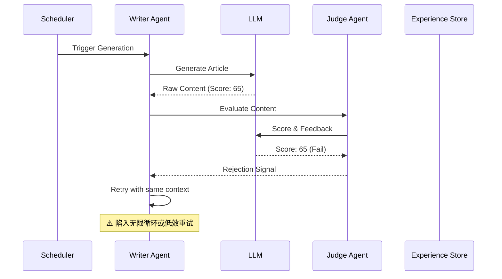
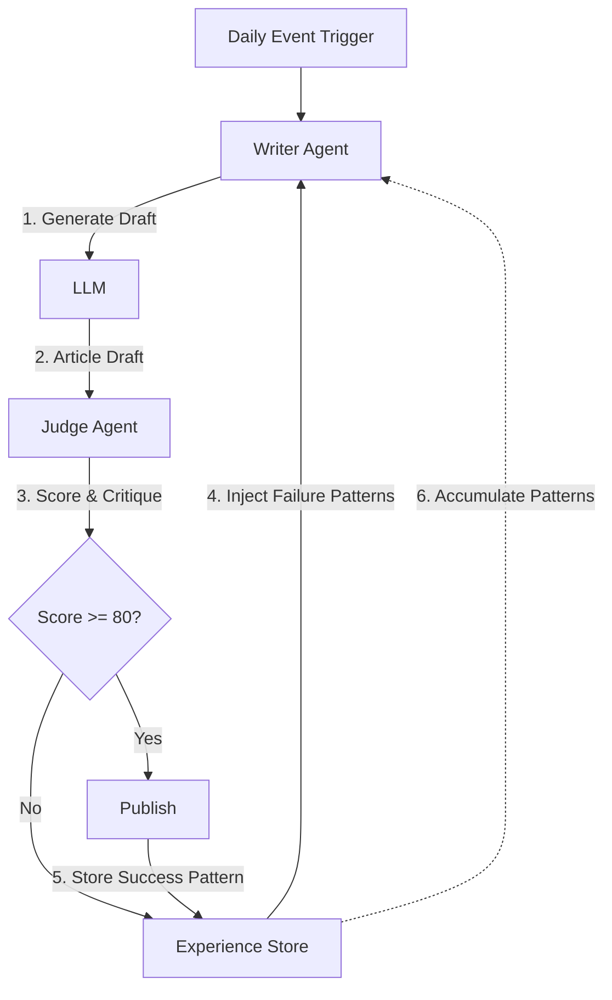

作为一名在这个领域摸爬滚打的架构师，我见过太多所谓的“自动化”系统最终沦为需要人工持续干预的累赘。今天要聊的是我们刚刚落地的一套 AI 文章生成系统——不仅仅是能写，而是能通过自我评判和经验积累不断进化的 Agent 系统。

### 背景：从“能写”到“写好”的鸿沟

我们的需求看似简单：基于每日的技术日志自动生成高质量的深度技术文章。初期实现很直接，Prompt + LLM = 文章。但现实很快给了我们一记耳光：生成的内容质量极不稳定。有时候是深度剖析，有时候则变成了流水账，Score 经常在 60-70 分徘徊。更糟糕的是，这种不稳定性是不可接受的，因为我们的受众是准备面试的高级工程师，低质量的输出会直接摧毁信任度。

问题的核心在于：单一的生成过程缺乏反馈机制。LLM 生成完就结束了，它不知道哪里写得好，哪里写得烂。如果你不告诉它评价标准，它下一次依然会随机乱撞。

### 根本原因分析

我们来拆解一下为什么简单的“生成-发布”模式行不通。这里的关键在于缺乏一个闭环的质量控制系统。



系统存在两个致命缺陷：
1. **无状态重试**：当 Judge 给出低分时，Writer 只是简单地重试。由于没有记住上次失败的原因（比如“缺乏架构图”或“深度不够”），LLM 很可能再次犯同样的错误。
2. **缺乏记忆**：成功的写作模式没有被沉淀。某天写了一篇 95 分的文章，其中完美的章节结构、代码示例的穿插方式，都没有被记录下来。第二天，系统又像一张白纸一样开始。

这导致两个后果：一是 Token 极大的浪费（大量低分重试），二是质量方差大，完全看“运气”。

### 解决方案深度剖析

为了解决这个问题，我们引入了 **Judge-Write 循环** 配合 **Experience Store（经验存储）**。核心思想是把“人工审核”这一步自动化，并将审核结果转化为下一次生成的上下文。

#### 架构图



#### 核心代码实现

这不是伪代码，而是基于实际生产逻辑提炼的实现模式。我们定义了两个关键 Agent：`WriterAgent` 负责创作，`JudgeAgent` 负责打分和提建议。

**Before (简单生成，无反馈)**

```java
public void generateArticleDaily(DailyLog log) {
    String prompt = buildPrompt(log);
    String article = llmClient.generate(prompt);
    articleRepository.save(article); // 直接保存，不管质量
}
```

**After (Judge-Write Loop + Experience)**

```java
public void generateWithQualityGate(DailyLog log) {
    int maxRetries = 3;
    Article finalArticle = null;

    for (int i = 0; i < maxRetries; i++) {
        // 1. 加载历史经验（高分文章的模式 + 历史失败的教训）
        List<String> successPatterns = experienceStore.getTopPatterns("interview_article", 5);
        List<String> failureLessons = experienceStore.getRecentFailures("interview_article", 3);

        // 2. Writer Agent 结合经验生成
        GenerationContext ctx = new GenerationContext(log, successPatterns, failureLessons);
        Article draft = writerAgent.write(ctx);

        // 3. Judge Agent 评判
        Judgment judgment = judgeAgent.evaluate(draft);
        
        if (judgment.getScore() >= 80) {
            finalArticle = draft;
            // 关键：将成功模式存入经验库
            experienceStore.recordSuccess(draft.extractPatterns(), judgment.getScore());
            publish(draft);
            break;
        } else {
            // 关键：记录失败原因，指导下一次重试
            experienceStore.recordFailure(draft, judgment.getCritique());
            logger.warn("Attempt {} failed. Score: {}. Reason: {}", i, judgment.getScore(), judgment.getCritique());
        }
    }

    if (finalArticle == null) {
        throw new RuntimeException("Failed to generate quality article after retries.");
    }
}
```

#### Experience Store 的设计哲学

`Experience Store` 本质上是一个向量数据库或者带 Metadata 的 Document Store（如 PgVector）。我们存储的不是整篇文章，而是“模式”。

例如，一次成功的存储可能包含：
- **Pattern**: "在 Root Cause Analysis 部分使用 Mermaid Sequence Diagram 展示失败路径"
- **Context**: "Stock data synchronization failure"
- **Score**: 92

当下次遇到类似的上下文时，RAG 检索会把这个 Pattern 喂给 Writer Agent。这就像一个新员工入职后，不是从头摸索，而是先阅读了过去两年的“最佳实践文档”。

### 架构决策记录

| Decision | Alternative | Why Chosen |
|----------|-------------|------------|
| **Judge-Write Loop** | 单次生成 + 人工审核 | 人工审核无法应对每日自动化需求；Loop 提供了即时反馈，能收敛到高质量结果。 |
| **Score 阈值 80** | 阈值 90 / 阈值 70 | 90 过高会导致重试次数爆炸，成本不可控；70 太低，无法保证内容深度。80 是质量和成本的平衡点。 |
| **Experience Store (Vector DB)** | 静态 Prompt / Fine-tuning | 静态 Prompt 无法动态进化；Fine-tuning 周期太长且成本高。RAG 允许系统以天为单位快速积累新知识。 |

### 生产环境考量

这套系统上线后，我们观察到了一些预期的现象，也踩了一些坑：

1. **冷启动问题**：系统刚上线时，Experience Store 是空的，前几篇文章的质量提升不明显。我们手动导入了一些历史高分文章的 Pattern 作为“种子数据”来缓解这个问题。

2. **Token 成本**：引入 Judge Agent 后，每次发布的 Token 成本大约增加了 40%（Judge 需要完整阅读一遍）。但这比因发布低质量内容导致的用户流失要便宜得多。我们通过限制 Judge 的 Prompt 长度优化了成本。

3. **死循环风险**：如果 Writer Agent 始终无法理解 Judge 的反馈，会消耗大量 Token。我们在代码中设置了硬性的 `maxRetries`，并加入了“降级策略”——如果 3 次都不及格，系统会发送告警，人工介入分析，而不是无限重试。

4. **指标监控**：我们重点监控两个指标：
   - **First Pass Yield (FPY)**：第一次生成就通过（>=80分）的概率。目标是从 20% 提升到 60%。
   - **Avg Retries**：平均重试次数。用于衡量成本效率。

### 关键总结

1. **反馈闭环是进化的前提**：任何自动化系统，如果缺少评价环节，都无法自我优化。Judge Agent 不只是打分者，它是 Teacher。

2. **存储“模式”而非“数据”**：Experience Store 存储的是成功的抽象模式，这样才具有泛化能力。直接存历史数据会让模型陷入过拟合，只会写昨天发生的事情。

3. **质量门禁优于后期修复**：与其生成大量垃圾内容后清洗，不如在源头卡住。虽然这会增加生成的计算成本，但极大降低了运营成本。

4. **冷启动必须有人工干预**：不要指望 AI 系统一上线就能自我进化。就像训练学徒，先由“师父”（人工）喂入高质量的初始经验，系统才能走上正轨。

这套系统目前运行稳定，不仅解放了编辑团队，更重要的是，随着时间的推移，它越来越“懂”我们要什么样的文章。这就是 Agent 架构的魅力——不仅是工具，更是能随时间成长的数字员工。