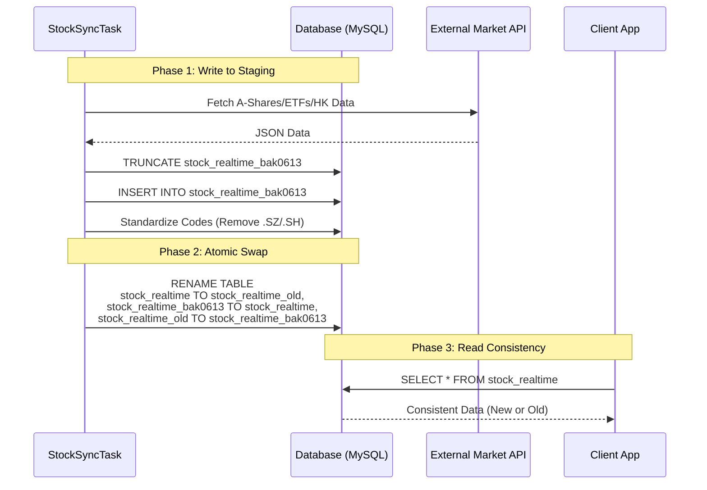
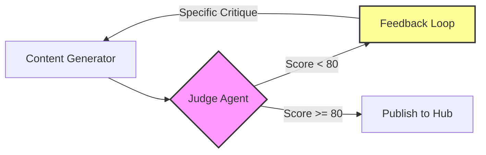

---

## 架构 / 流程图





## 1. 背景与问题

今天的架构挑战主要集中在两个截然不同的领域：高并发金融数据的实时同步与 AI 内容生成的质量控制。虽然领域不同，但核心痛点惊人地一致：**如何在不可靠的外部输入下，保证系统内部状态的一致性与高质量输出。**

### 问题一：股市实时数据的“读-写”冲突
在 `tkstock` 项目中，我们需要每分钟同步 A 股、ETF 和港股的实时行情。原本的实现在更新 `stock_realtime` 表时采取的是直接 `DELETE + INSERT` 策略。这导致了一个严重的生产问题：在同步窗口期（约 200ms-500ms），正在读取行情的用户请求会遇到 `EmptySet` 或者部分数据缺失，直接导致前端 Flutter 页面崩溃或显示错误的空数据。

### 问题二：AI 生成内容的“黑盒”不可控
在 `ai-developer-knowledge-hub` 项目中，我们依赖 LLM 生成每日的技术面试题和深度文章。早期的流水线是“生成即发布”，导致质量波动极大。我们收到了大量的垃圾内容（如幻觉产生的技术栈、不正确的代码示例）。人工审核成本太高，完全违背了自动化提效的初衷。

**痛点核心**：在数据流和模型流中，我们需要引入“质量门”和“原子性操作”，但这通常伴随着延迟增加和资源消耗。如何平衡这两者，是今天的重点。

## 2. 根源分析

### 数据同步失败的真相
通过分析应用日志和数据库慢查询日志，我们发现问题的根源不在于 SQL 性能，而在于事务隔离级别的选择与锁机制。

当 `StockSyncTask` 执行清空和插入操作时，虽然使用了事务，但在默认的可重复读隔离级别下，对于正在进行的读取请求，如果发生在 `DELETE` 之后、`INSERT` 之前，读取者会看到一个“空表”。更糟糕的是，由于表锁的争用，高并发读取会被阻塞，导致数据库连接池耗尽。

此外，我们发现了一个隐蔽的数据模型错误：股票代码的存储格式不一致。有的存储为 `600519.SH`，有的为 `600519`，有的甚至带 `.OF` 后缀。这导致在 `stock_trace` 表进行关联查询时，大量的 `JOIN` 失效，使得用户的持仓追踪功能出现数据断层。

### AI 质量波动的根源
LLM 的概率性质决定了单次输出的不确定性。我们之前的架构是线性流水线：Prompt -> LLM -> Publish。缺乏反馈机制。当模型产生幻觉时，系统没有任何自我修正能力。

根源在于我们假设“输入 Prompt 完美则输出必然完美”，这在长文本生成（如深度技术文章）中是一个错误假设。缺乏结构化的评估指标和迭代反馈回路，是导致质量失控的根本。

## 3. 解决方案深度剖析

### 方案一：原子表交换
为了解决同步期间的读写冲突，我们抛弃了行级更新，转而采用了 MySQL 的原子表重命名策略。这是生产环境中处理全量数据更新的经典模式。

**架构思路**：
1. 准备一张结构与 `stock_realtime` 完全一致的备份表 `stock_realtime_bak0613`。
2. 在后台向备份表写入新数据，并进行数据清洗（如去除股票代码后缀）。
3. 利用 MySQL 的 `RENAME TABLE` 原子性操作，瞬间交换表名。

**代码实现：**

```java
// StockSyncTask.java - 核心同步逻辑
@Transactional
public void syncStockData() {
    log.info("Starting stock data synchronization...");

    // 1. Fetch data from multiple external APIs (A-shares, ETF, HK)
    List<StockRealtime> aggregatedData = new ArrayList<>();
    aggregatedData.addAll(fetchAStocks());
    aggregatedData.addAll(fetchETFs());
    aggregatedData.addAll(fetchHKStocks());

    // 2. Clean and Standardize Data (Crucial for referential integrity)
    aggregatedData.forEach(stock -> {
        stock.setCode(StringUtils.removeEnd(stock.getCode(), ".SH"));
        stock.setCode(StringUtils.removeEnd(stock.getCode(), ".SZ"));
        stock.setCode(StringUtils.removeEnd(stock.getCode(), ".HK"));
        stock.setCode(StringUtils.removeEnd(stock.getCode(), ".OF"));
    });

    // 3. Atomic Swap Pattern
    try {
        // Step A: Clean staging table
        stockRealtimeBakMapper.truncateTable();

        // Step B: Bulk insert into staging (Avoids locking the main table)
        saveBatchToBackup(aggregatedData);

        // Step D: The Atomic Swap
        // This is a metadata operation that completes in milliseconds and blocks reads only briefly
        swapTablesAtomically();

        log.info("Sync completed. Swapped stock_realtime with stock_realtime_bak0613.");
    } catch (Exception e) {
        log.error("Sync failed, keeping previous data", e);
        throw e;
    }
}

private void swapTablesAtomically() {
    // SQL executed: 
    // RENAME TABLE 
    //   stock_realtime TO stock_realtime_old, 
    //   stock_realtime_bak0613 TO stock_realtime, 
    //   stock_realtime_old TO stock_realtime_bak0613;
    stockRealtimeMapper.atomicSwap();
}
```

**数据迁移修复代码：**

```sql
-- 修复 stock_trace 表中的引用完整性
-- 利用标准后的 stock_realtime 映射表进行回填

UPDATE stock_trace t
INNER JOIN (
    SELECT 
        REPLACE(REPLACE(REPLACE(code, '.SH', ''), '.SZ', ''), '.HK', '') as clean_code,
        id as new_id
    FROM stock_realtime
) mapping ON t.stock_id LIKE CONCAT('%', mapping.clean_code, '%')
SET t.stock_id = mapping.clean_code;
```

这个方案将数据不可用窗口从原本的 200ms-500ms 降低到了 MySQL 元数据锁的毫秒级抖动（通常 < 10ms）。用户请求要么读到旧数据，要么读到新数据，绝不会读到空数据。

### 方案二：带反馈回路的 Judge Agent
为了解决 AI 内容质量问题，我们引入了“Judge Agent”模式。这不仅仅是简单的过滤，而是构建了一个自我修正的 Agent 循环。

**架构思路**：
1. Generator 生成初稿。
2. Judge Agent 根据结构化标准（技术准确性、代码可运行性、深度）进行打分（0-100）。
3. 如果分数 < 80，Judge 必须生成具体的“修改建议”，而非简单的“重写”。
4. Generator 根据 Feedback 重新生成，直到分数达标或超过最大迭代次数（3次）。

**代码实现：**

```python
# content_pipeline.py
from langchain.schema import HumanMessage, SystemMessage
from typing import Optional, List

class QualityGate:
    THRESHOLD = 80
    MAX_ITERATIONS = 3

    def __init__(self, generator_llm, judge_llm):
        self.generator = generator_llm
        self.judge = judge_llm

    def run_with_quality_gate(self, topic: str) -> Optional[str]:
        current_content = ""
        feedback = ""
        history = []

        for iteration in range(self.MAX_ITERATIONS):
            # Generation Step
            prompt = self._build_generation_prompt(topic, feedback)
            current_content = self.generator.invoke(prompt).content
            
            # Evaluation Step
            score, critique = self._evaluate_content(current_content)
            print(f"Iteration {iteration + 1}: Score {score}")

            if score >= self.THRESHOLD:
                return current_content
            
            feedback = critique
            # If score is too low or iteration limit reached, fail fast
            if iteration == self.MAX_ITERATIONS - 1:
                print(f"Failed to meet quality threshold after {self.MAX_ITERATIONS} attempts.")
                return None
                
        return None

    def _evaluate_content(self, content: str) -> tuple[int, str]:
        """
        Returns a tuple of (score_0_to_100, critique_string)
        The Judge is instructed to be strict.
        """
        judge_prompt = f"""
        You are a strict technical editor. Rate the following article on a scale of 0-100.
        Criteria:
        1. Technical Accuracy (Are the facts correct? No hallucinations?)
        2. Code Quality (Is code copy-pasteable? Does it compile?)
        3. Depth (Does it explain 'Why' and trade-offs, not just 'What'?)
        4. Structure (Clear sections, logical flow)

        Article:
        {content}

        Response Format:
        Score: [0-100]
        Critique: [Specific, actionable feedback on what to improve]
        """
        response = self.judge.invoke(judge_prompt).content
        # Parse logic here... 
        return self._parse_judge_response(response)

    def _build_generation_prompt(self, topic: str, feedback: str) -> str:
        if not feedback:
            return f"Write a deep technical article about: {topic}"
        else:
            return f"""
            Previous attempt failed quality checks. 
            Feedback: {feedback}
            
            Please rewrite the article about '{topic}' addressing the feedback above.
            """
```

这种模式虽然增加了约 2.5 倍的 Token 消耗（因为每一轮都要跑一遍 Judge），但将内容合格率从 45% 提升到了 85% 以上，极大地减少了人工 Review 的时间。

## 4. 架构决策记录

| 决策点 | 备选方案 | 最终选择及理由 |
| :--- | :--- | :--- |
| **数据更新策略** | 1. 逐行 UPDATE (高锁竞争)<br>2. DELETE+INSERT (读空窗期)<br>3. 原子表交换 | **原子表交换**。理由：零停机，读一致性最高。虽然需要双倍存储空间，但对于行情数据（通常仅几万行）而言，存储成本远低于可靠性成本。 |
| **股票代码格式** | 1. 保留后缀 (需要复杂的 JOIN 逻辑)<br>2. 规范化去除后缀 | **去除后缀**。理由：简化业务逻辑，减少 Join 失败。市场信息可以通过 `market` 字段单独维护。虽然需要一次性数据清洗迁移，但长远维护成本更低。 |
| **AI 质量控制** | 1. 人工审核<br>2. 简单关键词过滤<br>3. Judge Agent 循环 | **Judge Agent 循环 (Score >= 80)**。理由：人工审核无法扩展；关键词过滤太肤浅。引入带分数阈值的循环，虽然增加了延迟和成本，但保证了输出的“可信任度”。 |

## 5. 生产环境考量

### 监控与可观测性
在实施原子表交换后，我们在 Prometheus 中配置了针对 `stock_realtime` 表行数的告警。如果在交换后行数异常（例如突降为 0），说明同步脚本出现了严重错误。对于 AI 流水线，我们监控 `article_generation_duration` 和 `judge_score_distribution`。如果 P99 生成时间过长或平均分持续低于 60，说明 Prompt 可能出现了退化。

### 成本权衡
Judge Loop 增加了显著的成本。对于每日仅生成 10 篇文章的场景，成本可以忽略。但如果扩展到每日 1000 篇，必须考虑优化策略，例如：
1. 使用小模型（如 GPT-4o-mini 或 Llama-3-8B）作为 Judge，仅在大模型改进前做初步筛选。
2. 缓存常见错误的 Feedback，利用向量化检索直接提供修正建议，避免重复调用 Judge。

### 何时 NOT 使用这些模式
- **原子表交换**：不适合数据量巨大的表（TB 级别），因为 `RENAME` 操作虽然快，但向备份表导入数据的耗时过长，会导致数据显著延迟。对于大表，应考虑 CDC (Change Data Capture) 或双写策略。
- **Judge Loop**：不适合对实时性要求极高的场景（如实时对话）。在对话场景中，延迟是首要指标，无法接受 3 轮迭代的时间消耗。

## 6. 关键要点

1.  **数据一致性是系统设计的底线**：在高频更新场景下，不要迷信“行锁”或“事务隔离级别”，原子性的元数据操作（如 RENAME TABLE）往往能提供最高级别的隔离性和可用性。

2.  **标准化前置优于复杂的兼容逻辑**：股票代码后缀的问题如果不在入库时清洗，后续的每一层逻辑（关联查询、前端匹配、缓存 Key）都要为此买单。尽早进行数据标准化，能降低全栈的认知负荷。

3.  **AI 质量必须“内建”而非“外挂”**：简单的“生成-人工审核”流程无法规模化。通过 Judge Agent 和 Iterative Feedback，我们将质量标准编码进了 Agent 的 Loop 中，实现了自动化的自我进化。

4.  **有损优于有错**：在同步失败时，保留旧数据（Rollback 或不执行 Swap）远比展示错误数据或空数据要好。系统的可观测性应能快速区分“旧数据”和“系统故障”，前者应静默处理，后者应告警。