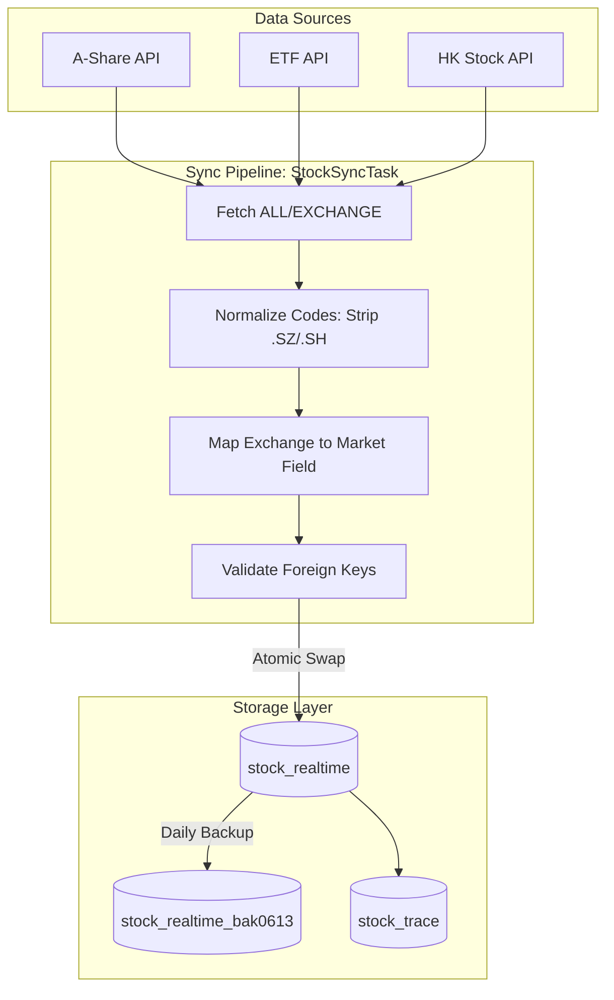
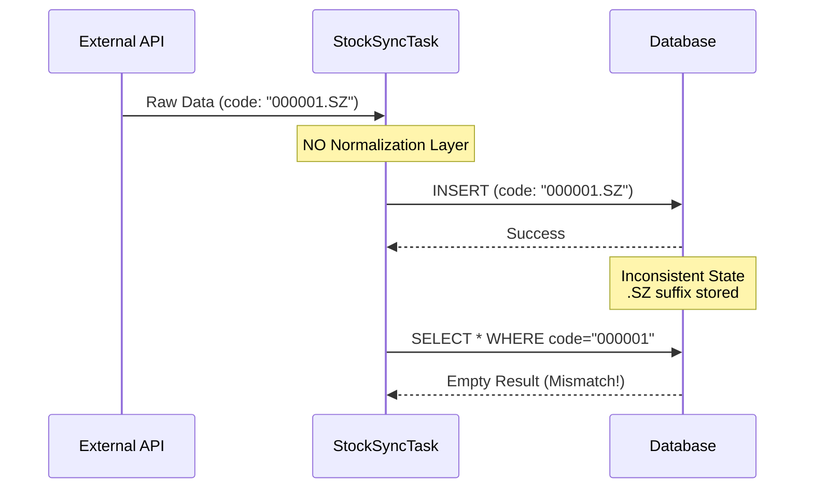

---

## 架构概览

在金融数据系统中，数据同步的可靠性直接决定了下游应用的可用性。今天的核心工作涉及构建一个全市场的股票数据同步管道，解决深层次的数据一致性问题，并实现自动化的知识库内容生成。下图展示了修复后的数据同步架构及其关键控制流：



## 1. 背景与问题：数据一致性的隐形杀手

今天的挑战源于一个看似简单的需求：实现一个自动化的全市场股票数据同步任务，覆盖 A 股、ETF 和港股。我们不仅要拉取数据，还要确保历史数据的可追溯性以及生产环境的数据安全。

在开发过程中，我们遭遇了一系列典型的“生产级”数据问题：
1.  **数据格式污染**：数据库中存在大量带有 `.SZ`、`.SH` 后缀的股票代码，这破坏了标准化的查询逻辑。
2.  **外键完整性缺失**：`stock_trace` 表中引用了不存在的 `stock_id`，导致关联查询失效。
3.  **静默的查询失败**：API 接口在某些参数下返回空结果，尽管数据库中明明有数据。这是由于字符集不匹配导致的——一个极其隐蔽且危险的 Bug。
4.  **跨平台空指针崩溃**：Flutter 前端在加载追踪列表时崩溃，因为后端返回了不完整的关联数据，且前端缺乏防御性编程。

如果这些问题不能在数据进入系统时被拦截，它们会像病毒一样扩散到报表、分析甚至 AI 模型训练数据中，造成难以估量的损失。

## 2. 根本原因分析：信任边界的崩塌

深挖这些问题，核心原因在于我们对数据源和存储层的“过度信任”。

### 故障模式：脏数据写入链路

下图展示了原始的、缺乏防御的数据写入流程是如何导致数据污染的：



### 关键假设错误

*   **假设 1**：外部 API 的数据格式是标准化的。事实证明，API 返回的 `code` 字段带有交易所后缀，而我们的业务逻辑依赖纯数字代码。
*   **假设 2**：数据库的默认字符集设置能满足所有查询需求。实际上，查询参数的 Collation 与表字段的 Collation 不一致，导致字符串比较失败。
*   **假设 3**：前端和后端的数据契约是完美的。当后端进行 `LEFT JOIN` 时，如果关联数据缺失，返回的对象字段即为 `null`，而 Flutter 端未进行非空校验直接调用 `.method()` 导致崩溃。

### 外键失效的深层原因

`stock_trace` 表中出现无效的 `stock_id`，说明在之前的某些数据迁移或手动修复操作中，我们绕过了 ORM 层或事务约束，直接执行了 SQL 写入。这违反了“单一数据写入源”的原则。

## 3. 解决方案深度剖析

### 3.1 实现原子备份与交换机制

为了支持每日的数据同步且不丢失历史状态，我们不能直接 `TRUNCATE` 或盲目 `UPDATE`。我们实现了一种**原子备份-交换模式**。

**代码实现：**

```java
// Before: Risky direct update without rollback capability
@Transactional
public void syncDataUnsafe(List<Stock> newData) {
    stockRepository.deleteAll(); // Destructive, hard to rollback
    stockRepository.saveAll(newData);
}

// After: Atomic backup-swap pattern with rotation capability
@Transactional
public void syncDataSafe(List<Stock> newData) {
    String dateStr = LocalDate.now().format(DateTimeFormatter.ofPattern("MMdd"));
    String backupTableName = "stock_realtime_bak" + dateStr;
    
    // 1. Atomic backup: Rename current table to backup in a single transaction
    // Note: Syntax varies by DB (PostgreSQL: ALTER TABLE ... RENAME TO ...)
    jdbcTemplate.execute(String.format("ALTER TABLE stock_realtime RENAME TO %s", backupTableName));
    
    // 2. Create fresh table (schema should be version controlled)
    jdbcTemplate.execute("CREATE TABLE stock_realtime (LIKE stock_realtime_template INCLUDING ALL)");
    
    // 3. Batch insert with normalized data
    List<Stock> normalizedData = normalizeStockCodes(newData);
    saveBatch(normalizedData);
    
    // 4. Validation check before commit (optional but recommended)
    if (stockRepository.count() == 0) {
        throw new DataSyncException("Critical: Sync resulted in empty dataset!");
    }
}
```

**关键设计点：**
*   **原子性**：利用数据库 DDL 语句（如 `RENAME`）的原子性，确保备份和切换是瞬间完成的，避免数据真空期。
*   **可恢复性**：通过日期后缀（`bak0613`）保留历史快照，一旦发现新数据有误，可以迅速回滚。
*   **存储权衡**：这种方式会占用双倍存储空间，但对于金融级数据，这点成本是为了可靠性必须付出的代价。

### 3.2 数据清洗与标准化层

我们在 `StockSyncTask` 中引入了严格的清洗逻辑，确保脏数据在进入数据库前被拦截。

```java
private List<Stock> normalizeStockCodes(List<RawStockDto> rawStocks) {
    return rawStocks.stream().map(dto -> {
        Stock entity = new Stock();
        
        // Strip problematic suffixes (.SZ, .SH, .OF)
        String cleanCode = dto.getCode().replaceAll("\\.(SZ|SH|OF)$", "");
        entity.setCode(cleanCode);
        
        // Map exchange codes to standardized market field
        // Input: 'SZ', 'SH' -> Output: 'A_SHARE'
        // Input: 'HK' -> Output: 'HK_STOCK'
        String market = mapExchangeToMarket(dto.getExchange());
        entity.setMarket(market);
        
        return entity;
    }).collect(Collectors.toList());
}

private String mapExchangeToMarket(String exchange) {
    return switch (exchange.toUpperCase()) {
        case "SZ", "SH" -> "A_SHARE";
        case "HK" -> "HK_STOCK";
        default -> "UNKNOWN";
    };
}
```

通过将清洗逻辑置于同步任务的入口，我们修复了根本原因，而不是在查询层打补丁。

### 3.3 修复字符集与 Collation 冲突

`market-stock/page` 接口返回空数据的排查过程极具启发性。我们发现虽然查询参数是 UTF-8，但表字段使用了区分大小写或不区分重音的特定 Collation，导致 `WHERE market = 'HK'` 无法匹配数据库中存储的值。

**修复方案：**

```sql
-- Before: Implicit collation usage (risky)
SELECT * FROM stock_realtime WHERE market = ?;

-- After: Explicit collation casting to match table schema
-- Assuming table uses utf8mb4_general_ci, we force the comparison to use it
SELECT * FROM stock_realtime 
WHERE market = ? COLLATE utf8mb4_general_ci;
``

或者在代码层面（如 JPA/Hibernate）指定查询时强制使用一致性规则。这是一个典型的“环境漂移”问题——开发环境和生产环境的默认配置可能随版本升级而不同。

### 3.4 修复数据完整性与防御性编程

针对 `stock_trace` 的无效引用，我们编写了一次性的修复脚本，并在业务代码中增加了外键约束检查。

```java
// Repair logic executed once
@Transactional
public void repairStockTraceIntegrity() {
    List<StockTrace> invalidTraces = stockTraceRepository.findAll()
        .stream()
        .filter(trace -> !stockRepository.existsById(trace.getStockId()))
        .toList();
    
    log.warn("Found {} invalid stock_trace records, deleting...", invalidTraces.size());
    stockTraceRepository.deleteAll(invalidTraces);
}
```

**前端防御：**

在 Flutter 端，我们修改了 `TraceList` 组件，不再假设 `baseStockInfo` 永远非空。

```dart
// Before: Crash prone
Text(item.baseStockInfo!.name),

// After: Defensive programming
Text(item.baseStockInfo?.name ?? 'Unknown Stock (${item.stockId})'),
```

这一改动体现了全栈开发的要义：**可靠性是双向契约**。后端返回尽可能完整的数据，前端处理尽可能多的边界情况。

## 4. 架构决策记录 (ADR)

| 决策 | 备选方案 | 选择理由 |
| :--- | :--- | :--- |
| **原子备份-交换模式** | 软删除 + 时间戳标记 | 金融数据对查询性能要求极高，软删除会导致索引膨胀且查询逻辑变复杂。原子交换提供了最清晰的“时间点”视图，且恢复速度最快。 |
| **集中式 StockSyncTask** | 微服务化拆分（每个市场一个服务） | 当前规模下，拆分带来的网络开销和分布式事务复杂性远大于收益。集中式任务更利于统一监控、错误处理和保持多市场数据的时间一致性。 |
| **同步层做数据清洗** | 数据库触发器清洗 | 触发器增加了数据库的 CPU 负担，且逻辑难以版本控制。在应用层处理数据清洗符合“瘦数据库，富应用”的原则，便于调试和单元测试。 |

## 5. 生产环境考量

在将这套系统推向生产时，有几个关键的运维点必须注意：

### 监控与可观测性
*   **数据量监控**：在 `StockSyncTask` 执行前后记录 `stock_realtime` 的行数。如果同步后行数骤减（例如从 5000 降至 100），必须立即触发报警，因为这通常意味着清洗逻辑过于激进或上游 API 变更。
*   **备份保留策略**：虽然我们每日备份，但磁盘空间是有限的。建议实现一个 TTL 策略，例如仅保留最近 7 天的备份表，并将历史数据归档至冷存储。

### 错误处理策略
*   **部分失败处理**：如果 A 股同步成功但港股 API 超时，任务应当记录错误并继续，而不是回滚已成功同步的 A 股数据。我们需要设计更细粒度的事务边界。

### 性能与成本
*   **批量写入优化**：使用 JDBC Batch 或 JPA `saveAll` 并配置 `spring.jpa.properties.hibernate.jdbc.batch_size`。对于 5000+ 条记录，批量插入能将耗时从秒级降低到毫秒级。
*   **何时避免使用此模式**：对于高频更新的单一记录（如股价实时跳动），表级别的备份-交换是不适用的。这种模式仅适用于低频（日级/小时级）的全量快照同步。

## 6. 关键要点

1.  **标准化优于兼容化**：在数据进入系统的边界（Edge）进行清洗，比在下游各个查询点兼容各种脏数据格式要有效得多。
2.  **字符集陷阱**：在涉及多语言或字符串比较的系统中，显式指定 Collation 是防止“数据存在但查不到”这一诡异问题的关键。
3.  **原子操作是高可用的基石**：通过 `ALTER TABLE RENAME` 实现原子切换，是处理全量数据同步最稳健的模式之一，它将“数据不一致”的时间窗口压缩到了毫秒级。
4.  **防御性全栈开发**：后端的数据完整性约束（如外键）和前端的空安全检查是双重保险。依赖单一端点的“善意”在生产环境中是脆弱的。

今天的经历再次证明，构建 Agent 系统或任何数据驱动的应用，最难的部分往往不是算法本身，而是数据工程的基础设施——管道的健壮性决定了智能的上限。