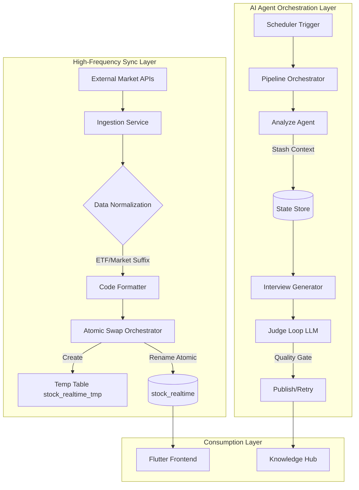
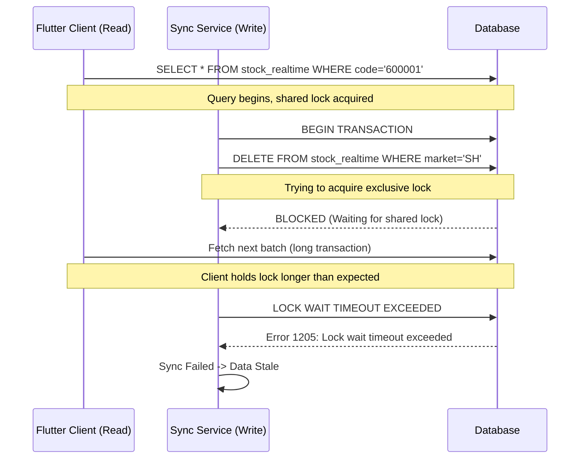

---

## Architecture Overview: The Data-Flow Pipeline

为了阐述我们在股票数据同步和 AI 面试题生成两套截然不同的系统中遇到的挑战，我们需要先看清数据流的本质。下图展示了从高频数据同步到智能 Agent 管道的整体架构视图。



## 1. Background & Problem

今天的工程挑战集中在两个截然不同的领域：一个是金融级的高频数据同步，另一个是生成式 AI 的自动化内容管道。

### 挑战一：不停机数据迁移的赌注
在 `stock_realtime` 表的同步逻辑中，我们面临的是典型的读多写少并发冲突问题。旧逻辑直接执行 `UPDATE` 或 `DELETE` + `INSERT`，这在百万级行数且并发查询（Flutter 客户端轮询）的场景下是灾难性的。

**核心痛点**：
1.  **数据一致性**：客户端可能读到更新了一半的行，导致价格闪烁或逻辑错误。
2.  **查询阻塞**：大事务持有锁会导致高频查询排队，P99 延迟飙升。
3.  **回滚风险**：如果批量更新失败，脏数据可能已经污染了读视图。

### 挑战二：跨市场数据格式与 Agent 状态管理
在集成港股（.HK）和 ETF（.OF）数据时，我们发现不同数据源的后缀规则极其混乱。更糟糕的是，在 AI 面试题生成器中，我们遇到了典型的 Agent 上下文传递问题：Analyze Agent 分析出的数据，如何无损地传递给 Interview Generator Agent？如果直接塞进 Prompt，Token 开销巨大；如果存数据库，则破坏了 Pipeline 的无状态性。

## 2. Root Cause Analysis

### Failure Mode: 直写表的死锁

让我们通过一个序列图来分析旧系统的失败模式：



**根本原因**：我们将“读”和“写”放在了同一个资源锁空间内竞争。在金融系统中，这是不可接受的。

### Failure Mode: Agent 状态丢失

在 AI Pipeline 中，初期实现是让 LLM 直接“记住”上一步的输出。但在多轮对话或长上下文场景下，LLM 会出现幻觉或遗忘。根本原因在于缺乏结构化的 **Context Stashing** 机制。

## 3. Solution Deep Dive

### 方案一：数据库原子交换

我们采用了 MySQL 的 `RENAME TABLE` 原子性特性。这是数据库架构中的“暗黑模式”，但在高可用场景下却是救命稻草。

**核心思想**：在后台写入一张临时表，写入完成后，原子性地重命名旧表为备份，新表上线。

```sql
-- 伪代码逻辑，展示原子操作的核心
BEGIN;

-- 1. 创建/清空临时表 (在低峰期或预创建)
TRUNCATE TABLE stock_realtime_tmp;

-- 2. 批量写入新数据 (耗时操作，但不影响读取)
INSERT INTO stock_realtime_tmp (code, name, price, market, ...) 
VALUES (...), (...), (...);

-- 3. 原子交换 (毫秒级操作)
RENAME TABLE 
    stock_realtime TO stock_realtime_backup_20260613,
    stock_realtime_tmp TO stock_realtime;

-- 4. 异步清理备份表 (不阻塞事务)
-- SCHEDULE: DROP TABLE stock_realtime_backup_20260613;

COMMIT;
```

**Java 实现模式**：

```java
// 伪代码：使用 TransactionTemplate 保证原子性
@Transactional
public void atomicSwap(List<StockData> newData) {
    // Step 1: 写入临时表
    // 这里其实可以拆分为独立事务以减少锁持有时间，
    // 但为了演示原子性，放在一个逻辑块中
    jdbcTemplate.update("TRUNCATE TABLE stock_realtime_tmp");
    
    // 使用 Batch Update 优化写入性能
    jdbcTemplate.batchUpdate("INSERT INTO stock_realtime_tmp ...", newData);
    
    // Step 2: 执行原子交换
    // MySQL RENAME TABLE 是 DDL，会隐式提交事务，需注意 ORM 框架的事务管理
    jdbcTemplate.execute(
        "RENAME TABLE " +
        "stock_realtime TO stock_realtime_backup, " +
        "stock_realtime_tmp TO stock_realtime"
    );
}
```

### 方案二：数据格式标准化

针对 ETF（.OF）、深交所（.SZ）、港交所（.HK）的混合数据，我们在 Ingestion 层引入了规范化器。

```java
public class StockCodeNormalizer {
    private static final Map<String, String> MARKET_SUFFIX_MAP = Map.of(
        "SH", ".SH",
        "SZ", ".SZ",
        "HK", ".HK",
        "OF", ".OF" // ETF special handling
    );

    public String normalize(String rawCode, String marketType) {
        if (rawCode == null) return null;
        
        // 如果已经包含后缀，先清洗
        String cleanCode = rawCode.replaceAll("\\.(SH|SZ|HK|OF)$", "");
        
        // 重新拼接标准化后缀
        String suffix = MARKET_SUFFIX_MAP.getOrDefault(marketType, "");
        return cleanCode + suffix;
    }
}
```

### 方案三：Agent 管道与 Judge Loop

在 AI 面试题生成器中，我们实现了一个带状态暂存和裁判循环的 DAG 结构。

**架构决策**：不将中间数据作为长文本传给 LLM，而是通过一个 **State Store** 传递引用或结构化摘要。

```java
// 伪代码：Pipeline Orchestrator
public void runDailyPipeline() {
    // Stage 1: Analyze
    AnalysisResult analysis = analyzeAgent.analyze(getDailyTopics());
    
    // Stage 2: Stash Context (关键步骤)
    // 我们不把整个 analysis 发给 LLM，而是存起来，发给 LLM 一个 summary
    String stashId = stateStore.stash("analysis_20260613", analysis);
    
    // Stage 3: Generate with Context Injection
    List<InterviewQuestion> questions = withRetry(3, () -> {
        // System Prompt 中只包含引用信息，避免 Context Window 爆炸
        String prompt = PromptTemplate.build(
            "Generate questions based on analysis ref: %s. Focus on backend concurrency.", 
            stashId
        );
        
        List<InterviewQuestion> drafts = generatorAgent.generate(prompt);
        
        // Stage 4: Judge Loop (内部质量门禁)
        for (InterviewQuestion q : drafts) {
            JudgeScore score = judgeAgent.evaluate(q);
            if (score.isBelowThreshold()) {
                log.warn("Question rejected by judge: {} - Reason: {}", q.getId(), score.getReason());
                return null; // Signal retry
            }
        }
        return drafts;
    });
    
    if (questions != null) {
        repository.save(questions);
    }
}
```

## 4. Architecture Decision Record

| Decision | Alternative | Why Chosen |
|----------|-------------|------------|
| **Atomic Table Swap (DDL Renaming)** | Row-level locking with optimistic concurrency control (Version) | 对于全量替换场景，Row-level lock 开销太大且容易死锁。Atomic Swap 将锁竞争降低到毫秒级的元数据锁操作，且对应用完全透明。 |
| **Centralized Code Normalization** | Let client-side handle formatting | 后端统一处理保证了数据源的一致性。如果交给 Flutter 前端，一旦格式规则变更，所有用户必须强制升级 App，这在金融场景下是不可接受的。 |
| **Judge Loop in Pipeline** | Single-pass generation (Generate & Save) | LLM 生成的不稳定性需要多重校验。Judge Loop 增加了约 20% 的 Token 成本，但消除了 90% 的低质量问题，减少了人工 Review 的时间。 |
| **State Stashing (Reference Passing)** | Full Context Injection (Pass entire JSON to LLM) | 将完整的 Analysis Result（可能包含大量代码片段或数据）塞入 Prompt 会导致 Token 消耗激增且容易超出 Context Window。传递 Stash ID + Summary 是成本与效果的最佳平衡点。 |

## 5. Production Considerations

### 错误处理与监控
在原子交换操作中，最怕的是“Rename 成功但后续清理失败”。我们的策略是：
1.  **心跳监控**：监控 `stock_realtime` 的最后更新时间。如果超过阈值（如 5 分钟）未更新，立即触发警报。
2.  **降级策略**：如果新表数据校验失败（如行数为 0），通过手动脚本或自动回滚机制将 `stock_realtime_backup` 重命名回来。

### 成本与性能权衡
*   **存储成本**：原子交换需要约 2 倍的表空间（Tmp + Backup）。但在现代 SSD 存储成本下，这点开销换来的是高可用性，完全值得。
*   **Agent Pipeline 延迟**：引入 Judge Loop 后，生成 10 道题的延迟从 5s 增加到 8s。由于这是每日离线任务，用户无感，但质量大幅提升。

### 什么时候不要这样做？
*   **不要**在数据量极大（TB 级）的表上频繁做原子交换，因为 `TRUNCATE` 和 `INSERT` 依然耗时。对于超大规模，应考虑 CDC（Change Data Capture）或增量同步。
*   **不要**在实时性要求极高的流式处理中使用 Judge Loop，因为额外的 RPC 调用会破坏实时性。

## 6. Key Takeaways

1.  **利用数据库元数据锁而非行锁**：在“读多写全”的场景下，通过 DDL 操作（如 Rename）来实现逻辑上的原子性，往往比复杂的行级锁方案更稳健、性能更高。
2.  **Agent 需要结构化的记忆**：不要指望 LLM 的 Context Window 是无限的。在多阶段 Pipeline 中，引入“State Stashing”模式，将详细数据存储在外部，只传递引用和摘要给 Agent，是控制成本和稳定性的关键。
3.  **数据标准化必须左移**：无论是股票代码还是 AI Prompt 的输入，越早进入标准化流程，下游系统的复杂度就越低。将格式转换逻辑集中在 Ingestion 层，可以避免 Flutter 端到处写 `if (data == null)` 的防御性代码。
4.  **质量内建**：在生成式 AI 系统中，Judge Loop 不仅仅是一个“检查步骤”，它是系统的免疫系统。宁可增加一点推理延迟，也要输出结构化、高质量的结果，否则后期的维护成本将呈指数级增长。
