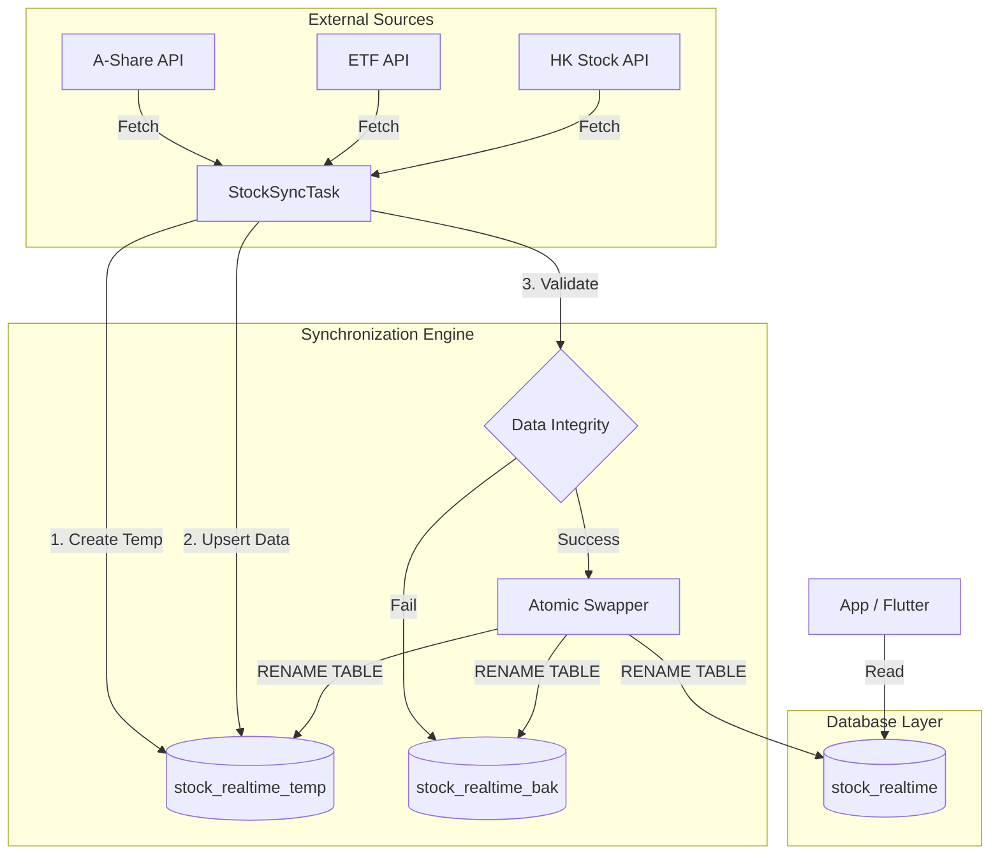
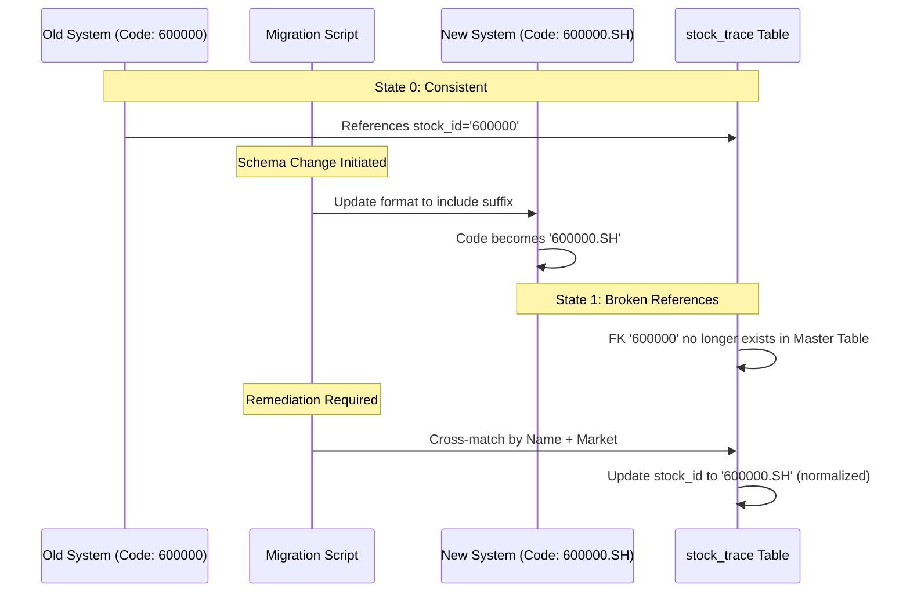

# 深度解析：金融实时数据管道中的原子性替换与数据完整性修复实践

## 架构概览

在构建高频交易或金融行情展示系统时，实时数据的一致性与服务的可用性往往是不可兼得的天平。今天我们解决的核心矛盾是：如何在进行全量数据同步（涉及数万条股票、ETF及港股数据）的同时，保证前端查询不会读到中间状态，且能在出错时瞬间回滚。

我们采用了一种基于 **Atomic Table Swapping（原子表切换）** 的模式。这不仅仅是数据库操作，更是一种在无分布式事务支持环境下的最终一致性保障策略。



## 1. 背景与问题：格式混乱与引用失效

今天的战场主要集中在数据层的治理。金融数据最怕的不是数据缺失，而是 **“看起来对但实际是错的”**。

### 1.1 核心挑战：标识符格式不一致

我们遇到的第一大问题是 **Stock Code 的格式战争**。上游 API 返回的数据格式极其混乱：
- A股代码混入了 `.SH`、`.SZ` 后缀（如 `600000.SH`）
- ETF 代码混入了 `.OF` 后缀
- 港股代码虽然格式尚可，但缺乏统一的市场字段标识

这导致了严重的查询失效。在关联查询 `stock_trace`（历史轨迹表）与 `stock_realtime`（实时行情表）时，由于 `stock_id`（代码）格式不匹配，导致大量历史数据“丢失”。对于金融应用来说，历史数据的丢失意味着用户看不到持仓成本，这是不可接受的业务事故。

### 1.2 第二大挑战：实时同步的读写冲突

原有的同步逻辑直接在 `stock_realtime` 表上执行 `DELETE` + `INSERT`。这在数据量小时尚可，但一旦涉及数万条记录的更新，耗时可能长达数秒。在这几秒内，正在查询行情的用户可能遇到：
1. **空结果集**：删完了还没插完。
2. **主键冲突**：插入中途发生了查询。

### 1.3 数据类型腐蚀

更隐蔽的 Bug 出在 `market` 字段。本该是枚举值（如 `SH`, `SZ`, `HK`）的字段，在某些脏数据中变成了数字字符串。这种类型腐蚀直接导致下游的 Dart/Flutter 代码在解析 JSON 时发生隐式转换失败或 Null Pointer Exception。

## 2. 根因分析

这不是简单的“Bug”，而是架构层面的 **Schema Drift（模式漂移）**。

### 2.1 假设的崩塌

系统初期假设：“Stock Code 是全局唯一且不可变的”。

现实情况：
- 数据源 A 认为代码是 `600000`，数据源 B 认为是 `600000.SH`。
- 数据清洗逻辑（ETL）在多个地方重复实现，且不一致。

### 2.2 引用完整性约束的缺失

在数据库层面，`stock_trace` 表并没有强制的外键约束（这在高并发写入场景下是常见的权衡，为了性能）。因此，当 `stock_realtime` 表的代码格式发生变更时，`stock_trace` 中的引用就变成了“悬空指针”。

下面是数据断裂的时序图：



## 3. 解决方案深度剖析

### 3.1 原子性表交换

这是本次最核心的架构升级。我们不再直接操作生产表，而是引入“临时表”和“原子重命名”。

**核心理念**：文件系统或数据库中的 `RENAME TABLE` 操作通常是元数据级别的锁定，毫秒级完成，且是原子的。

#### 实现模式

```python
# Pseudo-code representation of the Atomic Swap Logic
def execute_stock_sync(engine):
    session = Session(engine)
    
    try:
        # 1. Prepare the clean slate
        # Drop temp table if exists from a crashed previous run
        session.execute(text("DROP TABLE IF EXISTS stock_realtime_temp"))
        
        # 2. Create temp table structure identical to production
        session.execute(text("""
            CREATE TABLE stock_realtime_temp LIKE stock_realtime
        """))
        
        # 3. Fetch and Normalize Data (The Heavy Lifting)
        # This happens in isolation from user reads
        raw_data = fetch_all_market_data() 
        normalized_data = normalize_stock_codes(raw_data)
        
        # Bulk insert into temp table
        session.bulk_insert_mappings(StockRealtime, normalized_data)
        
        # 4. Validation: Ensure we have data before switching
        count = session.execute(text("SELECT COUNT(*) FROM stock_realtime_temp")).scalar()
        if count == 0:
            raise DataSyncError("No data fetched, aborting switch to prevent empty production table.")
            
        session.commit()
        
        # 5. THE ATOMIC SWAP (Critical Section)
        # This sequence must be executed in a single transaction block if possible,
        # or as fast as possible to minimize the "black hole" window.
        with engine.begin() as conn:
            # Step A: Production becomes Backup (Instant Rollback Point)
            conn.execute(text("RENAME TABLE stock_realtime TO stock_realtime_bak_{date}"))
            
            # Step B: Temp becomes Production (Cutover)
            conn.execute(text("RENAME TABLE stock_realtime_temp TO stock_realtime"))
            
        # If Step A succeeds but Step B fails (rare but possible), 
        # we have a backup table to manually restore from.
        
    except Exception as e:
        session.rollback()
        # Fallback: If swap failed mid-flight, we can restore from bak
        logger.error(f"Sync failed: {e}")
        raise
```

**为什么这样做？**
- **Zero Downtime**：查询 `stock_realtime` 的客户端只会在重命名的微秒瞬间看到 `Table not found`（实际上由于 MySQL/Meta 锁机制，通常连这个都看不到，或者只是极短暂的锁等待）。
- **Instant Rollback**：如果新数据有问题，只需 `RENAME stock_realtime TO stock_realtime_new_broken; RENAME stock_realtime_bak TO stock_realtime;`，秒级回滚。

### 3.2 数据修复：交叉引用匹配

针对历史数据 `stock_trace` 中失效的 `stock_id`，我们不能简单丢弃，必须重建关联。

由于直接 ID 映射已经断裂（`600000` vs `600000.SH`），我们采用 **Composite Key Matching（复合键匹配）** 策略。假设 **“股票名称 + 市场”** 的组合在时间维度上是相对稳定的。

```python
def remediate_trace_references(engine):
    """
    Rebuilds stock_id in stock_trace by matching old records (in backup)
    with new records (in production) using Name + Market.
    """
    
    # Logic:
    # UPDATE stock_trace t
    # JOIN stock_realtime_bak old ON t.stock_id = old.code
    # JOIN stock_realtime new ON old.name = new.name AND old.market = new.market
    # SET t.stock_id = new.code
    # WHERE t.stock_id IS NULL OR t.stock_id NOT IN (SELECT code FROM stock_realtime)
    
    update_sql = text("""
        UPDATE stock_trace t
        INNER JOIN stock_realtime_bak old ON t.stock_id = old.code
        INNER JOIN stock_realtime new ON old.name = new.name 
            AND (
                (old.market = 'SH' AND new.market = 'SH') OR 
                (old.market = 'SZ' AND new.market = 'SZ') OR
                -- Handle market field corruption/nulls by inferring from code prefix if necessary
                (RIGHT(old.code, 3) = '.SH' AND new.market = 'SH')
            )
        SET t.stock_id = new.code
        WHERE t.stock_id != new.code
    """)
    
    result = engine.execute(update_sql)
    logger.info(f"Remediated {result.rowcount} trace records.")
```

这个查询虽然重（O(N*M) in worst case without proper index），但对于一次性的数据修复是完全可接受的。关键在于我们在 `name` 和 `market` 字段上建立了索引。

### 3.3 代码清洗：去除后缀与类型纠正

在数据写入 `stock_realtime_temp` 之前，必须进行严格的 **Pre-insert Validation（预插入校验）**。

```python
def normalize_stock_code(code: str, market: str) -> tuple[str, str]:
    """
    Returns (clean_code, clean_market)
    """
    if not code:
        raise ValueError("Stock code cannot be null")
    
    # Rule 1: Strip known suffixes
    for suffix in ['.SH', '.SZ', '.HK', '.OF']:
        if code.endswith(suffix):
            code = code[:-3]
            break
            
    # Rule 2: Infer market from code if market field is corrupted/missing
    # Assuming Chinese stock codes standard: 6=SH, 0/3=SZ
    if not market or market.isdigit():
        if code.startswith('6'):
            market = 'SH'
        elif code.startswith('0') or code.startswith('3'):
            market = 'SZ'
        elif len(code) == 5: # Typical HK stock code length
            market = 'HK'
        else:
            market = 'UNKNOWN' # Failsafe
            
    return code, market

# Inside the data fetching loop
for item in raw_api_data:
    clean_code, clean_market = normalize_stock_code(item['code'], item.get('market'))
    
    record = {
        'code': clean_code,
        'market': clean_market, # Now strictly enforced as String Enum
        'name': item['name'],
        'price': item.get('current_price', 0.0), # Default handling
        # ... other fields
    }
    records_to_insert.append(record)
```

这里体现了一个重要的架构原则：**Defense in Depth（纵深防御）**。不要相信上游 API 的类型定义，在边界处（Entry Point）就将其规范化。

## 4. 架构决策记录

| 决策点 | 替代方案 | 最终选择及理由 |
| :--- | :--- | :--- |
| **全量更新策略** | 1. 逐条 `UPDATE` <br> 2. 行级锁事务 <br> 3. 原子表切换 | **原子表切换** <br> *理由*：逐条更新锁竞争太严重，且无法保证全量数据的一致性快照。行级锁在数万条数据下会导致锁超时。原子表切换是唯一能实现“全量或全无”且对查询影响最小的方法。 |
| **ID 格式处理** | 1. 数据库存储带后缀 <br> 2. 应用层动态拼接 <br> 3. 存储纯代码 + 独立 Market 字段 | **存储纯代码 + 独立 Market 字段** <br> *理由*：带后缀导致查询必须使用 `LIKE` 或复杂的字符串解析，无法利用索引效率。独立字段符合数据库范式，且便于跨市场统计。应用层拼接（展示层）去处理即可。 |
| **历史数据修复** | 1. 丢弃历史记录 <br> 2. 维护 Code Mapping 表 <br> 3. 交叉引用匹配 | **交叉引用匹配 (一次性) + 规范化入库 (长期)** <br> *理由*：丢弃数据不可行。Mapping 表维护成本高且容易过时。利用 Name+Market 匹配是一次性清洗的务实之举，配合新的规范化逻辑防止再次发生。 |

## 5. 生产环境考量

### 5.1 监控与告警

仅仅实现原子交换是不够的，我们需要监控交换的结果：
- **行数校验**：`SELECT COUNT(*) FROM stock_realtime` 必须在预期范围内（如 4000-6000 条）。如果突然变成 0，必须触发 P0 告警。
- **心跳检测**：Sync Task 每次运行完成后，更新一个 `system_health` 表的时间戳。监控服务如果发现该时间戳超过 5 分钟未更新，说明同步挂了。

### 5.2 成本与性能权衡

- **存储成本**：原子交换需要保留 `_bak` 表。如果每天全量同步，且保留 7 天备份，存储开销会翻倍。**策略**：仅保留最近 1 次的 `_bak` 表，或者将历史备份数据归档到廉价存储（如 S3/OSS）。
- **API 配额**：全量同步意味着高频调用上游接口。必须与数据提供商确认 QPS 限制，必要时实施 **Incremental Sync（增量同步）**（但这会增加逻辑复杂度，需要处理 diff 算法）。

### 5.3 何时 NOT 使用此方案

- **数据量极大（亿级）**：`RENAME TABLE` 虽快，但如果 `CREATE TABLE` 和 Bulk Insert 耗时 30 分钟，这 30 分钟的数据延迟是无法接受的。此时应改为 CDC (Change Data Capture) 或双写 + Diff 策略。
- **强事务依赖**：如果业务逻辑要求“更新用户持仓”必须与“更新股票实时价”在同一个数据库事务中，这种分库分表（甚至只是表隔离）的模式会破坏事务一致性。

## 6. 关键总结

1.  **原子操作是高可用系统的基石**：不要在用户可见的路径上做破坏性的批量写操作。利用 `RENAME`、`SWAP` 等元数据操作来实现瞬态切换。

2.  **数据质量是业务的生命线**：金融数据中的脏数据（如类型错误、格式不统一）会像病毒一样扩散到前端。必须在数据入口处建立严格的 Sanitization Layer（清洗层）。

3.  **永远要有回滚计划**：当你无法保证逻辑 100% 正确时（特别是涉及外部 API 和复杂数据转换时），设计上必须支持“一键回滚”。`stock_realtime_bak` 表就是我们的安全网。

4.  **ID 设计时想清楚“不可变性”**：如果可能，永远不要改变实体的 Primary ID。如果必须改（如从带后缀变无后缀），必须提前规划 Migration Path，否则后期的 Cross-match 脚本会非常痛苦且容易出错。

通过这一天的重构，我们不仅修复了 Flutter 端的空指针崩溃，更重要的是建立了一套健壮的实时数据同步范式，为后续接入更多市场（如美股、期货）打下了坚实的架构基础。