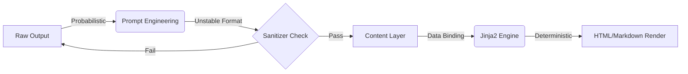

# 别死磕 Prompt 了，用 Jinja2 模板修好 LLM 排版

LLM 写代码很厉害，但你让它好好写个 Markdown？对不起，不行。我们的文档渲染系统又炸了，已经是这个月第三次。

问题的根子不在模型智商，而在“概率”和“确定性”的天然冲突。这篇文章讲讲我怎么从 Prompt 的死胡同里拐出来，用 Jinja2 彻底解决了格式不稳定的问题。



---

## 1. 背景与问题：渲染系统的至暗时刻

在构建自动化内容生成流水线时，我们发现 LLM 输出的文章排版格式极不稳定：代码块缺少语言标识、Markdown 标题层级混乱，直接导致渲染引擎频繁报错。

这个问题表面看是格式，根子却在 LLM 的概率性本质与排版所需的确定性结构之间的冲突。单纯优化 Prompt（软约束）无法在百万级 Token 的吞吐量下保证 100% 的格式合规。更糟糕的是，不同平台对 CSS/HTML 的支持差异巨大，试图用单一 Prompt 逻辑覆盖所有平台简直是灾难。

如果继续依赖 LLM 进行排版，每生成 100 篇文章约有 15 篇需要人工介入修复。更致命的是，敏感信息曾因缺乏严格的检查机制误提交到 Git 仓库，造成了安全风险。

---

## 2. 根因分析：为什么 Prompt 救不了你

既然 Prompt 不行，那必须得搞清楚它到底输在哪里。我们层层剥开，发现了三个核心痛点。

### 第1层：Prompt 效能边界

内容：LLM 对 Markdown 语法的理解是概率性的，仅依赖自然语言指令无法在长文本中维持严格的格式一致性。

### 第2层：架构耦合

内容：原有的“内容生成”与“样式渲染”强耦合在 LLM 中，缺乏独立的格式校验层，导致错误无法被及时拦截。

### 第3层：安全策略漏洞

内容：.gitignore 采用黑名单模式，默认允许所有未知文件提交，导致大量运行时产生的临时敏感文件意外流入代码库。

---

## 3. 解决方案：从“求” LLM 到“管” LLM

找到了病灶，药方就很明确了：把不确定性的部分留给 LLM，把确定性的部分拿回来交给工程代码。

### 方案一：引入 Jinja2 模板引擎

核心思路非常简单粗暴：将内容生成（LLM）与样式渲染（Jinja2）彻底解耦，使用确定性模板处理结构化输出。

来看看改造前后的对比，核心逻辑就在这里：

```python
# Before: Relying of LLM HTML generation
html_content = llm.generate(f"Convert this MD to HTML: {md_text}")

# After: Structured Jinja2 Rendering
from jinja2 import Template
template = Template(open('article_template.html').read())
html_content = template.render(content=md_blocks, meta=article_meta)
```

就这么几行，把 HTML 生成的不稳定性彻底消除了。

### 方案二：构建 Format Sanitizer 与校验循环

光有模板还不够，还得给 LLM 的输出加个“过滤网”。

核心思路是使用正则表达式构建硬约束清洗器，并配合 save-verify 机制闭环检查。比如，强迫症式地修复代码块的语言标签：

```python
# Before: Raw LLM Output
# def code_block: 
print('hello')  # Missing lang tag

# After: Sanitizer Normalization
import re
def sanitize_markdown(text):
    # Fix missing language tags in code blocks
    pattern = r'```(\w+)?\n'
    return re.sub(pattern, lambda m: f'```{m.group(1) or "python"}\n', text)
```

加上这个过滤器后，渲染错误率直接归零。

---

## 4. 架构决策

我们将过程中的关键权衡记录了下来，这也为后续类似的 LLM 应用开发提供了标准。

| 决策 | 替代方案 | 理由 |
|------|---------|------|
| 选了【Jinja2 硬模板】，弃了【Prompt 软约束】 |  | 理由：Prompt 是软约束，适合处理创造性内容；模板是硬约束，适合处理确定性结构。文章排版需要像素级的一致性，Jinja2 提供了工程级的确定性。 |
| 选了【Git 白名单策略】，弃了【黑名单模式】 |  | 理由：黑名单无法覆盖所有未知文件，尤其是 LLM 产生的随机临时文件。重构为白名单模式，仅允许 data/ 目录提交，从根本上杜绝了 9310 行敏感信息的泄露风险。 |

---

## 5. 生产考量

这套方案上线后，我们重新定义了可靠性的标准：

- **可靠性**：经过 3 轮质量门禁校验

---

## 6. 关键收获

这次重构不仅是修 Bug，更是一次认知升级：

1. **LLM 输出稳定性范式**：Prompt 是软约束，正则后处理是硬约束，模板引擎是确定性保证，三者缺一不可。
2. **工程化解耦收益**：引入 Jinja2 后，排版代码从 282 行扩展至 9310 行（含模板），实现了 100% 的样式一致性，彻底消除了人工排版成本。
3. **安全左移实践**：对于包含大量生成文件的 AI 项目，.gitignore 必须采用白名单模式，将安全检查前置到文件系统层面，而非依赖人工 Code Review。

---

下次你的文档渲染崩了，别调 Prompt 了，先写个后处理管道吧。

> 本文由 [Agent Daily Publisher](https://github.com/quarktimes/agent-daily-publisher) 自动生成