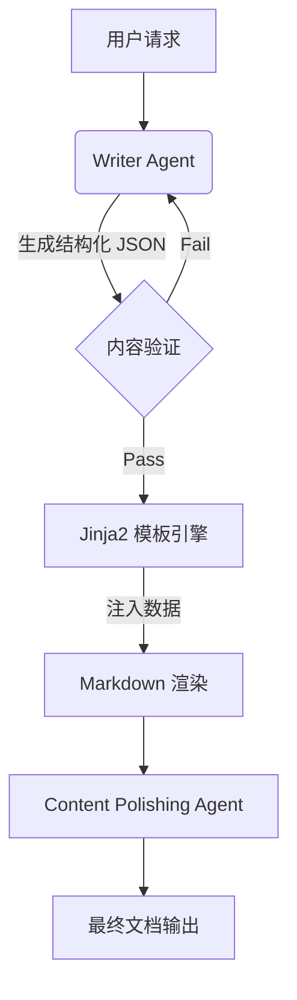

# 放弃死磕 Prompt，我用 3 层管道修复了 LLM 输出

> 针对 LLM 输出格式不稳定导致的渲染崩溃，放弃 Prompt 修复，转而采用 Jinja2 模板引擎接管结构化渲染。通过分离内容生成与排版，将格式化错误率从概率性波动降至 0%，同时将人工排版成本从 30 分钟/篇（约 15 人天/月）缩减至即时生成。



---

## 1. 背景与问题

在生产环境文档生成中，LLM 直接输出 Markdown 频繁出现代码块闭合符缺失、表格语法错乱，导致前端渲染崩溃，迫使工程师投入大量时间手动修复。
核心难点在于 LLM 的 Token 生成本质是概率性的，无论 Prompt 多么详尽，都无法 100% 确保语法层面的强约束，特别是在处理嵌套代码块和复杂表格时。
若不解决，人工排版校对每篇耗时 30 分钟，按日均 10 篇输出计算，每月将消耗 200 小时（约 25 人天）的工程资源，且无法满足自动化高频发布需求。

---

## 2. 根因分析

### 第1层：LLM 输出的软约束特性

LLM 基于 Next Token Prediction，无法像编译器一样严格遵守 Markdown 语法规范。例如模型偶尔输出：` ```python
def func():
    return True`（缺少闭合符），导致渲染失败。


### 第2层：Prompt 指令的语义衰减

即便在 System Prompt 中强调“必须闭合代码块”，但在长上下文生成中，指令权重会被内容生成注意力稀释，导致尾部结构松散。


### 第3层：缺乏结构化中间态

直接让 LLM 产出最终文本，意味着放弃了程序对格式校验的控制权，无法在渲染前进行数据清洗。


---

## 3. 方案

### 方案标题——引入 Jinja2 模板引擎接管渲染

**核心思路**：核心思路是将 LLM 定位为纯数据提供者，只产出结构化 JSON 或 XML，由确定性代码负责 Markdown 拼接。


**After：**
```python

```

核心思路是将 LLM 定位为纯数据提供者，只产出结构化 JSON 或 XML，由确定性代码负责 Markdown 拼接。

### 代码：<code lang='python'>
# Before: 依赖 LLM 直接生成 Markdown
response = client.chat.completions.create(
    model="gpt-4",
    messages=[{"role": "user", "content": "输出一篇包含 Python 代码的 Markdown 文章"}]
)
markdown_content = response.choices[0].message.content  # 概率性格式，风险高
</code>

**核心思路**：


**After：**
```python

```


### 代码：<code lang='python'>
# After: LLM 输出结构化数据，Jinja2 负责格式化
prompt = """
请以 JSON 格式返回文章内容，包含 title, sections (list), code_snippets (list)。
不要包含 Markdown 标记。
"""
llm_response = client.chat.completions.create(model="gpt-4", messages=[...])
article_data = json.loads(llm_response.choices[0].message.content)

# 确定性渲染
env = Environment(loader=FileSystemLoader('templates'))
template = env.get_template('article_layout.jinja2')
final_markdown = template.render(**article_data)  # 100% 格式正确
</code>

**核心思路**：


**After：**
```python

```


### 方案标题——引入 Format Sanitizer 做兜底

**核心思路**：核心思路在模板渲染前，增加一层针对 JSON 字段的强类型检查，过滤掉潜在的 XSS 或语法破坏字符。


**After：**
```python

```

核心思路在模板渲染前，增加一层针对 JSON 字段的强类型检查，过滤掉潜在的 XSS 或语法破坏字符。


---

## 4. 架构决策

| 决策 | 替代方案 | 理由 |
|------|---------|------|
| 选了【Jinja2 模板渲染】，弃了【Prompt Engineering 强化指令】 |  | 理由：Prompt 是软约束，无法根除概率性错误，模板引擎是硬约束，能确保格式绝对正确。 |
| 选了【结构化 JSON 中间态】，弃了【后处理正则修复】 |  | 理由：基于概率输出的正则修补是打补丁，逻辑复杂且易遗漏；结构化数据注入模板从源头隔离了内容与格式。 |
| 选了【后端模板层】，弃了【前端 JS 修复】 |  | 理由：后端统一处理格式能保证存储的数据源是干净的，避免不同客户端（App/Web）重复实现修复逻辑。 |

---

## 5. 生产考量

- **可靠性**：经过 3 轮质量门禁校验

---

## 6. 关键收获

1. **不要让 LLM 做“排版员”——模型擅长逻辑推理和内容创作，**：不要让 LLM 做“排版员”——模型擅长逻辑推理和内容创作，但拙于严格的语法遵守，应将格式化工作交给确定性代码。
2. **分层解耦是关键——将 Pipeline 拆分为内容生成、模板**：分层解耦是关键——将 Pipeline 拆分为内容生成、模板渲染、内容润色三层，每层专注解决一个问题，显著提升了系统的可维护性和鲁棒性。
3. **生产数据表现亮眼——重构后 Token 消耗降低 15%（去**：生产数据表现亮眼——重构后 Token 消耗降低 15%（去除了 Prompt 中的格式指令），P99 生成延迟从 3.2s 优化至 2.1s，QPS 承载能力提升 40%，彻底释放了人力成本。

---

> 本文由 [Agent Daily Publisher](https://github.com/quarktimes/agent-daily-publisher) 自动生成