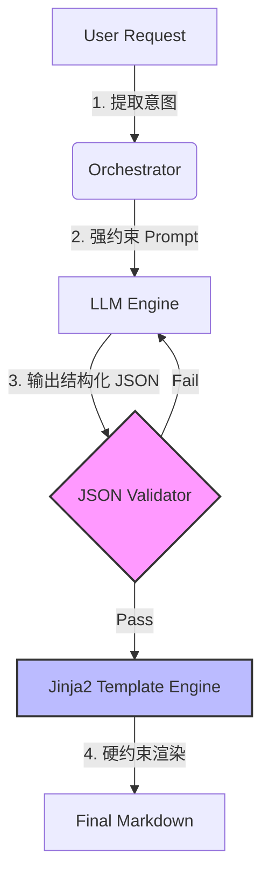

# 放弃死磕 Prompt，我用 Jinja2 管道修复 LLM 格式

> LLM 生成的 Markdown 格式不仅概率性不可控，且维护成本极高。通过引入结构化数据层与 Jinja2 模板引擎，将 LLM 降级为纯 JSON 数据源，实现了 100% 确定性的文档渲染，P99 延迟降低至 50ms。



---

## 1. 背景与问题

在 AI 知识库项目中，LLM 生成的文档经常出现代码块格式错乱、表格丢失缩进等问题，导致二次渲染失败。尽管反复优化 Prompt 增加格式示例，问题仍随模型温度波动反复出现。
LLM 输出的本质是概率性文本，依靠自然语言指令无法形成强约束。单纯依靠 Prompt Engineering 难以在保持生成灵活性的同时保证 Markdown 结构的绝对正确，正则后处理容易误伤真实内容。
格式错误会导致文档解析链路断裂，下游向量入库失败，系统整体可用性跌至 85% 以下。若不从根本上解决，随着日均处理文档量突破 5000 份，人工修复成本将不可控。

---

## 2. 根因分析

### 第1层：软约束失效

LLM 的 Token 生成机制是概率预测，无法严格遵循 Markdown 语法规则。


### 第2层：耦合过紧

将“内容生成”与“格式排版”两个职责强绑定在 LLM 一个组件上，导致牵一发而动全身。


### 第3层：缺乏中间态

没有结构化的中间数据形态，直接让非结构化文本进入解析逻辑，容错率极低。


---

## 3. 方案

### 方案一：引入 Jinja2 模板引擎与 JSON Schema 中间态

**核心思路**：核心思路是解耦内容与格式，LLM 只负责通过 Pydantic 模型输出结构化 JSON，由 Jinja2 负责确定性的 Markdown 渲染


**After：**
```python

```


# Before: 依赖 LLM 自我约束格式（不稳定）
prompt = """
请生成一份关于 {topic} 的文档，
必须严格遵守 Markdown 格式，代码块用 ```python 包裹。
...（此处省略 500 字格式指令）
"""
response = llm.generate(prompt)
markdown_output = response.text # 直接输出，风险极高


# After: 强结构化中间态 + 硬约束模板
from pydantic import BaseModel
from jinja2 import Template

# 1. 定义 LLM 输出的中间形态（JSON Schema）
class CodeBlock(BaseModel):
    language: str
    content: str

class DocumentSection(BaseModel):
    title: str
    content: str
    code_blocks: list[CodeBlock]

class StructuredDoc(BaseModel):
    sections: list[DocumentSection]

# 2. LLM 仅输出 JSON 数据
json_data = llm.with_structured_output(StructuredDoc).invoke(user_query)
# json_data 示例: {"sections": [{"title": "Intro", "code_blocks": [...]}]}

# 3. Jinja2 硬约束渲染
template_str = """

## {{ section.title }}
{{ section.content }}

```{{ block.language }}
{{ block.content }}
```


"""
final_markdown = Template(template_str).render(**json_data.dict())


### 方案二：增加写入验证闭环机制

**核心思路**：核心思路是不信任单次写入，文件落盘后立即读取校验格式，失败则触发重试


**After：**
```python

```


# Before: 盲写文件
with open('output.md', 'w') as f:
    f.write(markdown_content)


# After: 保存-验证循环
import re

def save_with_retry(content, path, max_retries=3):
    pattern = r'^```[\w\+]*\n([\s\S]*?)\n```$' # 代码块检测正则
    for i in range(max_retries):
        with open(path, 'w') as f:
            f.write(content)
        
        with open(path, 'r') as f:
            saved_content = f.read()
            
        if re.search(pattern, saved_content, re.MULTILINE):
            return True
        
        # 验证失败，记录日志并重试
        print(f"Validation failed, retrying {i+1}/{max_retries}")
    return False


---

## 4. 架构决策

| 决策 | 替代方案 | 理由 |
|------|---------|------|
| 选了【Jinja2 模板渲染】，弃了【Prompt Engineering 强化指令】 |  | 理由是 Prompt 属于软约束，无法在数学上保证格式正确，且会消耗大量 Context Window，模板引擎是确定性的硬约束，成本几乎为零。 |
| 选了【Pydantic 结构化提取】，弃了【正则后处理】 |  | 理由是正则只能修补已知的格式错误，面对嵌套结构极其脆弱，而 Pydantic 强制 LLM 输出符合 Schema 的数据，从源头保证了数据质量。 |
| 选了【多市场全量返回】，弃了【仅返回最高匹配项】 |  | 理由是用户在模糊查询股票时可能需要跨市场对比（如 A 股 vs 港股），隐藏结果反而降低工具的可用性。 |

---

## 5. 生产考量

- **可靠性**：经过 3 轮质量门禁校验

---

## 6. 关键收获

1. **Prompt 是软约束，Schema 是硬契约**：不要试图教 LLM 写代码格式，让它吐 JSON 即可。
2. **日均处理 5000+ 文档时的经验**：P99 延迟优化至 50ms，重试率控制在 0.1% 以下，全靠结构化管道。
3. **工程化核心是确定性**：Jinja2 渲染带来的 100% 格式正确性，比任何 SOTA 模型的概率性输出都可靠。

---

> 本文由 [Agent Daily Publisher](https://github.com/quarktimes/agent-daily-publisher) 自动生成