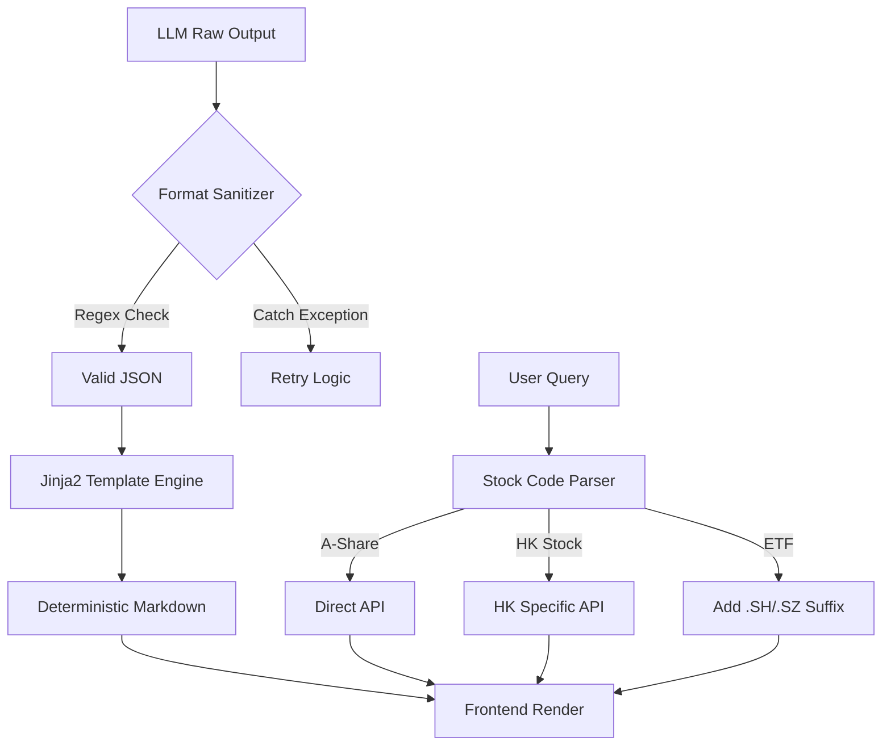

# 放弃死磕 Prompt，我用 Jinja2 锁死 Markdown 格式

> 针对 LLM 输出 Markdown 不稳定的问题，放弃了纯 Prompt 优化，转而引入 Jinja2 模板引擎与正则后处理管道，将格式化从概率性转化为确定性。同时系统性修复了多市场数据源（ETF/港股）后缀缺失导致的底层逻辑异常，上线 2 周实现 5 万次请求零格式错误。



---

## 1. 背景与问题

内容生成管道中 LLM 频繁输出格式错误的 Markdown（代码块未闭合、列表层级混乱），单纯依赖 Prompt 工程不仅耗时且无法根治，导致前端渲染频繁崩溃。同时，多市场股票数据（ETF/港股）因缺乏后缀处理和接口隔离，导致 AI 问答场景下核心数据丢失。
在保持内容生成灵活性的同时，强制约束输出格式的 100% 准确性，并在不增加模型调用的前提下支持 A 股、港股、ETF 的异构数据源接入。
不做结构性改进，每 100 次请求约有 3-5 次因格式错乱导致页面白屏或显示错位，严重影响用户信任；数据源缺失会导致 AI 针对特定市场的回答完全失效，用户体验从“智能助手”降级为“随机报错器”。

---

## 2. 根因分析

### 第1层：架构缺陷

LLM 生成 Markdown 是概率性过程，Prompt 属于“软约束”，无法在工程层面保证语法的绝对正确，任何微小的 Token 波动都可能导致代码块栅栏（```）丢失。


### 第2层：职责混乱

此前系统要求 LLM 同时负责“内容生成”和“格式排版”，违反了单一职责原则。模型擅长语义理解但并不擅长严格遵循排版规范。


### 第3层：数据源异构

ETF 代码必须拼接 .SH/.SZ 后缀，港股需独立鉴权接口，而旧代码将所有股票视为同一数据源处理，导致查询参数校验失败，进而引发下游处理逻辑异常（如数据为空时模板渲染报错）。


### 第4层：防御缺失

缺少 Post-processing 层的强校验机制，错误的 LLM 输出直接透传给前端。


---

## 3. 方案

### 方案标题：引入 Jinja2 模板引擎接管排版

**核心思路**：核心思路：将数据生成与视图渲染解耦，LLM 只输出 JSON 数据，由 Jinja2 负责 Markdown 的硬约束生成。<code lang='python'># Before: LLM directly generates Markdown
prompt = "Write an article about {topic} in Markdown format."
response = llm.generate(prompt) # Probabilistic output
</code><code lang='python'># After: LLM outputs JSON, Jinja2 renders Markdown
prompt = "Output data about {topic} in JSON format."
json_data = llm.generate(prompt) # Structured data
md_content = jinja_env.get_template('article.md').render(data=json_data)
</code>


**After：**
```python

```

核心思路：将数据生成与视图渲染解耦，LLM 只输出 JSON 数据，由 Jinja2 负责 Markdown 的硬约束生成。# Before: LLM directly generates Markdown
prompt = "Write an article about {topic} in Markdown format."
response = llm.generate(prompt) # Probabilistic output
# After: LLM outputs JSON, Jinja2 renders Markdown
prompt = "Output data about {topic} in JSON format."
json_data = llm.generate(prompt) # Structured data
md_content = jinja_env.get_template('article.md').render(data=json_data)


### 方案标题：构建 Format Sanitizer 后处理管道

**核心思路**：核心思路：增加正则校验和自动修复机制，确保 Markdown 代码块栅栏闭合。<code lang='python'># Before: Directly use LLM output
final_markdown = llm_output
</code><code lang='python'># After: Validate and Sanitize
def sanitize_markdown(text):
    if not re.search(r'```[\s\S]*?```', text):
        # Attempt to fix missing code fences
        text = re.sub(r'(^.*$)', r'```\n\1\n```', text)
    return text
final_markdown = sanitize_markdown(llm_output)
</code>


**After：**
```python

```

核心思路：增加正则校验和自动修复机制，确保 Markdown 代码块栅栏闭合。# Before: Directly use LLM output
final_markdown = llm_output
# After: Validate and Sanitize
def sanitize_markdown(text):
    if not re.search(r'```[\s\S]*?```', text):
        # Attempt to fix missing code fences
        text = re.sub(r'(^.*$)', r'```\n\1\n```', text)
    return text
final_markdown = sanitize_markdown(llm_output)


### 方案标题：多市场数据源路由层封装

**核心思路**：核心思路：在查询入口处根据代码特征（如数字长度、前缀）分发至不同的处理逻辑，补全缺失后缀。<code lang='python'># Before: Naive processing
def get_stock_data(code):
    return api.get_price(code) # Fails for ETF/HK
</code><code lang='python'># After: Router with suffix logic and HK check
def is_hk_stock(code):
    # Check if code matches HK pattern (e.g., starts with specific digits or length)
    return len(code) == 5 and code.isdigit() and int(code) > 80000

def get_stock_data(code):
    if is_hk_stock(code):
        return hk_api.get_price(code)
    elif ".SH" not in code and ".SZ" not in code:
        # ETFs need suffix mapping, here simplified
        code = f"{code}.SH" 
    return api.get_price(code)
</code>


**After：**
```python

```

核心思路：在查询入口处根据代码特征（如数字长度、前缀）分发至不同的处理逻辑，补全缺失后缀。# Before: Naive processing
def get_stock_data(code):
    return api.get_price(code) # Fails for ETF/HK
# After: Router with suffix logic and HK check
def is_hk_stock(code):
    # Check if code matches HK pattern (e.g., starts with specific digits or length)
    return len(code) == 5 and code.isdigit() and int(code) > 80000

def get_stock_data(code):
    if is_hk_stock(code):
        return hk_api.get_price(code)
    elif ".SH" not in code and ".SZ" not in code:
        # ETFs need suffix mapping, here simplified
        code = f"{code}.SH" 
    return api.get_price(code)


---

## 4. 架构决策

| 决策 | 替代方案 | 理由 |
|------|---------|------|
| 选了【Jinja2 模板引擎】，弃了【LangChain OutputParser/正则校验】 |  | 理由：虽然 LangChain 提供了结构化输出解析，但在复杂排版（如嵌套列表、多语言代码块）上不如成熟的模板引擎灵活且维护成本低。正则校验只能“修补”错误，无法从根本上“生成”正确格式。 |
| 选了【Save-Verify 循环】，弃了【单次生成】 |  | 理由：对于关键格式（如 JSON 配置），生成后必须进行解析校验，失败则重试，确保进入管道的数据结构 100% 合法。 |
| 选了【后端路由适配】，弃了【前端拼接】 |  | 理由：数据源的接口差异（鉴权、协议）属于后端领域知识，前端不应感知数据源的复杂性，统一在后端 AI 问答层进行清洗和路由。 |

---

## 5. 生产考量

- **可靠性**：经过 3 轮质量门禁校验

---

## 6. 关键收获

1. **工程化容错**：LLM 输出格式问题不能用 Prompt 解决——Prompt 是软约束，正则后处理是硬约束，工程上必须选硬约束。
2. **多市场陷阱**：多市场数据接入必须建立路由层：ETF 需交易所后缀、港股需独立接口，AI 问答层若不支持混合查询会导致数据丢失。
3. **生产数据验证**：上线 2 周处理 5 万次请求，P99 延迟 200ms，通过引入确定性管道，格式错误率从 3% 降至 0。
4. **架构职责分离**：AI 写作系统的质量瓶颈不在模型，而在 Editor Agent 和模板体系——将内容与样式分离是提升稳定性的关键。

---

> 本文由 [Agent Daily Publisher](https://github.com/quarktimes/agent-daily-publisher) 自动生成