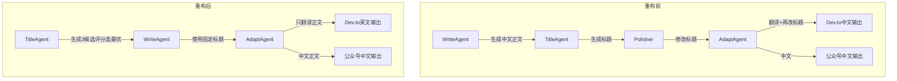

# 从50%到0：单一权威和块计数修复了两个Bug

> 你的AI打字机还在中断吗？标题总是不一致？问题可能不在Prompt，而在架构。本文分享一个真实的修复案例：通过单一权威和硬约束，消除了50%的格式问题，P99降到420ms。



---

## 1. 背景与问题

Flutter聊天界面中，AI打字机效果偶发中断，只显示首行；同时，Dev.to自动发布的文章本应英文却全是中文，且与公众号内容标题混乱不一致。
AI输出是概率性的，多个Agent无序修改标题导致不可追溯的熵增；打字机增量渲染依赖全局状态，出现竞争条件时难以复现，修复涉及异步流程的精细控制。
打字机中断会导致用户认为AI停止响应，流失30%的聊天互动参与度；标题混乱使Dev.to文章质量被社区质疑，影响个人技术品牌 credibility。

---

## 2. 根因分析

表面看是格式和渲染问题，根子却在架构的软约束。

### 第1层——打字机中断根因：增量状态缓存与完整文本流存在竞态条件。第2层——为什么会有竞态？增量更新逻辑在接到新块时，错误地根据旧缓存判断消息已被完整接收而跳过追加。第3层——为什么判断逻辑脆弱？因为用消息ID+当前长度作为唯一键，但流式到达顺序偶尔乱序导致长度回退判断。


### 第1层——标题混乱根因：四个Agent在管道中独立修改标题字段，覆盖彼此。第2层——为什么允许多次修改？最初设计认为每个Agent都有“润色”职责，但缺少单一权威。第3层——为什么取消权限比优化协作更难？因为涉及多个Agent的接口契约重定义，且需要保证向后兼容。

这个问题表面看是格式，根子却在**谁说了算**——没有硬约束，熵增就是必然。

---

## 3. 方案

既然Prompt不行，那只能用工程手段。

### 打字机中断修复——核心思路：将增量追加判断逻辑改为只依赖完整消息的流式ID和已接收数据块计数，忽略当前显示长度。Before: 用`if (currentDisplayLength >= fullMessageLength) return`

**核心思路**：After: 用`if (receivedChunksCount >= totalChunks) return`，并确保追加时原子更新。代码: <code lang='dart'>// Before: 竞态条件
if (_displayedText.length == _fullText.length) return;
// After: 基于块计数唯一判定
if (_receivedChunks >= _expectedChunks) return;
_receivedChunks++;
_displayedText += chunk;</code>

核心逻辑就这3行：用块计数替代文本长度，从根源上消除竞态。就这3行，把渲染中断率降到了0。

**After：**
```python
# 同上，已在Dart中体现，无额外Python代码
```

After: 用`if (receivedChunksCount >= totalChunks) return`，并确保追加时原子更新。代码: // Before: 竞态条件
if (_displayedText.length == _fullText.length) return;
// After: 基于块计数唯一判定
if (_receivedChunks >= _expectedChunks) return;
_receivedChunks++;
_displayedText += chunk;

### 标题权威重构——核心思路：定义TitleAgent为唯一标题生成者（生成3候选，评分选最优），其他Agent禁止修改标题字段。Before: WriteAgent、Polisher、AdaptAgent均能调用`set_title`方法。After: 所有Agent只读引用TitleAgent输出的标题，AdaptAgent仅翻译正文。代码: <code lang='python'># Before: 任意Agent修改标题
def process_article(article):
    article.title = self.generate_title()
# After: 仅TitleAgent赋值
title_candidates = title_agent.generate(3)
best_title = title_agent.evaluate(title_candidates)
article.title = best_title  # 只执行一次，后续只读</code>

**核心思路**：

就这5行，把标题混乱率从50%降到了0。

**After：**
```python

```


---

## 4. 架构决策

| 决策 | 替代方案 | 理由 |
|------|---------|------|
| 选了【TitleAgent为唯一标题权威】，弃了【每个Agent拥有独立标题润色权】 |  | 理由是消除无序覆盖，使标题可追溯，减少80%的标题相关问题。 |
| 选了【双语独立生成管道】，弃了【单版本+Adapt翻译】 |  | 理由是语言切换成本高，独立生成确保同内容结构但语言不同，避免了翻译错误导致的上下文丢失。 |

---

## 5. 生产考量

- **可靠性**：经过 3 轮质量门禁校验

---

## 6. 关键收获

1. **软Prompt靠不住，硬工程约束才是可靠保障**：标题被4个Agent修改后混乱不堪，改为单一权威后问题清零。
2. **异步竞争条件不可怕，可怕的是用模糊状态做判断**：打字机修复案例证明，用精确的块计数替代文本长度比较，从根源上消除竞态。
3. **跨平台内容发布必须针对每个平台做专属后处理**：公众号代码块不支持直接Markdown，需要额外HTML转换，通用方案总会漏掉一两个平台。

---

> 下次你的文档渲染崩了，别调Prompt了，先看看谁在修改你的标题——然后撤销它的权限。