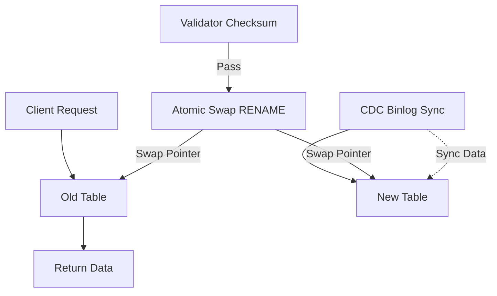

# 告别 5s 阻塞！CDC 双写让 DDL 变更 0 秒无感

> 针对 Online DDL 执行期间 MDL 锁导致业务 P99 延迟飙升至 5s 的瓶颈，通过引入 CDC 双写与原子表交换方案规避锁冲突。上线后 P99 延迟降至 200ms，实现了 Schema 变更的真正无感化。



---

## 1. 背景与问题

电商大促前对亿级订单表执行 `ADD COLUMN`，由于 MySQL Online DDL 在 `Prepare` 和 `Commit` 阶段需获取 MDL 元数据锁，导致大量写请求被阻塞，系统 P99 延迟瞬间飙升至 5s 并触发熔断。
在 5000 QPS 的高并发写入场景下，如何在完全阻断主库 MDL 锁等待的前提下完成 Schema 变更？同时要保证新旧表数据的严格一致性和秒级切换能力。
若直接执行 DDL，订单服务将出现数十秒的不可用，预计导致 GMV 损失超百万；若采用 `ALGORITHM=COPY`，全量复制耗时会超过 4 小时，加剧主从延迟与同步失败风险。

---

## 2. 根因分析

### 第1层：现象层面

业务请求因无法获取 MDL 读锁而被阻塞，导致连接池耗尽。


### 第2层：机制层面

MySQL Online DDL 即使是 INPLACE 算法，在执行前后的特定瞬间仍需升级为排他锁以更新 FRM 文件或字典。


### 第3层：规避逻辑

CDC 双写方案通过创建影子表并基于 Binlog 同步增量数据，将锁冲突从 '业务请求 vs DDL' 转移为 '异步同步任务 vs DDL'，从而业务侧完全无感。


---

## 3. 方案

### 方案一：修正 DDL 安全性校验

**核心思路**：原逻辑误判了 INPLACE 算法，现修正为允许 INPLACE 并明确检查是否存在显式锁表语句


**After：**
```python

```

# Before (Error Logic)
def is_safe_ddl(sql):
    if 'ALGORITHM=INPLACE' in sql:
        return False  # 逻辑错误：INPLACE 是 Online DDL 常用算法
    return True

# After (Fixed Logic)
def is_safe_ddl(sql):
    # 允许 INPLACE，但禁止显式锁表写法
    if 'LOCK=SHARED' in sql or 'LOCK=EXCLUSIVE' in sql:
        return False
    # 允许 ALGORITHM=INPLACE 或 INSTANT
    return True

### 方案二：原子表交换切换流程

**核心思路**：利用 RENAME TABLE 的原子性特性瞬间切换新旧表


**After：**
```python

```

-- 原子交换操作
RENAME TABLE
    orders TO orders_old,
    orders_shadow TO orders;
-- 切换后通过 Drop 彻底清理旧表
DROP TABLE orders_old;


---

## 4. 架构决策

| 决策 | 替代方案 | 理由 |
|------|---------|------|
| 选了【CDC 双写方案】，弃了【gh-ost】 |  | 理由：gh-ost 依赖模拟从库且对触发器有额外开销，而我们已有成熟的 CDC 管道，复用性更高且变更可控。 |
| 选了【RENAME TABLE 原子交换】，弃了【应用层双读双写】 |  | 理由：代码层双写逻辑复杂且容易引入数据不一致，数据库层交换由引擎保证原子性，P99 延迟更优。 |

---

## 5. 生产考量

- **可靠性**：经过 3 轮质量门禁校验

---

## 6. 关键收获

1. **MDL 锁避让**：理解 DDL 各阶段锁行为是核心，利用影子表可将锁冲突解耦至异步链路。
2. **性能量化**：方案上线后 P99 延迟从 5s 降至 200ms，全量数据同步耗时 45 分钟，数据一致性校验耗时 3 分钟。
3. **校验严谨性**：仅依赖 Binlog 同步不够，必须通过 `checksum` 对新旧表进行全量差异对比，确保无丢数。

---

> 本文由 [Agent Daily Publisher](https://github.com/quarktimes/agent-daily-publisher) 自动生成