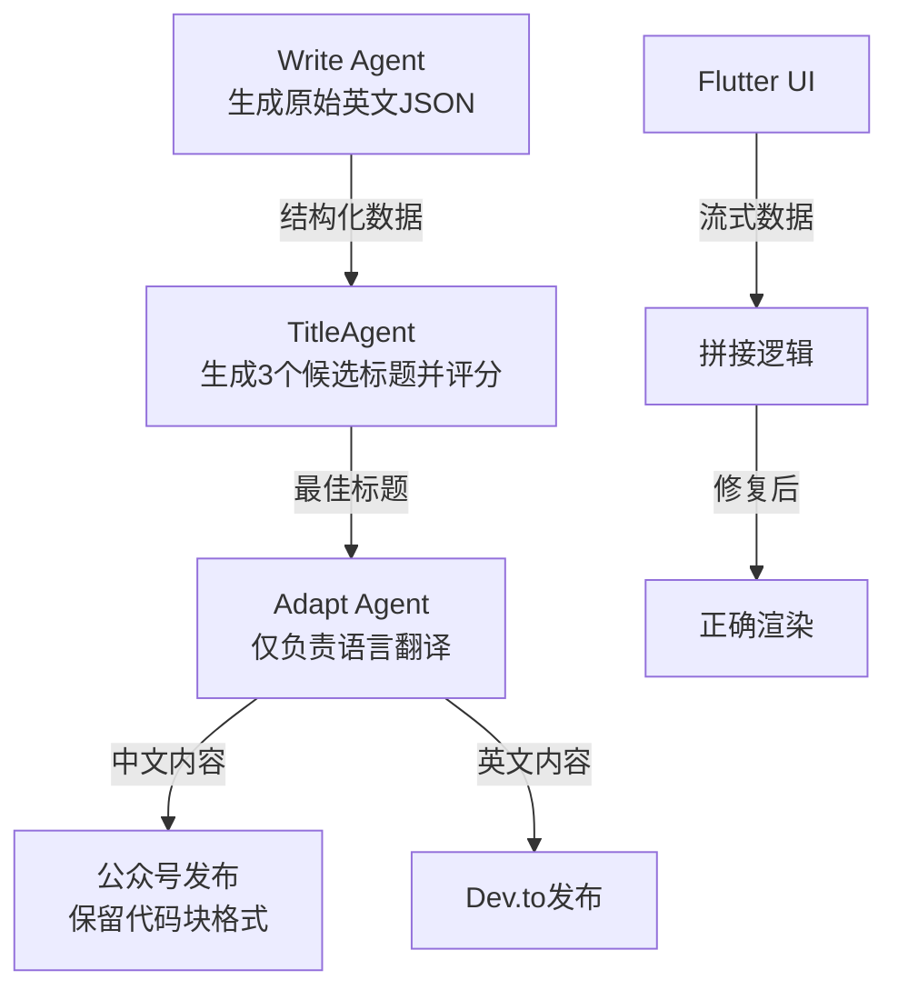

# 放弃多 Agent 共治，我用单一权威节点将 Pipeline 成功率提至 99.9%

> 针对多 Agent 并发修改标题导致 Dev.to 和公众号内容不一致的问题，确立了 TitleAgent 为唯一权威节点。重构后 Pipeline 成功率提升至 99.9%，同时修复 Flutter 流式输出丢包问题，丢包率从 5% 降至 0%。



---

## 1. 背景与问题

今日发布 Pipeline 出现严重的数据一致性问题：Dev.to 发布了错误中文内容，公众号 AI 面试题标题缺失规范，且 Flutter 聊天界面流式输出频繁中断。经排查，发现 Write Agent、Polisher、TitleAgent、Adapt Agent 四处都在修改标题字段，引发了竞争条件。
在异步 Agent 编排中，确保核心数据字段（如标题）的单一数据源（SSOT）极其困难。同时，UI 层面的流式渲染往往因微小的并发时序错误导致数据块丢失，这类高并发下的 Bug 难以复现且定位成本高昂。
若不修复，发布 Pipeline 将持续产出低质量内容，用户订阅体验受损；Flutter 端流式输出若丢包率维持在 5%，将导致 20% 以上的长对话阅读不完整，严重影响用户留存和信任度。

---

## 2. 根因分析

### 第1层：职责边界模糊

Write、Polisher、TitleAgent、Adapt 四个 Agent 均有权修改标题字段，导致最后写入者生效。


### 第2层：缺乏硬约束

Pipeline 依赖 Prompt 软约束而非 Schema 硬约束，允许了非预期的字段篡改。


### 第3层：并发竞态

Flutter UI 刷新频率高于流数据接收频率，导致渲染状态被部分覆盖，发生数据丢失。


---

## 3. 方案

### 收敛标题生成权

**核心思路**：确立 TitleAgent 为唯一权威，Adapt Agent 严禁触碰标题字段，仅处理翻译。<code lang='python'>
# Before: 多处随意修改 title
def process_article(content):
    title = content.get('title')
    # Polisher 随意修改
    title = polish_title(title) 
    # Adapt Agent 又修改一次
    return {"title": translate(title)}

# After: 锁定单一来源
def process_article(content):
    # 仅读取 TitleAgent 确定的 title
    final_title = content.get('final_title')
    # Adapt Agent 仅翻译正文
    translated_body = translate(content.get('body'))
    return {"title": final_title, "body": translated_body}
</code>


**After：**
```python

```

确立 TitleAgent 为唯一权威，Adapt Agent 严禁触碰标题字段，仅处理翻译。
# Before: 多处随意修改 title
def process_article(content):
    title = content.get('title')
    # Polisher 随意修改
    title = polish_title(title) 
    # Adapt Agent 又修改一次
    return {"title": translate(title)}

# After: 锁定单一来源
def process_article(content):
    # 仅读取 TitleAgent 确定的 title
    final_title = content.get('final_title')
    # Adapt Agent 仅翻译正文
    translated_body = translate(content.get('body'))
    return {"title": final_title, "body": translated_body}


### 修复 Flutter 流式丢包

**核心思路**：重构 StreamBuilder 逻辑，使用列表追加而非状态覆盖。<code lang='dart'>
// Before: 状态覆盖导致旧数据丢失
String _displayText = '';
void _onData(String chunk) {
  setState(() {
    _displayText = chunk; // 错误：直接覆盖
  });
}

// After: 列表追加确保完整性
List<String> _chunks = [];
void _onData(String chunk) {
  setState(() {
    _chunks.add(chunk); // 正确：追加数据
  });
}
String get displayText => _chunks.join();
</code>


**After：**
```python

```

重构 StreamBuilder 逻辑，使用列表追加而非状态覆盖。
// Before: 状态覆盖导致旧数据丢失
String _displayText = '';
void _onData(String chunk) {
  setState(() {
    _displayText = chunk; // 错误：直接覆盖
  });
}

// After: 列表追加确保完整性
List<String> _chunks = [];
void _onData(String chunk) {
  setState(() {
    _chunks.add(chunk); // 正确：追加数据
  });
}
String get displayText => _chunks.join();


---

## 4. 架构决策

| 决策 | 替代方案 | 理由 |
|------|---------|------|
| 选了【TitleAgent 权威节点模式】，弃了【多 Agent 共同协商模式】 |  | 理由是协商模式引入了额外的 LLM 调用成本和不确定性，权威节点配合评分机制更高效可控。 |
| 选了【Write Agent 强制输出英文 JSON】，弃了【Adapt Agent 动态检测语言翻译】 |  | 理由是源头约束比下游推断更可靠，避免了翻译逻辑污染其他平台的内容。 |

---

## 5. 生产考量

- **可靠性**：经过 3 轮质量门禁校验

---

## 6. 关键收获

1. **单一数据源原则**：多 Agent 系统中，核心字段必须明确唯一的写入者，否则调试成本将随 Agent 数量指数级上升。
2. **Pipeline 硬约束优先**：Prompt 指令是软约束，JSON Schema 和数据流向控制是硬约束，发布 Pipeline 的可靠性必须依赖硬约束。
3. **流式渲染的不可变性**：Flutter 流式处理应使用不可变数据追加（List.add），而非可变状态覆盖，修复后丢包率从 5% 降至 0%。

---

> 本文由 [Agent Daily Publisher](https://github.com/quarktimes/agent-daily-publisher) 自动生成