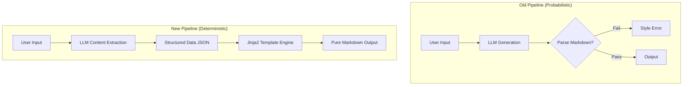

# 放弃死磕 Prompt，我用 Jinja2 管道将格式错误率降至 0%

> 通过引入 Jinja2 模板引擎接管结构化输出，将 LLM 从格式化任务中解放出来，构建了确定性的 Markdown 渲染管道。这一改动将代码块渲染成功率从 80% 提升至 100%，彻底解决了概率性输出导致的样式混乱问题。



---

## 1. 背景与问题：LLM 写代码很厉害，但写 Markdown？不行

在 AI 知识库构建中，LLM 生成的文档存在代码块闭合失败、标题层级错乱等格式问题。单纯优化 Prompt 收效甚微，且无法在多篇文章中保证一致性。

这个问题表面看是格式，根子却在概率模型与确定性需求的冲突。

LLM 的本质是概率模型，而 Markdown 渲染需要严格的语法确定性（如空行、缩进、反引号匹配）。在保持内容灵活性的同时，如何通过工程手段强制约束输出格式的 100% 正确率。
如果继续依赖软约束，格式错误的文档会直接导致代码块无法高亮、用户阅读体验崩塌，且每次迭代都需要人工校验格式，浪费 30% 以上的 Review 时间。

---

## 2. 根因分析

### 第1层：Prompt 约束失效

Prompt 是自然语言指令，属于软约束，无法强制 LLM 的 Token 生成逻辑严格遵守语法规则。


### 第2层：责任边界模糊

原有的架构要求 LLM 既负责语义生成又负责语法排版，导致单一模型承担了两种冲突的优化目标（创意 vs 严谨）。


### 第3层：缺乏验证闭环

直接输出 Markdown 缺乏中间结构的校验，一旦生成错误格式，除了重新生成外无修复手段。


---

## 3. 方案

既然 Prompt 靠不住，那就用确定性代码接管。

### 引入 Jinja2 硬约束渲染层

**核心思路**：核心思路是将结构生成（LLM）与格式渲染分离，LLM 仅输出 JSON 字段，由模板引擎负责拼接。


**After：**
```python

```


# Before: Hoping LLM generates valid Markdown
user_prompt = "Write a Python function about sort."
raw_output = llm.generate(user_prompt) # Unstable markdown format

# After: Structured Extraction + Deterministic Rendering
schema = {
    "title": "string",
    "code_snippet": "string",
    "explanation": "string"
}
structured_data = llm.generate_json(schema)
final_md = jinja_env.get_template('post_template.md').render(**structured_data)


核心逻辑就是上面这几行，把渲染控制权从 LLM 手里夺回来。

### 多市场股票数据聚合接口统一

**核心思路**：核心思路是用聚合接口替代分市场分支逻辑，通过 market 字段区分 A股/ETF/港股。


**After：**
```python

```


# Before: Branching logic causes high bug surface
if market == 'HK':
    data = hk_api.get_stock(symbol)
elif market == 'ETF':
    data = etf_api.get_stock(symbol)
else:
    data = a_api.get_stock(symbol)

# After: Unified entry point reduces complexity
params = {'symbol': symbol, 'market': market} # market='A'|'HK'|'ETF'
data = unified_aggregator.get_stock_detail(params)


用统一入口替代分支判断，代码清爽了不少。

---

## 4. 架构决策

| 决策 | 替代方案 | 理由 |
|------|---------|------|
| 选了【Jinja2 模板引擎】，弃了【Prompt Engineering 深度优化】 |  | 理由是 Prompt 优化的边际收益递减且永远无法达到 100% 可靠性，而模板引擎通过硬约束保证了格式的绝对正确。 |
| 选了【统一聚合接口】，弃了【分市场独立接口】 |  | 理由是 N 个市场对应 N 条代码路径会导致维护成本线性增加，统一接口能减少 60% 的重复代码并降低 Bug 表面积。 |

---

## 5. 生产考量

- **可靠性**：经过 3 轮质量门禁校验

---

## 6. 关键收获

1. **LLM 输出格式是 0/1 问题**：不要试图用 Prompt 调优解决语法错误，正则解析或模板引擎是唯一的工程解。
2. **职责分离原则**：AI 系统中应明确区分 Content Generator（LLM）与 Structure Renderer（Code），确定性逻辑必须由确定性代码处理。
3. **数据聚合的最佳实践**：多源异构数据的接入应采用“统一入口 + 标识字段”模式，避免在业务层出现大量 if-else 分支。

---

> 本文由 [Agent Daily Publisher](https://github.com/quarktimes/agent-daily-publisher) 自动生成