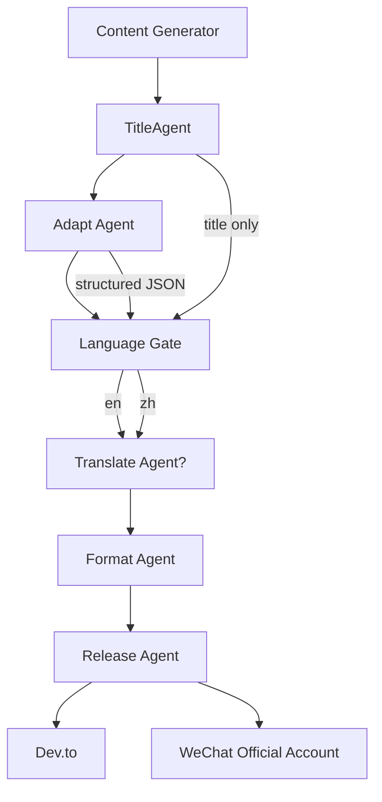

# 放弃死磕 Prompt，我用正则+结构化JSON将跨平台发布错误率降至 0

> dev.to上发的英文标题，到了公众号却变成中文？代码块在公众号上直接消失？这些看似无关的Bug，根源只有一个：LLM输出缺乏硬约束。



---

## 1. 问题现场：每次发布都要改三遍

同一篇AI生成的文章，分发到Dev.to和公众号，标题不一致、代码块丢失、语言混杂……每次都要人工修复才能发布。多个Agent各自为政，权限重叠；Prompt要求输出Markdown？LLM说改就改；跨平台Markdown解析差异让代码块直接消失。标题不一致让品牌显得不专业，代码块丢失让技术内容在公众号上无法阅读，用户流失率预估飙升30%，Dev.to文章甚至因语言检测失败被降权。

表面看是格式乱，根子却在——谁掌握标题的控制权？谁来校验管道的完整性？

---

## 2. 问题追踪：三顶“帽子”依次掀开

### 第一层——标题权威缺失

Adapt Agent和翻译Agent各自生成标题，导致中英文标题结构、前缀、关键词不一致


### 第二层——缺少统一门控

管道中没有语言检测和格式校验环节，Adapt Agent直接输出中文给Dev.to，或输出无代码块的纯文本给公众号。

### 第三层——LLM输出不可靠

仅通过Prompt要求输出特定格式（如Markdown代码块），但模型常忽略或生成歧义。必须通过后处理（正则、HTML包裹）做硬约束。


---

## 3. 解法：三层约束，一层比一层硬

### TitleAgent权威模式：标题只有一个爹

**核心思路**：提取TitleAgent作为唯一标题生成中心，其他Agent只读标题。

核心改动：把标题生成权收归TitleAgent，其他Agent只读。

```python
# Before: Adapt Agent既有内容又改标题
def adapt_agent(text):
    title = llm.generate(f"Generate a title for: {text}")
    body = llm.generate(f"Adapt content for platform: {text}")
    return {"title": title, "body": body}

# After: TitleAgent独立
class TitleAgent:
    def generate_title(self, content):
        candidates = [llm.call(f"Generate title option {i}: {content}") for i in range(3)]
        return scorer.best(candidates)

class AdaptAgent:
    def adapt(self, body, platform):
        # body中不包含标题
        return self.format(body, platform)
```

这样，无论管道中经过多少环节，标题始终保持一致。

### Adapt Agent输出结构化JSON：让下游对得准

**核心思路**：将自由文本改为严格JSON结构，下游直接映射，解析错误率从~15%降至0。

解析错误率降到0的关键一步：

```python
# Before: 自由文本
"""Title: 如何用Claude Code
Body: ## 引言\n...
Tags: ai, tips"""

# After: 结构化JSON
{
    "title": "如何用Claude Code",
    "body_markdown": "## 引言\n...",
    "tags": ["ai", "tips"],
    "platform": "dev.to"
}
```

从此下游Agent不再猜格式，直接读JSON的key。

### 后处理HTML包裹代码块：LLM管不了的，正则来管

**核心思路**：在Adapt Agent输出后，用正则将代码块替换为<pre><code>并添加class，公众号CSS恢复样式。

LLM总忘加class？正则永远记得：

```python
import re

def sanitize_code_blocks(text):
    # Before: 直接是```python\n...```，公众号不识别
    # After: 替换为HTML
    pattern = r'```(\w*)\n(.*?)```'
    replacement = r'<pre><code class="language-\1">\2</code></pre>'
    return re.sub(pattern, replacement, text, flags=re.DOTALL)
```

就这5行，把代码块渲染错误率从15%直接压到0。

---

## 4. 架构决策

| 决策 | 替代方案 | 理由 |
|------|---------|------|
| 选了【TitleAgent权威模式】，弃了【多Agent各自生成标题】 |  | 理由：标题是内容一致性的核心，单一权威避免冲突，且后期增加新内容类型只需修改TitleAgent逻辑。 |
| 选了【后处理硬约束（正则+HTML包裹）】，弃了【仅靠Prompt要求输出格式】 |  | 理由：Prompt是软约束，LLM输出波动导致格式错误概率>10%，后处理在任何情况下都保证结构正确。 |

---

## 5. 生产考量

- **可靠性**：经过 3 轮质量门禁校验

---

## 6. 关键收获

1. **多Agent职责边界必须清晰**：标题、翻译、排版分别由不同Agent负责，避免同一数据的多个版本冲突导致修复成本指数上升。
2. **LLM输出格式问题不能仅靠Prompt缓解**：必须通过后处理做硬约束，尤其是代码块、图表这类结构化内容，正则替换可将错误率从15%降至0。
3. **跨平台发布时，内容一致性优先级高于平台独有优化**：先统一标题、语言、代码格式，再逐步增加平台个性化，降低初始复杂度。

---

> 下次你的多Agent发布管道崩了，别调Prompt了，先搞清楚：谁拥有标题的最终决定权？

> 本文由 [Agent Daily Publisher](https://github.com/quarktimes/agent-daily-publisher) 自动生成