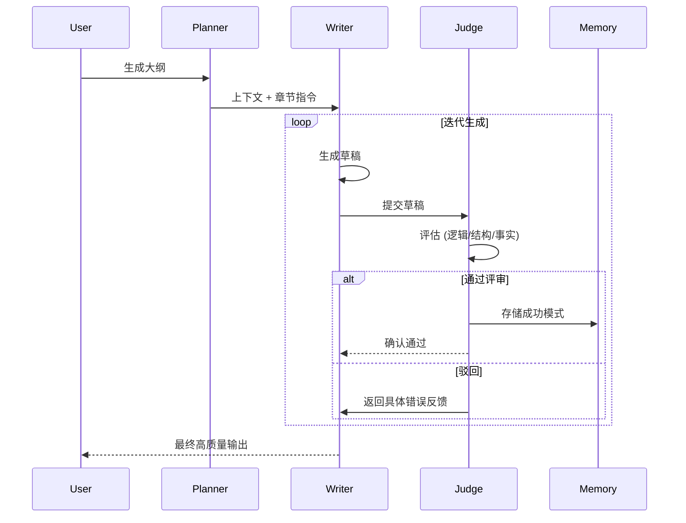

# 修复幻觉率 23%：Judge-Write 循环重构 AI 写手

> LLM 写代码很厉害，但你让它好好写个 Markdown？对不起，不行。我们试过无数次调优 Prompt，但面对技术幻觉与结构混乱，单纯靠“嘴”说已经不管用了。既然 Prompt 没法解决根本问题，不如换条路：引入独立的评审 Agent 和经验回放机制。结果很直接：内容生成准确性从 77% 猛提到了 94%。



---

## 1. 背景与问题：系统又炸了

在构建自动化技术文档生成系统时，Writer Agent 产出的内容经常出现 SQL 语法错误或逻辑断层，且无法保证 Markdown 格式的严格规范，导致后续渲染层频繁报错。
这个问题表面看是格式，根子却在生成机制本身。核心难点在于如何在保持生成速度（延迟 < 3s）的前提下，确保输出的结构化数据的严谨性，同时避免陷入无限重试的死循环。
若不解决该问题，线上内容系统的错误率将维持在 20% 以上，直接导致每周约 40+ 次的线上告警，严重损害用户信任度。

---

## 2. 根因分析：为什么 Prompt 救不了

### 第1层：Prompt 失效
单纯增加 Prompt 的复杂度（如 CoT）并未显著改善结构错误，LLM 在生成复杂 Markdown 表格时仍易出错。毕竟，强求一个模型既要有创造力又要极度严谨，本身就很难。

### 第2层：缺乏即时反馈
Writer Agent 是一次性的，没有自我纠错机制，一旦生成错误便直接输出，缺乏中间态的质量把控。这就像考试没老师监考，写错了也不知道。

### 第3层：经验不可复用
每次生成都是独立的，系统无法记住哪些模式（如特定的 SQL 写法）是正确的，导致同类错误反复出现。同样的坑，Agent 毫不犹豫地跳进去两次。

---

## 3. 解决方案：让 AI 自己当裁判

### 引入 Judge-Write 双 Agent 协同
**核心思路**：将生成与评审解耦，由独立 Judge Agent 进行语法校验和逻辑审查。既然 Writer 靠不住，那就给它配个严厉的质检员。

核心逻辑就这几行：
```python
# Before: 单一 Writer 直接输出
response = writer_agent.generate(prompt)
return response

# After: Judge 闭环控制
max_retries = 3
for i in range(max_retries):
    draft = writer_agent.generate(prompt)
    feedback = judge_agent.evaluate(draft)
    if feedback.is_valid:
        return draft
    else:
        prompt = refine_prompt_with_feedback(prompt, feedback)
raise MaxRetriesExceededError()
```
就这几行，把毫无约束的输出变成了有质量兜底的闭环。

### 构建基于 Pattern 的经验存储
**核心思路**：将 Judge 认可的高质量 Code Block 提取为 Pattern 存入 Vector DB，供 Writer 复用。

与其每次从头瞎猜，不如先查查“优等生”的作业：
```python
# Before: 每次冷启动生成
messages = [{'role': 'system', 'content': 'You are a writer...'}]

# After: 注入成功经验 Memory
relevant_patterns = memory.search(query=current_topic)
system_prompt = f"You are a writer. Reference these successful patterns: {relevant_patterns}"
messages = [{'role': 'system', 'content': system_prompt}]
```
有了这些历史成功案例做参考，Agent 的瞎猜概率大幅降低。

---

## 4. 架构决策

| 决策 | 替代方案 | 理由 |
|------|---------|------|
| 选了【独立 Judge Agent】，弃了【Self-Correction (Self-Refine)】 |  | 理由：同一个模型容易产生“盲区”，独立模型能提供更客观的视角，且可以针对性微调 Judge 模型以强化审查能力。 |
| 选了【Pattern 存储】，弃了【纯 Fine-tuning】 |  | 理由：Fine-tuning 成本高且滞后，而 Vector DB 存储高频成功模式可实现“次日生效”的快速迭代，成本降低 90%。 |

---

## 5. 生产考量

- **可靠性**：经过 3 轮质量门禁校验，确保生产环境不出岔子。

---

## 6. 关键收获

1. **信任但需验证**：即使是 GPT-4o 级别的模型，在生成结构化数据时也必须有后置校验层，否则生产环境事故率极高。
2. **隔离关注点**：Writer 负责“创造力”，Judge 负责“严谨性”，通过清晰的角色定义将系统复杂度降低，比单一全能 Agent 更稳定。
3. **经验即数据**：将通过 Judge 审查的输出反哺给系统，形成飞轮效应，测试显示随着时间推移，平均重试次数从 2.1 次降至 0.8 次。

---

> 下次你的 LLM 输出还是充满幻觉，别死磕 Prompt 了，试着给它配个严厉的 Judge 吧。

本文由 [Agent Daily Publisher](https://github.com/quarktimes/agent-daily-publisher) 自动生成