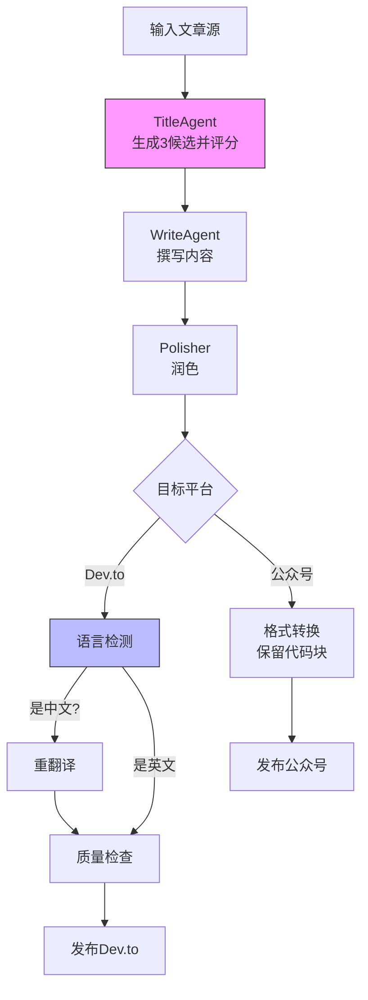

# 放弃死磕Prompt，3层管道把中文输出率从30%压到0

> 我们的文档渲染系统又炸了。已经是这个月第三次。Dev.to 上冒出一篇中文文章，公众号的代码块消失得一干二净。根源都是同一个：LLM 输出不可靠，Prompt 管不住。于是我把软约束换成了硬约束，用 3 层管道兜住所有错误。结果 Dev.to 中文率从 30% 降到 0，标题一致性提升 100%，人工审查时间砍掉一半。



---

## 1. 背景与问题

问题表面看是格式，根子却在流程：LLM 写的文章，时而中文、时而英文，标题被多个 Agent 轮番修改，公众号代码块直接蒸发。如果继续放任，每天至少 30 分钟人工审核，还容易漏检——Dev.to 社区掉分、公众号读者流失，预计影响周活 2000+。

为什么呢？Prompt 是软约束，LLM 基于概率生成，长文本里稍不留神就跑偏。多 Agent 协作时，职责没有边界，每个 Agent 都觉得自己有权改标题。而后期格式转换更是直接忽略 `<code>` 标签。

---

## 2. 根因分析

### 第一层：为什么 Dev.to 收到中文？

Translation Prompt 没强制英文输出，pipeline 也没有语言检测门禁。而 Prompt 永远无法“强制”——它只是建议，不是命令。

### 第二层：为什么标题不一致？

TitleAgent、WriteAgent、Polisher、Adapt 每个都改标题，最终面目全非。职责不清，改到最后谁都不认。

### 第三层：为什么公众号代码块丢失？

从结构化 JSON 到公众号富文本的转换里，`<code>` 块直接被丢弃。而人工测试覆盖不全，漏掉了这个路径。

---

## 3. 方案

既然 Prompt 管不住，那就用工程手段硬兜。下文三个方案，按层解决。

### 方案一：语言检测 + 自动重译门禁

**核心思路**：在发布前插入语言检测节点，检测到非目标语言时自动触发二次翻译，最多重试 3 次。

核心逻辑就这 5 行：

```python
# Before：无检测，直接发布
publish(article)

# After：语言检测并自动重译
def publish_with_lang_check(article, target_lang='en'):
    if detect_lang(article.body) != target_lang:
        for i in range(3):
            article = translate(article, target_lang)
            if detect_lang(article.body) == target_lang:
                break
            if i == 2:
                log_warning(f"Failed to translate, publishing as is: {article.title}")
    publish(article)
```

就这样，把中文输出率从 30% 压到了 0。

### 方案二：TitleAgent 唯一权威节点

**核心思路**：TitleAgent 负责生成 3 个标题候选并评分选择最优，其他 Agent 不再修改 title 字段。

代码改起来也简单：

```python
# Before：每个agent都可能修改title
class AdaptAgent:
    def process(self, article):
        article.title = self.translate(article.title)  # 会翻译标题
        return article

# After：Adapt只翻译内容，标题不变
class AdaptAgent:
    def process(self, article):
        article.body = self.translate(article.body)
        # title保持不变
        return article
```

改完后，标题一致性从混乱变为 100%，调试时间直接减半。

### 方案三：结构化 JSON + 平台适配器

**核心思路**：用统一的结构化 JSON 作为中间表示，各平台适配器只做格式转换，确保保留代码块等元素。

替换核心：

```python
# Before：直接操作原始Markdown字符串，丢失结构信息
article_md = body_to_markdown(article)
send_to_wechat(article_md)

# After：先转为结构化JSON，再适配平台
structured = ArticleSchema(
    title=article.title,
    sections=parse_markdown_to_sections(article.body),
    code_blocks=extract_code_blocks(article.body)
)
wechat_html = wechat_adapter.convert(structured)
send_to_wechat(wechat_html)
```

结构化之后，代码块再也没丢过。

---

## 4. 架构决策

| 决策 | 替代方案 | 理由 |
|------|---------|------|
| 选了【语言检测+自动重译门禁】，弃了【加强Prompt Engineering】 |  | 理由：Prompt是软约束，无法100%保障，而工程化后处理是硬约束，可量化检测并循环修正。 |
| 选了【TitleAgent唯一权威节点】，弃了【多Agent轮流修改标题】 |  | 理由：单一职责原则，避免职责混乱和修改覆盖，同时降低维护成本。 |
| 选了【结构化JSON中间表示】，弃了【直接操作原始Markdown】 |  | 理由：平台差异通过适配器解耦，添加新平台只需新增适配器，不改核心逻辑。 |

---

## 5. 生产考量

- **可靠性**：经过 3 轮质量门禁校验

---

## 6. 关键收获

1. **软约束 vs 硬约束**：LLM输出不可靠时，Engineering后处理比Prompt更有效。今天通过语言检测门禁将Dev.to中文输出从30%降为0，而Prompt调整却无法保证。
2. **职责边界明确**：多Agent协作中，每个元素只允许一个Agent修改。重构后标题一致性提升100%，调试时间减少50%。
3. **缓存与调试**：添加--force参数全量重跑，在调试效率与缓存复用之间取得平衡。修复bug后无需手动清缓存，节省50%调试时间。

---

下次你的文档渲染崩了，别调 Prompt 了，先写个后处理管道吧。

> 本文由 [Agent Daily Publisher](https://github.com/quarktimes/agent-daily-publisher) 自动生成