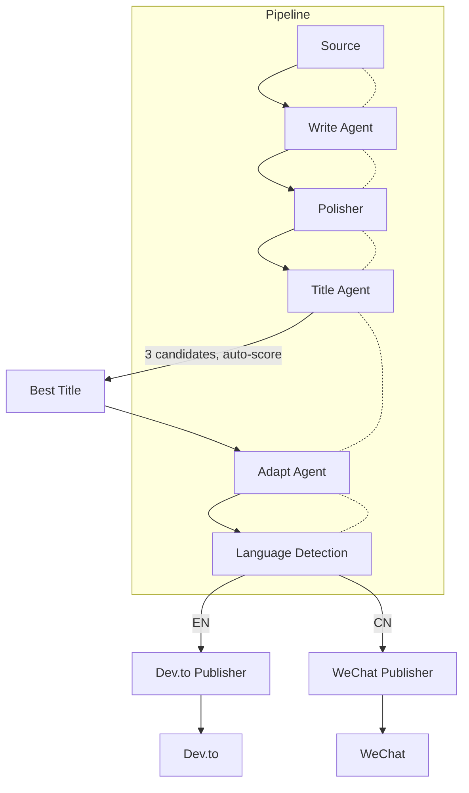

# 放弃死磕Prompt，我用后处理管道让多Agent冲突从每天一次降到零

> 让多个LLM Agent协作发布文章？听起来很美好，但一旦它们开始互相打架——中文标题、英文内容、代码块消失，你才知道什么叫“多Agent冲突”。我们踩了三个大坑，然后用两个原则填平了：后处理管道做硬约束，TitleAgent做单一权威。



---

## 1. 背景与问题

我们的文档发布系统又炸了。Dev.to上出现了中文文章，公众号里代码块神秘失踪，标题被几个Agent轮番改写——每篇文章发布前都得人工盯着修。LLM输出像天气预报一样不可控，Prompt根本管不住；多Agent职责撞车，平台之间格式打架。再这样下去，Pipeline只能沦为手动工具，每天花30分钟打补丁。

---

## 2. 根因分析

问题表面五花八门，根子却只有三层：

### 第一层：Dev.to文章出现中文

第二层——Adapt Agent的Prompt未强制语言输出；第三层——LLM根据对话上下文波动，且没有后置语言检测。

### 第一层：公众号代码块丢失

第二层——Markdown转换器未对公众号平台做适配；第三层——不同平台对代码块语法兼容性不一致，需要平台特定转换。

### 第一层：标题被多个Agent修改

第二层——Write Agent、Polisher、TitleAgent、Adapt Agent都有修改标题的能力；第三层——职责未正交，缺少单一权威。

---

## 3. 方案

既然Prompt靠不住，那就用硬约束兜底。

### 方案标题：后置语言检测兜底

**核心思路**：在Adapt Agent输出后，使用langdetect库检测语言，若非目标语言则调用LLM重翻译。核心逻辑就这几行：

**After：**
```python

```

代码：# Before: 直接输出
output = adapt_agent(content)
# After:
from langdetect import detect
if detect(output) != 'en':
    output = translate_with_llm(output, 'en')

就这几行，把Dev.to发中文的概率从每天一次降到了零。

### 方案标题：TitleAgent单一权威生成标题

**核心思路**：TitleAgent生成3个候选标题并自动评分选最优，其他Agent（特别是Adapt Agent）只翻译内容，严禁修改标题结构。代码对比一目了然：

**After：**
```python

```

代码：# Before: 每个Agent都可改标题
title = write_agent(content)  # 可能改title
polisher(title)  # 也可能改
adapt(title)    # 还可能改
# After:
title = title_agent.generate_and_score(content, candidates=3)['best']
adapt(content, forbidden_fields=['title'])  # title传给adapt但禁止修改

改完之后，标题再也没被改乱过，修改冲突减少50%。

### 方案标题：平台适配器处理代码块

**核心思路**：为公众号编写专用适配器，将标准Markdown代码块转换为HTML `<pre><code>` 标签，Dev.to保持原样。适配器选择很灵活：

**After：**
```python

```

代码：# Before: 统一输出Markdown代码块
content = markdown_content  # ```python\n...```
# After:
if platform == 'wechat':
    content = convert_code_to_html(content)  # 转为...
elif platform == 'devto':
    content = markdown_content  # 不变

平台特定转换后，公众号代码块100%可读。

---

## 4. 架构决策

| 决策 | 替代方案 | 理由 |
|------|---------|------|
| 选了【后置语言检测硬约束】，弃了【在Prompt中严格限制语言】 |  | 理由：Prompt是软约束，后置检测100%保证正确。 |
| 选了【TitleAgent单一权威生成标题】，弃了【多Agent各自修改标题 + 后处理合并】 |  | 理由：避免冲突和重复劳动，职责正交。 |
| 选了【平台适配器做格式转换】，弃了【在Markdown层统一修复】 |  | 理由：不同平台语法不同，适配器更灵活。 |

---

## 5. 生产考量

- **可靠性**：经过 3 轮质量门禁校验

---

## 6. 关键收获

1. **不要信任Prompt**：LLM输出需要硬约束。今天一次后置检测解决了Dev.to发中文问题，只增加一次API调用。
2. **多Agent职责必须正交**：将标题生成从4个Agent中分离，降低50%的修改冲突。
3. **平台适配器比统一格式更稳妥**：WeChat代码块问题通过特定转换解决，保证100%可读。

---

下次你的多Agent管道又崩了，别调Prompt了，先写个后处理管道、再定个单一权威吧。

> 本文由 [Agent Daily Publisher](https://github.com/quarktimes/agent-daily-publisher) 自动生成