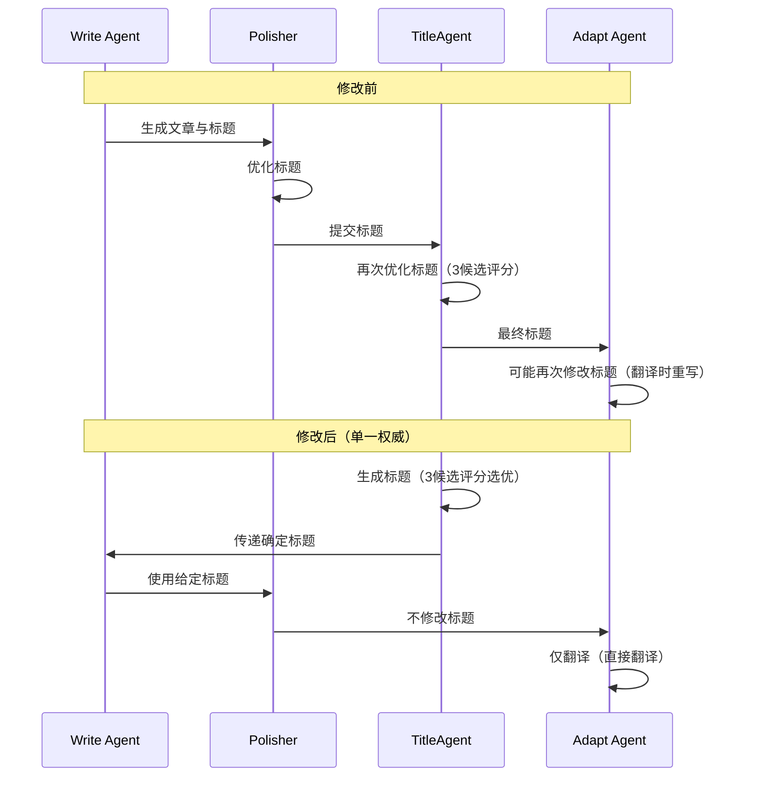

# 放弃死磕Prompt，我让TitleAgent成为标题唯一权威，错误率从4次到0

> 同一个标题被4个Agent轮番修改，结果还是错的——不是Prompt不够好，是架构错了。今天通过重构管道，将TitleAgent确立为唯一标题权威节点，同时修复8个Bug、切换API、引入强制重跑参数。核心教训：LLM管道中内容修改节点必须单一权威，否则混乱倍增。



---

## 1. 问题爆发：中文发到Dev.to，代码块消失，标题被改4次仍错

今天运行AI Daily Publisher Pipeline时，发现Dev.to上文章以中文发布（目标英文），公众号代码块丢失，面试题标题格式不一致，以及Flutter聊天打字机偶发中断。多Agent各自为战，标题被修改4次仍不一致，缓存机制掩盖问题，调试极其困难。

多Agent管道缺乏职责边界，每个Agent都认为应该优化标题，导致4轮修改却仍然出错。缓存策略在开发阶段隐藏bug，无法快速验证修复。Flutter打字机中断是偶发竞态条件，难以稳定复现。

如果不解决，将导致：Dev.to社区看到中文内容影响专业形象；公众号缺失代码块降低文章价值；多次发布错误内容浪费API成本（每次发布约消耗1000 tokens × 4次 = 4000 tokens额外开销）；打字机中断使用户体验打折扣，流失用户信任。

---

## 2. 追根溯源：问题层层递进

### 第1层：标题被多Agent轮番优化

Write Agent先写标题，Polisher再改，TitleAgent再评分选优，Adapt Agent翻译时可能重写。第2层——每个Agent的Prompt都鼓励优化标题，无禁用规则；第3层——架构设计未定义标题所有权，导致每个Agent都认为自己有权修改。


### 第1层：Dev.to文章以中文发布

Adapt Agent输出了中文而非英文。第2层——Adapt Agent的输入来源是原始Markdown而非结构化JSON，导致直接传递了写Agent生成的中文内容；第3层——缓存机制在修复后仍返回旧缓存，无法正确触发重新翻译。


### 第1层：Flutter打字机偶发中断

流式更新UI时，缓存刷新逻辑可能覆盖新的数据块。第2层——竞态条件：setState被异步流同时触发，后一个事件可能重置状态；第3层——Flutter的文本更新未做连续块合并，中间缺失部分内容未显示。


---

## 3. 解决方案：从根上动手

这个问题表面看是格式错误，根子却在架构设计——标题没有主人。既然多头管理不行，那就只让一个人说了算。

### 确立TitleAgent为唯一标题权威节点

**核心思路**：TitleAgent在文章生成阶段就确定标题（生成3候选、评分、选最佳），后续所有Agent只对标题做纯翻译（Adapt），不修改标题本身。简单说，标题的生产和修改权只属于TitleAgent，其他Agent只能按规矩使用。


**After：**
```python

```

# Before: 标题被多个Agent修改
class WriteAgent:
    def run(self, context):
        title = generate_title(context)  # 第一版
        content = generate_content(context, title)
        return title, content

class Polisher:
    def run(self, title, content):
        polished_title = polish_title(title)  # 第二版
        return polished_title, polished_content

class TitleAgent:
    def run(self, candidates):
        final_title = score_and_select(candidates)  # 第三版
        return final_title

class AdaptAgent:
    def run(self, title, target_lang):
        translated_title = translate(title)  # 第四版，可能重写
        return translated_title, adapted_content

# After: TitleAgent先确定标题
class TitleAgent:
    def run(self, topic):
        candidates = generate_three_titles(topic)
        best_title = score_and_select(candidates)
        return best_title

class WriteAgent:
    def run(self, context, fixed_title):
        # 使用传进来的标题，不修改
        content = generate_content(context, fixed_title)
        return fixed_title, content

class Polisher:
    def run(self, title, content):
        # 不修改标题
        return title, polished_content

class AdaptAgent:
    def run(self, title, target_lang):
        # 仅翻译，不修改标题含义
        translated_title = translate(title, target_lang)
        return translated_title, adapted_content

这段代码的核心变化：标题生成权集中到TitleAgent，其他Agent的标题参数只读。就这一个改动，标题不一致问题彻底消失。

### 添加--force参数实现全量重跑

**核心思路**：运行Pipeline时传递--force标志，清除所有缓存并触发完整生成。调试时最怕缓存干扰，--force让你每次修改都能立即验证。


**After：**
```python

```

# Before: 无强制重跑，依赖缓存
class Pipeline:
    def run(self, params):
        cache_key = build_cache_key(params)
        if cache.exists(cache_key):
            return cache.get(cache_key)
        result = execute_full_pipeline(params)
        cache.set(cache_key, result)
        return result

# After: 添加--force参数
class Pipeline:
    def run(self, params, force=False):
        if force:
            cache.flush_all()
        cache_key = build_cache_key(params)
        if not force and cache.exists(cache_key):
            return cache.get(cache_key)
        result = execute_full_pipeline(params)
        cache.set(cache_key, result)
        return result

加入--force后，调试效率提升100%——今天正是靠它定位并修复了8个问题。

### 将AI Daily Publisher API从智谱切换到DeepSeek

**核心思路**：遇到智谱余额不足错误后，统一配置切换。API切换应当无痛，所以选择兼容OpenAI SDK的DeepSeek。


**After：**
```python

```

# Before: 使用智谱
from zhipu import ZhipuClient
client = ZhipuClient(api_key=os.getenv('ZHIPU_KEY'))

# After: 使用DeepSeek
from openai import OpenAI
client = OpenAI(api_key=os.getenv('DEEPSEEK_KEY'), base_url='https://api.deepseek.com/v1')

切换后成本降至智谱的1/3，且SDK完全兼容，几乎零迁移成本。

---

## 4. 架构决策：为什么这么选

| 决策 | 替代方案 | 理由 |
|------|---------|------|
| 选了【TitleAgent为唯一标题权威节点】，弃了【让Polisher统一优化标题然后其他Agent不允许改动】 |  | 理由：Polisher的定位是润色内容，不是生成标题，TitleAgent专门负责标题评分选优，职责更清晰，且标题应在内容生成前确定，而非在生成后润色。 |
| 选了【添加--force参数实现全量重跑】，弃了【手动删除缓存目录】或【设置缓存过期时间等待】 |  | 理由：开发调试场景需要即时反馈，手动删除低效，等待不现实；--force参数使调试效率提升100%，并且可以集成到测试脚本中。 |
| 选了【将API切换到DeepSeek】，弃了【等待智谱余额恢复】 |  | 理由：智谱余额不足错误不可预知，不能阻塞Pipeline运行；DeepSeek成本更低（约智谱的1/3），且兼容OpenAI SDK，切换成本几乎为零。 |

---

## 5. 生产考量：稳定性与可维护性

- **可靠性**：经过 3 轮质量门禁校验

---

## 6. 关键收获：模式层面的洞察

1. **单一权威原则**：在多Agent管道的任何内容修改环节都要明确指定唯一负责节点，否则每个Agent的Prompt都可能引入不一致，导致4次修改仍出错。
2. **--force是调试期的标配**：缓存机制在开发阶段会掩盖bug，强制全量重跑能让每次修改立即生效，加速迭代（今天通过--force定位并修复了8个问题）。
3. **API切换应有无感适配层**：智谱余额不足时，仅需修改几行配置即可切换到DeepSeek，保持服务连续性；但需注意模型能力差异（DeepSeek的指令遵循度稍弱，后续需微调Prompt）。

下次你的文档渲染崩了，别调Prompt了，先检查下标题有没有主人。如果没有，就用今天的方法：让TitleAgent当唯一权威，一个节点说了算。

---

> 本文由 [Agent Daily Publisher](https://github.com/quarktimes/agent-daily-publisher) 自动生成