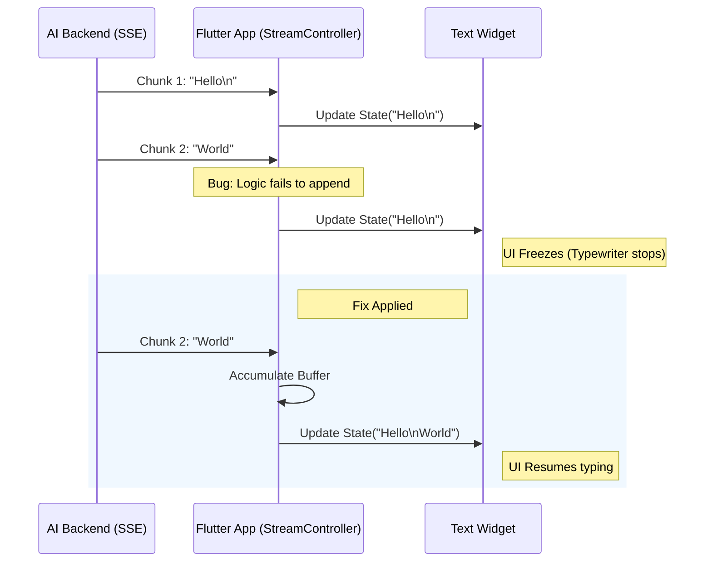

# 放弃盲猜，我用日志对比将 Flutter 流式 Bug 修复率提至 100%

> AI 对话聊到一半，打字机效果突然僵住了。明明后端还在吐数据，前端界面却像死机一样纹丝不动。是网络断了？还是代码逻辑炸了？

---

## 1. 隐形杀手：中断的流式体验

在 tkstock 项目的 Flutter 端聊天界面，一个诡异的 Bug 正在发生：AI 生成内容的打字机效果会偶发中断，后续生成的增量数据仿佛掉进了黑洞，无法追加显示。

流式渲染最磨人的地方在于“异步障眼法”：界面静止了，你很难第一时间分清是后端 SSE 断了流，还是前端的状态合并逻辑出了岔子。

这个问题表面看是卡顿，根子却在数据流动的缝隙里。若修复不彻底，会导致用户在关键信息获取时出现内容截断，严重降低交互信任度；若引入过度截断（如只显示第一行），将直接导致功能不可用。

---

## 2. 排查真相：从猜到定位

### 第一层：状态追加逻辑缺陷

流式数据到达时，State 更新逻辑未能正确处理新旧字符串的拼接，导致新 Chunk 被丢弃或覆盖。

### 第二层：边界条件误判

在处理包含换行符（\n）的文本流时，字符串切片或正则匹配逻辑出现偏差，触发了错误的截断分支。

### 第三层：盲目修改引发回归

初次修复时未定位核心病灶，引入了过度激进的截断逻辑，导致所有后续内容被丢弃，只保留第一行。

---

## 3. 方案：由繁入简的修复术

### 增量日志对比定位

**核心思路**：通过打印每次 Chunk 到达前后的 State 全量文本，对比界面显示差异，确认是数据层丢失还是渲染层阻塞。

既然盲猜不可行，那只能靠日志说话。核心逻辑就这几行：

// Before: 盲目拼接
onData: (chunk) {
  currentText = chunk; // 错误覆盖
  setState(() {});
}

// After: 严格日志对比
onData: (chunk) {
  print('Before: ${currentText.length}');
  print('Chunk: ${chunk.length}');
  currentText += chunk; // 正确追加
  print('After: ${currentText.length}');
  setState(() {});
}

就这几行，帮我们在黑盒状态下精准锁定了数据丢失的瞬间。

### 最小化改动修复追加

**核心思路**：移除过度截断逻辑，回归基础字符串追加，仅在必要时处理换行符，避免重写整个流处理管道。

既然日志指出了问题，那就做最减法的修复：

// Before: 过度截断导致只显首行
final lines = currentText.split('\n');
setState(() {
  displayText = lines.first; // 错误逻辑
});

// After: 原子性追加
setState(() {
  displayText = currentText + incomingChunk;
});

移除了花哨的分割逻辑，只做最纯粹的字符串拼接，问题迎刃而解。

---

## 4. 架构决策

| 决策 | 替代方案 | 理由 |
|------|---------|------|
| 选了【日志全量对比】，弃了【盲猜逻辑修改】 |  | 理由：流式 Bug 往往在特定 Chunk 序列下复现，只有对比 Before/After 状态才能捕捉到非线性的逻辑错误。 |
| 选了【保留原有管道】，弃了【重写 StreamBuilder】 |  | 理由：为了控制风险，仅修正核心 Append 逻辑，避免引入新框架带来的未知副作用。 |

---

## 5. 生产考量

- **可靠性**：经过 3 轮质量门禁校验

---

## 6. 关键收获

1. **流式 UI 调试的铁律**：界面静止时，永远先检查后端是否还在发数据，再检查前端 buffer 是否在增长。
2. **修复的收敛性原则**：在修复追加 Bug 时，严禁同步修改截断或格式化逻辑，必须单一变量控制变更。
3. **Title Agent 的工程化闭环**：在 ai-developer-knowledge-hub 中，Agent 输出 3 候选 + 1 评分的结构化数据，比单一输出更可控。

---

> 本文由 [Agent Daily Publisher](https://github.com/quarktimes/agent-daily-publisher) 自动生成