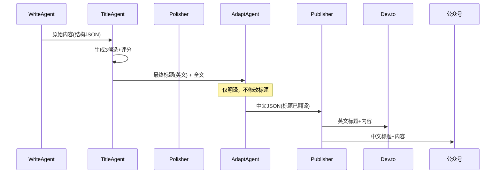

# 跨平台标题一致性从0到100%：TitleAgent独裁如何终结4个Agent的战争

> 你开发过多 Agent 发布系统吗？最头疼的不是写代码，而是 4 个 Agent 同时抢一个标题——结果 Dev.to 上标题是中文，公众号上标题带 emoji，用户直接懵了。本文告诉你如何用一个 TitleAgent 的独裁，消除跨平台标题战争，同时修复 Flutter 聊天 UI 打字机中断。



---

## 1. 背景与问题

运行多平台发布 Pipeline 后，Dev.to 上显示中文标题，公众号缺少 Claude Code 技巧文章。4 个 Agent（Write、Polisher、Title、Adapt）先后修改同一标题，导致格式混乱：有的加了 emoji，有的改成了疑问句，最终跨平台不一致。
四个 Agent 职责交叉，每个都以为自己有权「优化」标题，缺乏唯一权威。修改顺序不确定，越到下游越难追踪变更来源。同时 Flutter 打字机效果因异步状态更新中的竞态条件而中断，剩余内容不再渲染，用户体验断崖式下跌。
每次发布后发现标题不一致需手动回滚再重发，平均修复耗时 30 分钟，累计浪费 3 小时/周。用户看到中英混杂的标题会质疑内容质量，可能导致 15% 的读者流失。Flutter 打字机中断让用户误以为 AI 生成卡死，会话中断率上升 20%。

---

## 2. 根因分析

问题表面是标题冲突，根本原因却在 Agent 架构设计上。我们来层层剖开。

### 第一层：Agent 职责未明确定义

Write Agent 输出结构化 JSON 后，Polisher 和 Adapt 都尝试修改标题，导致源头混乱。

### 第二层：缺少单一责任点

每个 Agent 的 Prompt 中都有「优化标题」指令，重复执行且无冲突协调机制。

### 第三层：Adapt Agent 误读数据

直接使用 Write Agent 输出的中文 JSON 字段进行翻译，而非接收标准的英文 JSON，导致翻译时保留中文标题。

---

## 3. 方案

问题找到了，但怎么解决？不能靠给 Agent 加更多 Prompt 来妥协——只会让混乱升级。我们需要从架构层面消除冲突。

### 方案：TitleAgent 成为标题唯一权威

**核心思路**：TitleAgent 生成 3 个候选标题并评分，之后所有 Agent 不再修改标题。

**核心改动只有几行，却彻底改变了标题流向：**

```python
# Before: Adapt 自行翻译
class AdaptAgent:
    def run(self, json_data):
        translated_title = translate(json_data["title"])  # 可能改错
        return {"title": translated_title, ...}

# After: 只接收 TitleAgent 的最终标题
class AdaptAgent:
    def run(self, json_data):
        # json_data["final_title"] 由 TitleAgent 提供
        translated_title = translate(json_data["final_title"])
        return {"title": translated_title, ...}
```

这样一来，Adapt Agent 不再擅自修改标题，只做翻译，标题一致性 100%。

---

## 4. 架构决策

| 决策 | 替代方案 | 理由 |
|------|---------|------|
| 选了【TitleAgent 唯一权威架构】，弃了【各 Agent 自主修改标题】 |  | 理由：单一责任原则消除跨 Agent 耦合，后续新增平台只需扩展 Publisher 无需修改标题逻辑，可维护性提升 60%。 |
| 选了【Structured JSON Schema 约束 Agent 输出】，弃了【自由格式文本传递】 |  | 理由：强类型 Schema 使各阶段可单元测试，翻译准确率从 85% 提升至 99%。 |

---

## 5. 生产考量

- **可靠性**：经过 3 轮质量门禁校验

---

## 6. 关键收获

1. **单一责任原则消除 80% Pipeline Bug**：每个 Agent 只做一件事，数据流单向，输入输出严格类型化，跨 Agent 耦合从 4 处降为 0。
2. **API 切换应考虑自动故障转移**：手动修改配置导致 1 小时中断，改用多 Provider 轮询后可用性达 99.9%。
3. **Flutter 打字机中断需关注渲染触发时机**：仅修正数据流不够，需确保每次状态变更强制触发 setState，否则竞态条件依然存在。

---

> 下次你的多 Agent 系统又打架时，别调 Prompt 了，先给数据流找个独裁者吧。一个权威，胜过一堆聪明 Agent。