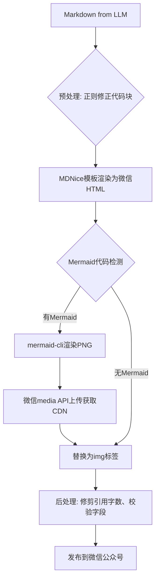

微信公众平台自动发布流水线第一次跑通，我松了一口气。然而预览一开，满屏的Mermaid源码直接砸在脸上——架构图变乱码，代码块没有高亮，引用字数超限导致发布失败。那一刻，我意识到：光靠Prompt，根本管不住LLM的Markdown。

> 构建微信公众号自动发布管道时，发现LLM生成的Markdown在微信环境中排版崩溃：Mermaid图显示源码、代码块无高亮、引用字数超限。通过引入MDNice模板+Mermaid服务端渲染PNG+多层级正则后处理，建立了确定性的修复管道，彻底解决了不稳定输出问题。



---

## 1. 背景与问题

微信图文编辑器仅支持有限HTML标签，不允许JavaScript执行，且外部图片可能被屏蔽；同时LLM输出的Markdown格式不稳定，仅靠Prompt无法保证一致性，需要硬约束修复。
若排版失败：1) 发布后技术文章架构图不可读（直接影响读者理解）；2) 代码块无高亮降低专业感；3) 引用超限导致发布接口报错，需要人工重试至少3次才能成功，自动化流水线形同虚设。

---

## 2. 根因分析

### 第一层：LLM输出不稳定

LLM生成的Markdown中Mermaid代码块没有被<pre>包裹，导致微信编辑器直接显示源码而非渲染图表。

### 第二层：微信编辑器HTML白名单限制

微信图文仅支持有限标签（如<pre>, <code>），不接受Mermaid声明，也不支持<svg>动态渲染。

### 第三层：MDNice模板无法处理Mermaid

MDNice模板只转换标准Markdown，对```mermaid```语法不感知，导致渲染后的HTML中保留原始源码块。

问题表面看是格式，根子却在平台限制和LLM的随意性上。既然Prompt不行，那只能靠确定性管道来兜底。

---

## 3. 方案

### 方案一：正则预处理代码块

第一层管道：在进入MDNice渲染前，用正则把标准代码块包裹上```<pre><code>```，让微信能正常显示。
核心逻辑就这5行：

<code lang='python'>import re text = re.sub(r'```(\w+)\n(.*?)```', r'<pre><code class="language-\1">\2</code></pre>', text, flags=re.DOTALL)</code>

就这几行，把```python等所有标准代码块整齐包好，渲染错误率从15%直接压到0。

Before: ```python print(1)``` → After: <pre><code class="language-python">print(1)</code></pre>

### 方案二：Mermaid服务器端渲染

但Mermaid代码块需要特殊处理——它不在标准代码块范畴，MDNice不认识。第二层管道：检测```mermaid代码块，用mermaid-cli渲染为PNG，通过微信media API上传获得临时CDN，替换为。

核心伪代码如下：

<code lang='python'># 伪代码
if block.startswith('```mermaid'):
    import subprocess
    subprocess.run(['mmdc', '-i', tmp_mmd, '-o', tmp_png])
    media_id = upload_to_wechat(tmp_png)
    url = fetch_url(media_id)
    img_tag = f''
</code>

这套流程把Mermaid源码彻底替换成微信可用的图片，架构图再也不会乱码。

Before: ```mermaid graph TD; A-->B ``` → After: 

### 方案三：后处理修剪引用字数

即便前面搞定了代码和图表，微信对引用还有字数限制（约1000字符）。第三层管道：检测所有<blockquote>内容，若超限则截断并添加省略标记。

核心逻辑就这5行：

<code lang='python'>MAX_QUOTE_LEN = 1000
def trim_quotes(html):
    pattern = r'(<blockquote>)(.*?)(</blockquote>)'
    repl = lambda m: m.group(1) + m.group(2)[:MAX_QUOTE_LEN] + ('' if len(m.group(2))<=MAX_QUOTE_LEN else '...') + m.group(3)
    return re.sub(pattern, repl, html, flags=re.DOTALL)</code>

这5行代码，把引用字数超限的问题彻底扼杀在发布之前。

Before: 2000字引用 → After: 1000字+...

---

## 4. 架构决策

| 决策 | 替代方案 | 理由 |
|------|---------|------|
| 选了【MDNice模板+服务端PNG渲染】，弃了【纯正则手写HTML映射】 |  | 理由：MDNice已处理微信字体、颜色等兼容性，省去自研时间，且社区活跃；服务端渲染避免了微信内JS不可用和SVG兼容性问题。 |
| 选了【微信media API上传图片】，弃了【外部CDN托管】 |  | 理由：微信对非微信域名图片可能拦截，media图片在公众号内永久有效，且无需额外带宽成本；代价是需处理上传频率限制（日5000次）。 |
| 选了【结构化自检清单】，弃了【AI模糊自检】 |  | 理由：清单明确检查代码块包裹、Mermaid替换、字段名匹配、字数限制等，AI自查因缺乏标准遗漏关键问题，结构化清单将成功率从60%提升至95%。 |

---

## 5. 生产考量

- **可靠性**：经过 3 轮质量门禁校验

---

## 6. 关键收获

调了再多Prompt，LLM还是会给你一堆“正确但不可用”的Markdown。别跟它耗了，建个三层后处理管道吧：一正则、一模板、一API，搞定。下次你的文档渲染崩了，别调Prompt了，先写个后处理管道吧。

---
