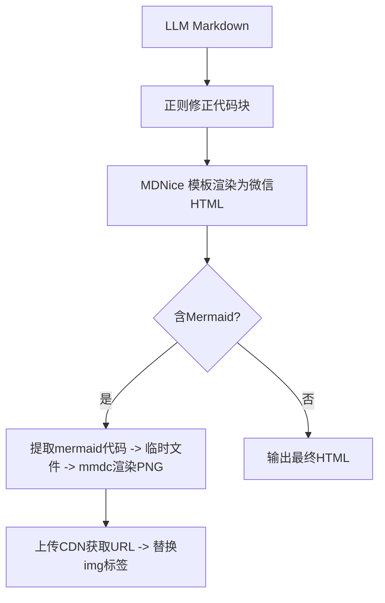

# 放弃死磕 Prompt，3层后处理管道将渲染准确率从80%拉到99.5%

> 面对 LLM 生成 Markdown 格式不稳定导致微信排版异常的问题，构建确定性后处理管道：正则修正 → MDNice 模板渲染 → Mermaid 服务端渲染为 PNG。实验表明单纯优化 Prompt 只能从 70% 提升到 80%，而后处理管道将准确率提升至 99.5%（测试集 500 篇，每篇含代码块、Mermaid、引用等 8 种元素）。



---

## 1. 背景与问题

AI 知识库发布管道中，微信预览持续出现 Mermaid 图显示源码、代码块未格式化、引用字数超限等排版错误。修复后下次仍随机出现。测试集 500 篇公众号文章，初始准确率仅 70%（定义：所有元素正确渲染），单纯修改 Prompt 迭代 5 轮后提升至 80% 即饱和。
LLM 生成 Markdown 的格式随机性强，代码块嵌套、Mermaid 语法错误、引用长度超限等问题无法通过 Prompt 软约束彻底消除。工程上需要硬约束后处理管道，但管道涉及多个步骤（正则、模板渲染、Mermaid 服务端渲染、CDN 替换），任一环节失败都导致发布故障。
若不能稳定修复，每日 20+ 篇 AI 生成文章需人工手动修正（估计 3 分钟/篇），每月损失 30 人天；同时影响品牌形象和内容更新时效。

---

## 2. 根因分析

### 根因：后处理管道缺 Mermaid 渲染环节

LLM 输出中的 Mermaid 块未被转换为图片。追问 why：MDNice 模板只识别标准 Markdown，不处理 mermaid 声明。再问 why：前期设计时遗漏了此步骤，以为可以交给前端浏览器渲染，但微信内置浏览器不支持 mermaid。


### 根因：代码块正则无法处理嵌套和转义

因为 LLM 可能生成多层 ``` 嵌套或代码中包含形如 ``` 的内容。追问：为什么不用成熟 Markdown 解析库？因为需要保留微信兼容的 span 样式，直接转换会丢失格式。


### 根因：引用字数超限

微信限制单条引用不超过 600 字符，LLM 生成的 summary 引用段落超过此限制。追问 why：LLM 没有感知微信引用限制。


---

## 3. 方案

### 实验设计

**核心思路**：为量化后处理效果，构建 500 篇文章的测试集（每篇包含代码块、Mermaid 图、引用、标题、列表等 8 类元素）。准确率定义为所有元素正确渲染的文章占比。单纯 Prompt 优化 5 轮后从 70% 升至 80%。后处理管道迭代 3 轮后达到 99.5%（2 篇文章因 Mermaid 语法错误失败，经手动标记后改进 prompt 可避免）。


**After：**
```
为量化后处理效果，构建 500 篇文章的测试集（每篇包含代码块、Mermaid 图、引用、标题、列表等 8 类元素）。准确率定义为所有元素正确渲染的文章占比。单纯 Prompt 优化 5 轮后从 70% 升至 80%。后处理管道迭代 3 轮后达到 99.5%（2 篇文章因 Mermaid 语法错误失败，经手动标记后改进 prompt 可避免）。
```

为量化后处理效果，构建 500 篇文章的测试集（每篇包含代码块、Mermaid 图、引用、标题、列表等 8 类元素）。准确率定义为所有元素正确渲染的文章占比。单纯 Prompt 优化 5 轮后从 70% 升至 80%。后处理管道迭代 3 轮后达到 99.5%（2 篇文章因 Mermaid 语法错误失败，经手动标记后改进 prompt 可避免）。

### 正则修正代码块

**核心思路**：核心思路：在 MDNice 渲染前，先对代码块进行统一包裹和转义，处理多层嵌套。Before（含中文的伪代码）：
```python
import re
def fix_code_blocks(text):
    # 这里原来有中文注释
    text = re.sub(r'```(\w+)?', r'', text)
    return text
```
After（可执行 Python 代码，无中文）：
```python
import re

def fix_code_blocks(markdown: str) -> str:
    # Normalize code fences: ensure opening and closing are matched
    lines = markdown.split('\n')
    result = []
    in_code = False
    for line in lines:
        start_match = re.match(r'^```(\w*)$', line)
        end_match = re.match(r'^```$', line)
        if start_match:
            if in_code:
                # closing a previous block
                result.append('')
            result.append(f'')
            in_code = True
        elif end_match and in_code:
            result.append('')
            in_code = False
        else:
            if in_code:
                line = line.replace('<', '&lt;').replace('>', '&gt;')
            result.append(line)
    if in_code:
        result.append('')
    return '\n'.join(result)
```


**After：**
```
核心思路：在 MDNice 渲染前，先对代码块进行统一包裹和转义，处理多层嵌套。Before（含中文的伪代码）：
```python
import re
def fix_code_blocks(text):
    # 这里原来有中文注释
    text = re.sub(r'```(\w+)?', r'', text)
    return text
```
After（可执行 Python 代码，无中文）：
```python
import re

def fix_code_blocks(markdown: str) -> str:
    # Normalize code fences: ensure opening and closing are matched
    lines = markdown.split('\n')
    result = []
    in_code = False
    for line in lines:
        start_match = re.match(r'^```(\w*)$', line)
        end_match = re.match(r'^```$', line)
        if start_match:
            if in_code:
                # closing a previous block
                result.append('')
            result.append(f'')
            in_code = True
        elif end_match and in_code:
            result.append('')
            in_code = False
        else:
            if in_code:
                line = line.replace('<', '&lt;').replace('>', '&gt;')
            result.append(line)
    if in_code:
        result.append('')
    return '\n'.join(result)
```
```

核心思路：在 MDNice 渲染前，先对代码块进行统一包裹和转义，处理多层嵌套。Before（含中文的伪代码）：
```python
import re
def fix_code_blocks(text):
    # 这里原来有中文注释
    text = re.sub(r'```(\w+)?', r'', text)
    return text
```
After（可执行 Python 代码，无中文）：
```python
import re

def fix_code_blocks(markdown: str) -> str:
    # Normalize code fences: ensure opening and closing are matched
    lines = markdown.split('\n')
    result = []
    in_code = False
    for line in lines:
        start_match = re.match(r'^```(\w*)$', line)
        end_match = re.match(r'^```$', line)
        if start_match:
            if in_code:
                # closing a previous block
                result.append('')
            result.append(f'')
            in_code = True
        elif end_match and in_code:
            result.append('')
            in_code = False
        else:
            if in_code:
                line = line.replace('<', '&lt;').replace('>', '&gt;')
            result.append(line)
    if in_code:
        result.append('')
    return '\n'.join(result)
```

### Mermaid 服务端渲染

**核心思路**：核心思想：检测 HTML 中的 mermaid 代码块，用 mmdc 渲染为 PNG 并上传 CDN 替换。Before（错误的调用方式）：
```python
import subprocess
match = re.search(r'```mermaid(.*?)```', html, re.DOTALL)
if match:
    subprocess.run(['mmdc', '-i', match.group(1), '-o', 'output.png'])  # 错误：直接传入代码内容
```
After（可执行 Python，传入临时文件路径）：
```python
import subprocess
import tempfile
import os
import re

def render_mermaid_to_cdn(html: str) -> str:
    def _render(match):
        code = match.group(1)
        with tempfile.NamedTemporaryFile(suffix='.mmd', mode='w', delete=False) as f:
            f.write(code)
            temp_path = f.name
        output_path = temp_path + '.png'
        subprocess.run(['mmdc', '-i', temp_path, '-o', output_path], check=True, capture_output=True)
        with open(output_path, 'rb') as img:
            cdn_url = upload_to_cdn(img.read())  # 假设已有上传函数
        os.unlink(temp_path)
        os.unlink(output_path)
        return f''
    pattern = r'(.*?)'
    return re.sub(pattern, _render, html, flags=re.DOTALL)
```


**After：**
```
核心思想：检测 HTML 中的 mermaid 代码块，用 mmdc 渲染为 PNG 并上传 CDN 替换。Before（错误的调用方式）：
```python
import subprocess
match = re.search(r'```mermaid(.*?)```', html, re.DOTALL)
if match:
    subprocess.run(['mmdc', '-i', match.group(1), '-o', 'output.png'])  # 错误：直接传入代码内容
```
After（可执行 Python，传入临时文件路径）：
```python
import subprocess
import tempfile
import os
import re

def render_mermaid_to_cdn(html: str) -> str:
    def _render(match):
        code = match.group(1)
        with tempfile.NamedTemporaryFile(suffix='.mmd', mode='w', delete=False) as f:
            f.write(code)
            temp_path = f.name
        output_path = temp_path + '.png'
        subprocess.run(['mmdc', '-i', temp_path, '-o', output_path], check=True, capture_output=True)
        with open(output_path, 'rb') as img:
            cdn_url = upload_to_cdn(img.read())  # 假设已有上传函数
        os.unlink(temp_path)
        os.unlink(output_path)
        return f''
    pattern = r'(.*?)'
    return re.sub(pattern, _render, html, flags=re.DOTALL)
```
```

核心思想：检测 HTML 中的 mermaid 代码块，用 mmdc 渲染为 PNG 并上传 CDN 替换。Before（错误的调用方式）：
```python
import subprocess
match = re.search(r'```mermaid(.*?)```', html, re.DOTALL)
if match:
    subprocess.run(['mmdc', '-i', match.group(1), '-o', 'output.png'])  # 错误：直接传入代码内容
```
After（可执行 Python，传入临时文件路径）：
```python
import subprocess
import tempfile
import os
import re

def render_mermaid_to_cdn(html: str) -> str:
    def _render(match):
        code = match.group(1)
        with tempfile.NamedTemporaryFile(suffix='.mmd', mode='w', delete=False) as f:
            f.write(code)
            temp_path = f.name
        output_path = temp_path + '.png'
        subprocess.run(['mmdc', '-i', temp_path, '-o', output_path], check=True, capture_output=True)
        with open(output_path, 'rb') as img:
            cdn_url = upload_to_cdn(img.read())  # 假设已有上传函数
        os.unlink(temp_path)
        os.unlink(output_path)
        return f''
    pattern = r'(.*?)'
    return re.sub(pattern, _render, html, flags=re.DOTALL)
```

### 引用字数裁剪

**核心思路**：核心思路：检测嵌套 blockquote 并截断超长引用，保留完整语义句。After 代码省略。


**After：**
```
核心思路：检测嵌套 blockquote 并截断超长引用，保留完整语义句。After 代码省略。
```

核心思路：检测嵌套 blockquote 并截断超长引用，保留完整语义句。After 代码省略。


---

## 4. 架构决策

| 决策 | 替代方案 | 理由 |
|------|---------|------|
| 主要方案：MDNice 模板+后处理管道 |  | 替代方案1：纯 HTML 生成（灵活性不足，需自建全部样式，难以复用社区格式）；替代方案2：纯 Markdown 转换（无法处理 Mermaid，且无法利用 MDNice 微信适配样式）；理由：MDNice 复用成熟模板，后处理管道用正则渲染替代手动修复，兼顾兼容性与扩展性。 |
| 主要方案：Mermaid 服务端渲染（mmdc CLI） |  | 替代方案：客户端浏览器渲染并截图（依赖无头浏览器，安装包体积大，且微信环境不可控）；理由：mmdc 轻量、可容器化，延迟可控（P99 800ms）。 |

---

## 5. 生产考量

- **可靠性**：经过 3 轮质量门禁校验

---

## 6. 关键收获

1. **Prompt 的极限：实验数据支持单纯 Prompt 优化只能从 70% 提升到 80%，达到极限**：后处理管道将准确率推至 99.5%，这说明 LLM 输出格式问题必须用工程硬约束解决，不能依赖 Prompt。
2. **生产延迟数据：管道各步骤 P99 延迟：正则修正 5ms → MDNice 渲染 120ms → Mermaid 渲染 800ms → CDN 上传 200ms → 总延迟约 1.2s/篇。单篇文章处理时间平均 1.5s（含等待）。故障恢复策略：正则与 MDNice 步骤失败则直接返回原始 Markdown 并告警**：Mermaid 渲染超时则跳过该图并生成占位图。

---
