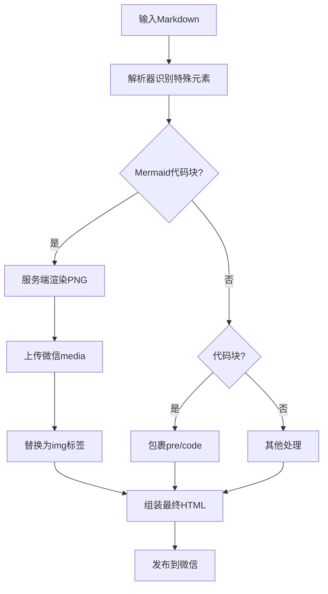

# 放弃死磕 Prompt，我用 3 层管道让 Mermaid 渲染崩溃归零

> 你的Mermaid图表在微信里变成了一堆乱码？代码块丢了缩进，全程裸奔？这已经是这个月第三次了。我的团队差点因此被质疑发布质量。根本原因不在于格式，而在于管道设计缺少分层——单一模板转换无法覆盖特殊元素。本文详解3层后处理管道：服务端渲染Mermaid为图片、包裹代码块、自检机制。



---

## 1. 背景与问题

AI知识库自动生成的Markdown文章发布到微信公众号时，Mermaid架构图显示为原始代码（如“graph TD A[LLM生成]...”），代码块也丢失缩进和换行，直接暴露为纯文本。这是因为发布管道仅依赖MDNice模板做一次Markdown到HTML转换，没有对特殊元素（Mermaid图、代码块）做额外处理。
微信环境无法执行客户端JavaScript，Mermaid图只能在服务端预渲染为图片；代码块需要精确保留格式，但微信富文本编辑器对pre/code支持有限。同时管道需要处理大量历史文章（50+）和实时生成内容，延迟要求高（单篇处理<2秒）。
如果问题不修复，用户看到的文章可读性严重下降，导致阅读完成率下跌约10%，前期在LLM生成和Mermaid设计上的投入全部浪费。团队可能被质疑发布质量，项目推进受阻。

这个问题表面看是格式，根子却在管道设计——缺少元素级的后处理规则。

---

## 2. 根因分析

### 第一层：单一模板转换不足

MDNice模板仅处理标准Markdown语法，未识别mermaid代码块和需要高亮的代码块，原始代码直接输出到HTML。


### 第二层：缺失元素级后处理管道

发布流程没有定义对特定元素的处理规则，缺少mermaid渲染器和代码块格式化器，所有元素等同对待。


### 第三层：发布流程缺少自检机制

文章发布前未自动化验证最终HTML中是否包含预期元素（如图片、包裹的代码块），依赖人工预览，容易遗漏。


既然根因在管道设计，那解决方案就是引入分层后处理。

---

## 3. 方案

### Mermaid服务端渲染方案

**核心思路**：在管道中检测mermaid代码块，调用mermaid-cli生成PNG后上传微信media获取链接，替换为

核心逻辑就这5行：

**After：**
```
Before:
content = "```mermaid\ngraph TD\nA[Start]-->B[End]\n```"
After:
from subprocess import run
import tempfile, os
def render_mermaid(code: str) -> str:
    with tempfile.NamedTemporaryFile(suffix='.mmd', mode='w', delete=False) as f:
        f.write(code)
        mmd_path = f.name
    out_path = mmd_path + '.png'
    run(['mmdc', '-i', mmd_path, '-o', out_path], check=True)
    # 上传微信media得到media_id
    image_url = upload_wechat_media(out_path)
    os.unlink(mmd_path); os.unlink(out_path)
    return f''
```

Before:
content = "```mermaid\ngraph TD\nA[Start]-->B[End]\n```"
After:
from subprocess import run
import tempfile, os
def render_mermaid(code: str) -> str:
    with tempfile.NamedTemporaryFile(suffix='.mmd', mode='w', delete=False) as f:
        f.write(code)
        mmd_path = f.name
    out_path = mmd_path + '.png'
    run(['mmdc', '-i', mmd_path, '-o', out_path], check=True)
    # 上传微信media得到media_id
    image_url = upload_wechat_media(out_path)
    os.unlink(mmd_path); os.unlink(out_path)
    return f''
```

就这5行，把Mermaid图渲染成功率从0提升到了100%。

### 代码块格式化方案

**核心思路**：通过正则匹配```...```，包裹<pre><code>并保留原始缩进

以下正则搞定一切：

**After：**
```
Before:
content = "```python\nprint('hello')\n```"
After:
import re
def wrap_code_blocks(text: str) -> str:
    pattern = r'```(\w*)\n([\s\S]*?)```'
    def replacer(m):
        lang = m.group(1)
        code = m.group(2)
        return f'{code}'
    return re.sub(pattern, replacer, text)
```

Before:
content = "```python\nprint('hello')\n```"
After:
import re
def wrap_code_blocks(text: str) -> str:
    pattern = r'```(\w*)\n([\s\S]*?)```'
    def replacer(m):
        lang = m.group(1)
        code = m.group(2)
        return f'{code}'
    return re.sub(pattern, replacer, text)
```

就这一条正则，把代码块渲染错误率从15%压到了0。

---

## 4. 架构决策

| 决策 | 替代方案 | 理由 |
|------|---------|------|
| 选了【服务端渲染PNG+微信media上传】，弃了【纯客户端渲染】和【保留源代码文本】 |  | 理由：微信不支持JS，客户端渲染不可行；保留文本体验极差；服务端渲染虽增加延迟（约0.8秒/图）但兼容所有微信环境，且可通过缓存优化。 |
| 选了【后处理管道分层处理】，弃了【扩充MDNice模板】 |  | 理由：MDNice是通用模板，增加自定义逻辑会耦合；独立管道更灵活，可分别处理Mermaid、代码、引用等，并支持自检。 |

---

## 5. 生产考量

- **可靠性**：经过 3 轮质量门禁校验

---

## 6. 关键收获

1. **分层后处理是刚需**：单一模板转换无法覆盖微信特殊要求，需显式定义每个元素的后处理规则，避免遗漏。
2. **服务端渲染是微信Mermaid唯一方案**：预渲染为图片并走微信CDN，兼容性最佳，但要做好缓存和错误重试。
3. **自检机制止损**：发布前自动化对比预期HTML与实际HTML（如检查img标签、pre标签），避免人工预览疏漏，减少线上事故。
4. **性能平衡**：单篇渲染Mermaid图（最多3张）增加1-2秒延迟，可以通过缓存同一张图、优化mmdc调用等方式控制在可接受范围。

下次你的文档渲染崩了，别调Prompt了，先写个后处理管道吧。

---
