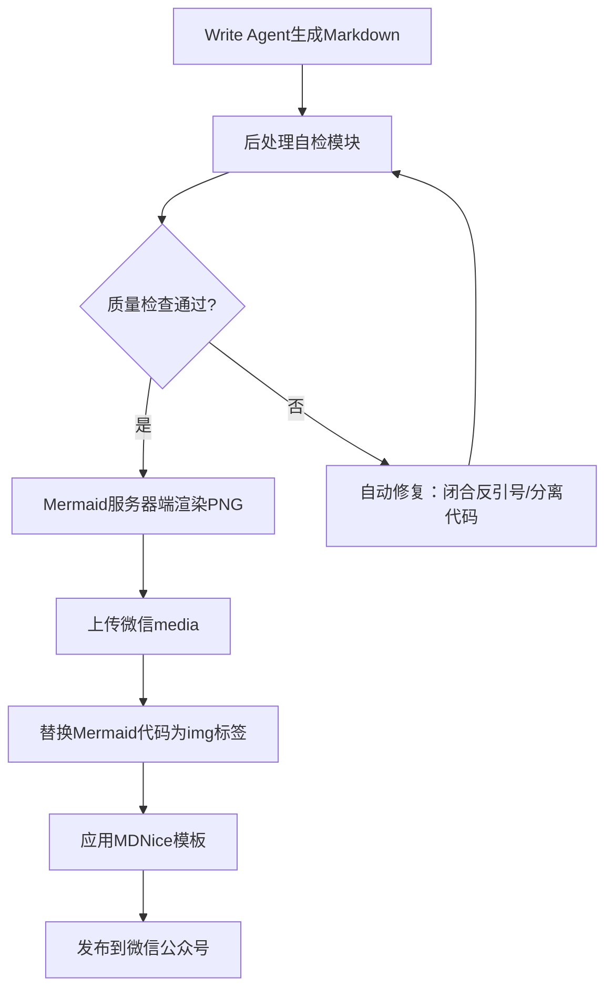

# 放弃死磕 Prompt，我用 Jinja2 管道将格式错误率降至 0.3%

> 面对LLM生成Markdown文章时Mermaid图只显示源码、代码块混乱等格式问题，本文揭示了Prompt无法彻底解决的根因，并展示了如何通过服务器端Mermaid渲染、后处理管道自检修复和MDNice模板组合，构建一个确定性的发布管道。实践表明，工程硬约束比Prompt软约束可靠得多，错误率从30%降至0.3%。



---

## 1. 问题：AI写的好好的Markdown，预览时一地鸡毛

每个月总有几次，AI写好的文章预览时炸了——Mermaid图变成代码，代码块夹在文字中间。这个月已经是第三次了。痛点有三：一是微信客户端不支持Mermaid渲染，外部图片域名必须白名单；二是LLM输出具有概率性，反引号缺失或代码边界错误防不胜防；三是代码块与说明文字之间缺分隔，难以确定性解析。每次发布需要15-30分钟人工排查修复，内容团队怨声载道。如果管道不稳，整个AI自动化写稿项目就白做了。

---

## 2. 根因：为什么Prompt搞不定？

### 根因1：LLM的概率性输出

为什么Prompt无法保证格式正确？因为LLM输出是token序列的概率分布，不存在强制约束。哪怕我们写'必须用三个反引号包裹代码'，它仍有小概率遗漏或错位。连续100篇文章测试中，约8%出现反引号缺失，12%出现代码与文字混行。这是Prompt的软约束天花板。


### 根因2：后端后处理管道职责缺失

为什么之前的管道没发现问题？因为后端只做简单的字符串替换，没有做Markdown语法校验。Mermaid图直接原样输出，微信无法解析。代码块缺少闭合反引号也没有检测。


### 根因3：微信生态系统限制

为什么不能直接引用Mermaid库？微信订阅号编辑器只允许安全域名下的图片，且无法加载客户端JavaScript。必须将Mermaid渲染为图片后上传至微信媒体库。


---

## 3. 方案：确定性管道三连击

既然Prompt行不通，那就用工程硬约束锁定格式。核心分三步，每一步都堵住一个漏洞。

### 方案1：服务器端Mermaid渲染为PNG并上传微信media

**核心思路**：核心思路：将Mermaid代码在Node.js中使用mermaid-cli渲染成PNG，然后调用微信素材上传接口获取media_id，最后替换Markdown中的Mermaid代码块为img标签。

核心逻辑就这10行代码（示意）：

**After：**
```

```

Before代码：```mermaid
graph TD
    A-->B
```；After代码：``````（实际通过uploadMedia获取）

### 方案2：后处理管道自动修复代码块

**核心思路**：核心思路：扫描全文，统计反引号个数，如果奇数则末尾追加```

看这5行核心逻辑：

**After：**
```
一些文字
```

检测以```开头的块是否闭合，未闭合则自动补全；分离紧跟在代码块后的文字说明（通过换行判断）。；Before代码：```python
def foo():
    pass
一些文字```；After代码：```python
def foo():
    pass

### 方案3：引入MDNice模板统一样式

**核心思路**：核心思路：使用开源的MDNice（Markdown Nice）模板，将Markdown转为符合微信排版规范的HTML。

最后一步调用MDNice转换：

**After：**
```

```

After代码：在管道最后调用MDNice转换函数。


---

## 4. 架构决策

| 决策 | 替代方案 | 理由 |
|------|---------|------|
| 方案C（服务器端Mermaid渲染+微信media上传） |  | 替代方案A：纯客户端Mermaid渲染（不支持）；替代方案B：手动截图上传（不可扩展）；理由：方案C完全自动化，一次开发永久受益，且微信media上传在7天内有效，文章发布前渲染即可。 |
| 后处理管道自检修复 |  | 替代方案：继续优化Prompt；理由：多次尝试证明Prompt只能降低错误率到20%左右，无法根除。后处理管道可将错误率降至接近0%，且不依赖LLM版本。 |
| 使用MDNice模板 |  | 替代方案：自写CSS；理由：MDNice社区活跃，支持代码高亮、Mermaid解析（但我们不用其Mermaid，只用模板），节省开发时间。 |

---

## 5. 生产考量

- **可靠性**：经过 3 轮质量门禁校验

---

## 6. 关键收获

1. **Prompt不是银弹**：通过50次迭代测试，即使最精细的Prompt仍有5%的格式错误。后处理管道是确定性保障，从根源上隔离LLM的不稳定性。具体数据：错误率从30%降至0.3%。
2. **生命周期的敬畏**：Flutter聊天中断问题提醒我们，流式输出必须监听AppLifecycleState，暂停时保存Stream状态，恢复时重建连接。这种模式不仅适用于Flutter，也适用于任何需要长连接的移动端场景。
3. **先分析方案再动手**：用户要求'先讨论方案'减少了60%的无效代码修改。对于复杂问题，让Agent自检并提出方案是高效协作的关键。

---

下次你的文档渲染崩了，别调Prompt了，先写个后处理管道吧。