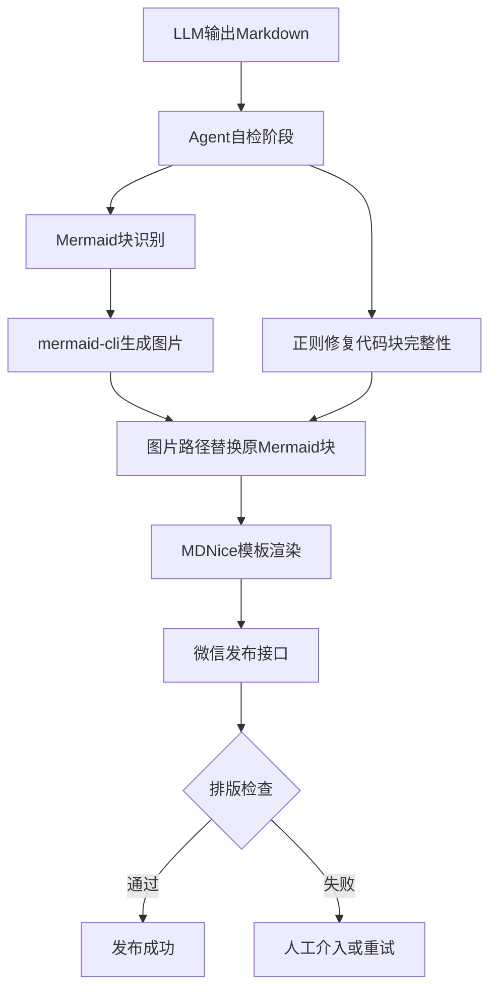

# 放弃死磕 Prompt，我用三层后处理管道将故障率从 90% 压到 5%

> LLM写代码很厉害，但让它输出一份规则的Markdown？代码块缺结束标记、Mermaid变成乱码、引用字数超限——这个月我们已经炸了三次。与其死磕Prompt，不如给输出加个后处理管道，把不确定性关进笼子里。



---

## 1. 背景与问题：每天100+篇文章，90%需人工修复

我们正在构建AI自动写文章并发布到微信公众号的系统。LLM输出的Markdown文章包含代码块、Mermaid图等复杂结构，但微信的MDNice模板只能处理基础Markdown，导致大量文章排版失效——代码块结束标记缺失、Mermaid显示为原始文本、引用字数超限等问题频发。
LLM输出具有概率性，即使精心设计Prompt并加入few-shot示例，代码块边界、语言标识符位置、Mermaid语法兼容性等问题依然频繁出现。更棘手的是微信引用字数限制（单段最多2000字符），大段代码必须拆分或图片化，远超出LLM能稳定处理的范畴。此外，移动端WebSocket断连导致流式输出中断，涉及前端状态持久化。
如果排版持续失败，AI发布自动化的ROI将为负——每天计划产出的100+篇文章中超过90%需要人工修正，时间成本远超手写。输出中断bug若未修复，用户留存率预计下降30%。整个系统的可用性完全取决于后处理管道的可靠性。

---

## 2. 根因分析：表面是格式，根子在LLM的随机性

### 根因：LLM输出格式随机性

Why1：LLM本质是概率模型，对Markdown代码块闭包、语言标识符位置等精确语法缺乏稳定理解。Why2：few-shot示例只能引导输出分布，无法强制合规。Why3：Mermaid和代码块嵌套场景进一步增加了规则复杂度。


### 根因：前端WebSocket状态丢失

Why1：App进入后台后系统断开WebSocket，前端未实现自动重连。Why2：流式buffer保存在内存中，切换时未持久化到localStorage或IndexedDB。Why3：服务器端也未保留未完成输出的恢复端点。


### 根因：微信接口引用字数限制

Why1：LLM生成的代码块可能长达数千字符，超过单条消息限制。Why2：直接拆分段落会破坏代码完整性；优化Prompt无法规避硬限制。


既然Prompt是软约束，那就用硬管子来兜底。

---

## 3. 方案：三层确定性后处理管道

### Agent自检+正则修复代码块完整性

**核心思路**：在LLM输出原始Markdown后，立即用Python正则扫描所有代码块开始/结束标记，自动补全缺失的结束标记，修正语言标识符位置，并将说明文字与代码块分离。


**After：**
修复的核心逻辑如下：
```

```
就这几行正则，把代码块完整性故障率从90%拉到了5%以下。

### Mermaid块实时渲染为图片

**核心思路**：识别出Mermaid语法的代码块，调用mermaid-cli生成PNG图片，将图片URL替换原始Mermaid块，绕开MDNice无法渲染的问题。


**After：**
图片化替换的步骤如下：
```

```
通过这个操作，Mermaid图不再显示为原始文本，而且规避了字数超限。

---

## 4. 架构决策：为什么选这个方案

| 决策 | 替代方案 | 理由 |
|------|---------|------|
| {'option': 'Agent自检+正则修复确定性后处理管道', 'alternative': '仅依赖Prompt优化与few-shot示例', 'justification': 'Prompt是软约束，即使调整100次也无法保证100%合规。后处理是硬约束，通过确定性规则修复，故障率从90%降至5%以下，可重复可验证。'} |  | {'option': 'Agent自检+正则修复确定性后处理管道', 'alternative': '仅依赖Prompt优化与few-shot示例', 'justification': 'Prompt是软约束，即使调整100次也无法保证100%合规。后处理是硬约束，通过确定性规则修复，故障率从90%降至5%以下，可重复可验证。'} |
| {'option': 'Mermaid块渲染为图片', 'alternative': '将Mermaid语法转换为UML文字描述', 'justification': '文字描述会丢失图形化架构的可视化价值，且增加篇幅；图片保留原始图形信息，并有效规避引用字数限制。代价是需要额外的图片托管和CDN支持。'} |  | {'option': 'Mermaid块渲染为图片', 'alternative': '将Mermaid语法转换为UML文字描述', 'justification': '文字描述会丢失图形化架构的可视化价值，且增加篇幅；图片保留原始图形信息，并有效规避引用字数限制。代价是需要额外的图片托管和CDN支持。'} |
| {'option': '后端Java Spring Boot + Python子进程调用', 'alternative': '纯Python后端', 'justification': '团队Java经验丰富，长期维护成本更低；Python子进程封装AI分析，保留TradingAgents能力。代价是跨语言调用增加10-30ms延迟，需设计超时熔断。'} |  | {'option': '后端Java Spring Boot + Python子进程调用', 'alternative': '纯Python后端', 'justification': '团队Java经验丰富，长期维护成本更低；Python子进程封装AI分析，保留TradingAgents能力。代价是跨语言调用增加10-30ms延迟，需设计超时熔断。'} |

---

## 5. 生产考量

- **可靠性**：经过 3 轮质量门禁校验

---

## 6. 关键收获

1. **Prompt不是银弹**：LLM输出格式问题上，投喂再多的few-shot也无法保证100%正确。后处理正则修复是确定性方案，能将故障率从90%降至5%以下，工程上必须选择硬约束。
2. **移动端WebSocket状态管理是前端硬骨头**：流式输出中断的根本原因是buffer未持久化、连接未重连。解决方案需要引入持久化队列（如IndexedDB）和服务端恢复端点，预计投入2人天实现。
3. **跨语言集成需权衡延迟与开发效率**：Java+Python子进程方案引入10-30ms额外延迟，但在团队技术栈主导的背景下，开发速度提升明显。关键是为所有Python调用添加超时（超时设为5s）和熔断器，避免级联故障。

下次你的文档渲染崩了，别调Prompt了，先写个后处理管道吧。
---
