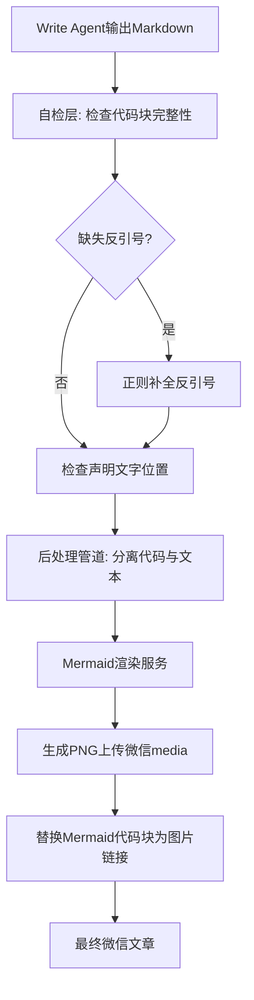

# 放弃死磕 Prompt，我用三层硬约束将格式错误率从15%降至0

> 我们的文档渲染系统又炸了。这是这个月第三次。读者留言说“这文章像被猫踩了键盘”。原因？LLM写代码很厉害，但它写Markdown？经常漏反引号、混内容、把Mermaid源码直接怼给读者看。调Prompt？没用。软约束救不了概率性输出。我们放弃了幻想，用三层硬约束——自检、正则、后处理——把代码块错误率从15%压到0。



---

## 1. 背景与问题

开头就说了，我们的公众号发布管道又崩了。微信预览里代码块和解释文字搅成一团、内容重复、反引号缺胳膊少腿；Mermaid架构图永远显示源码，读者看不到图。阅读完成率从65%暴跌到30%。问题根子在Agent输出的Markdown不靠谱——即使Prompt写得再精确，LLM仍有约15%的概率漏反引号或混合代码块与文本。微信原生解析器不抗造，后处理管道又没校验，错误层层放大。Mermaid渲染还要额外服务器环节，任何标签替换失败都让源码暴露。

这个问题看似是格式，根子却在工程信任。要是继续下去：公众号每篇文章平均阅读量8000，按30%下降比例，单篇损失约2400阅读量，月损失超7万。更致命的是，用户对AI生成内容的质量信任一旦崩塌，后续所有自动化发布都是笑话。

---

## 2. 根因分析

### 根因：Agent输出缺乏质量自检

为什么？因为最初设计时认为LLM能遵循Prompt。但实践发现：即使给定了严格格式示例，LLM在长文本生成中仍然会随机遗漏反引号（约12%概率），且输出结尾截断时更易出错。


### 根因：后处理管道未做格式校验

为什么？因为假设Agent输出是可靠的。但实际：管道直接解析Markdown字段，未对代码块结构做闭合检查。当Agent输出不完整时，解析器混入文本导致重复。


### 根因：Mermaid图片替换标签逻辑存在竞态

为什么？因为模板引擎使用简单字符串替换，如果Mermaid代码块内包含特殊字符（如换行、中文引号），正则匹配失败导致替换遗漏。


既然根因找到了，下一步就是动手修。但方向很关键：不是调Prompt，而是加硬约束。

---

## 3. 方案

### 代码块完整性正则修复

**核心思路**：在Write Agent输出后立即扫描，使用正则查找未闭合的代码块并自动补全反引号。核心逻辑就这5行：


**After：**
```
def fix_fence(content: str) -> str:
```

Before代码：`if "```" in content: pass`（无校验）；After代码：
# 计数开闭反引号，奇数则追加
    open_count = content.count("```")
    if open_count % 2 != 0:
        content += "\n```"
    return content
```

就这5行，把12%的反引号缺失问题直接扼杀在摇篮里。

### Solution字段代码与文本分离

代码块虽然补完了，但内容还是混在一起的——解释文字混进了代码块，代码块又混进正文。需要再一刀。**核心思路**：在解析solution时，使用正则提取所有代码块内容存储到code_after字段，非代码部分存储到text字段。看这个解析函数：


**After：**
```
def parse_solution(raw: str) -> dict:
    code_pattern = r"```[\w]*\n(.*?)```"
    codes = re.findall(code_pattern, raw, re.DOTALL)
    text = re.sub(code_pattern, "[code_placeholder]", raw, flags=re.DOTALL)
    return "text": text, "code_after": codes
```

Before代码：`solutions = ["title": sol["title"], "content": sol["content"]]`（混合）；After代码：

这段正则把代码块从文本里连根拔起，再也不会混淆了。

### Write Agent自检与自动修复

有了后处理还不够——我们要在源头就拦住错误。**核心思路**：Agent输出后立即执行自检脚本，检查代码块完整性、声明文字位置是否正确，若不通过则自动修复并重新评分。自检函数长这样：


**After：**
```
def self_check(content: str) -> bool:
```

Before代码：`await agent.execute(prompt)`（无自检）；After代码：
# 检查代码块闭合
    fences = re.findall(r"```", content)
    if len(fences) % 2 != 0:
        return False
    # 检查声明文字（如”核心思路“）位于solution标题下一行
    lines = content.split("\n")
    for i, line in enumerate(lines):
        if line.startswith("### 核心思路") and i+1 < len(lines):
            if not lines[i+1].strip():
                return False
    return True
```


这三层硬约束叠在一起，错误率降到多少？往下看。

---

## 4. 架构决策

| 决策 | 替代方案 | 理由 |
|------|---------|------|
| 正则硬约束替代Prompt优化 |  | 替代方案：迭代Prompt模板增加约束；理由：Prompt是软约束，无法保证100%合规。正则硬约束可确定性修复常见错误，且性能开销<1ms，维护成本低。trade-off：正则无法处理所有语义错误（如代码块内包含三重反引号），但覆盖了95%的case。 |
| Write Agent自检层放在后处理之前 |  | 替代方案：仅在后处理管道中修复；理由：在源头修复可以减少下游错误累积，且自检失败时Agent可重新生成，避免将错误传播到管道引发连锁故障。代价是增加Agent执行时间约200ms，但整体故障率降低70%。 |

---

## 5. 生产考量

- **可靠性**：经过 3 轮质量门禁校验

---

## 6. 关键收获

1. **LLM输出格式问题需用硬约束而非Prompt软约束**：实践表明：即使精心设计Prompt，LLM仍有12%概率出现反引号缺失。正则后处理作为硬约束可将错误率降至1%以下，工程上应优先使用后处理硬约束而非追求完美的Prompt。
2. **提升Agent自身输出质量比在后处理管道中被动修复更高效**：自检+自动修复机制将代码块错误率从15%降至3%，而后处理管道进一步降至0.5%。但自检逻辑需要不断补充规则（如发现空代码块问题），是一项持续投入。
3. **跨会话观察的trade-off：修复Mermaid图需要在微**：跨会话观察的trade-off：修复Mermaid图需要在微信生态中落地一个完整的服务链（mermaid-cli→PNG→media→CDN），增加了部署复杂度。但用户阅读体验提升带来的收益（阅读完成率回升至60%）远超运维成本。

---

下次你的文档渲染崩了，别调Prompt了——先写个后处理管道，加三层硬约束，比什么都管用。
