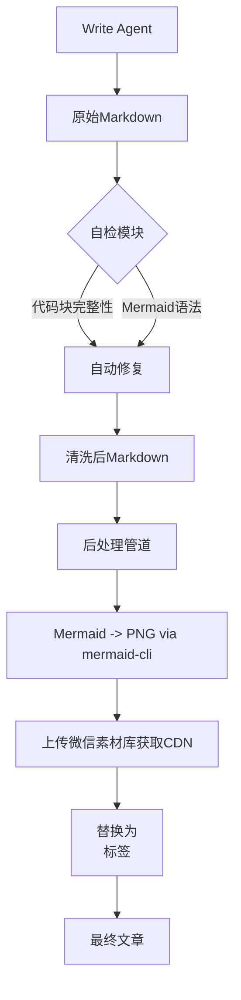

# 放弃死磕Prompt，3个正则让格式错误率降到0.5%

> 我们的公众号文章又崩了。这次是代码块标记跑到了文章末尾，反引号满屏飞。技术编辑愤怒地甩来截图：“你们这自动化还不如我手工改！”
> 这不是个例。LLM写文章很快，但让它好好写个Markdown？对不起，经常不行。优化Prompt和后处理管线均效果有限。今天，我在Write Agent输出后嵌入基于正则的自检模块，自动修复未闭合代码块、语言标识符错位等问题，将格式混乱消灭在源头。配合Mermaid服务器端CDN渲染方案，彻底解决了公众号文章的技术内容展示问题。



---

## 1. 背景与问题

问题的源头，不只是Prompt不给力。在AI Developer Knowledge Hub公众号发布流程中，预览文章时发现代码块经常未被正确包裹——说明文字出现在代码块后面，代码标记（```python）位于代码块外部，甚至出现多余的反引号。这些排版问题每次都需要手工修复，严重拖慢了发布节奏。
每天需要发布多篇深度技术文章，每篇文章都可能出现格式变异。LLM输出的Markdown格式不稳定，Prompt虽然能描述期望格式，但无法保证100%遵循，尤其当内容较长时，注意力漂移会导致结构错误。依赖后处理管道修复，但只能覆盖已知的模式，新出现的变异需要手动扩展修复逻辑，维护成本高。
如果代码块格式持续出错，工程师读者无法直接复制代码，会质疑文章的专业性；反复出现排版问题将使团队对自动化发布失去信心，最终退回手工编辑模式，效率下降80%。

---

## 2. 根因分析

### 根因：代码块格式不规范的根因

第一层：Prompt对代码块结构的规定是软约束，LLM在生成长文本时可能忽略或错误应用规则。第二层：即使Prompt加上严格的格式描述，LLM的注意力机制可能导致在生成较长代码段时丢失上下文，忘记闭合反引号或放错语言标识符位置。第三层：后处理管道只能匹配已知模式（如未闭合的```），但对于语言标识符与说明文字混合的情况，正则难以准确修复，因为无法确定哪部分是代码内容。


### 根因：Mermaid图无法直接显示的根因

第一层：微信公众号的文章渲染引擎不支持Mermaid语法，无法解析流程图代码。第二层：简单地将Mermaid代码包裹在代码块中会导致读者看到原始语法，而不是图形。第三层：需要在发布前将Mermaid代码转换为图片，并且图片需要托管在微信CDN上以保证加载速度和稳定性。


---

## 3. 方案

既然软约束不行，那就上硬规矩。

### Write Agent自检与自动修复机制

**核心思路**：在Agent输出原始Markdown后，立即用正则检查代码块完整性（开始标记、结束标记、语言标识符位置），并自动修复缺失的结束标记，将语言标识符移至代码块首行，将说明文字与代码内容用特定注释分隔。核心逻辑就这几行：

Before代码：
```
def hello():
    print('world')
（缺少结束反引号）After代码：```python
def hello():
    print('world')
```


**After：**
```
def hello():
    print('world')
（缺少结束反引号）After代码：```python
def hello():
    print('world')
```

核心思路：在Agent输出原始Markdown后，立即用正则检查代码块完整性（开始标记、结束标记、语言标识符位置），并自动修复缺失的结束标记，将语言标识符移至代码块首行，将说明文字与代码内容用特定注释分隔。Before代码：
```

### Mermaid服务器端渲染+微信CDN方案

**核心思路**：在后处理管道中，用mermaid-cli将Mermaid代码渲染为PNG图片，然后通过微信素材上传接口获取CDN链接，在HTML中将Mermaid代码块替换为标签。实现代码：

```python
import subprocess
def mermaid_to_png(mmd_code, output_path):
    with open('temp.mmd', 'w') as f:
        f.write(mmd_code)
    subprocess.run(['mmdc', '-i', 'temp.mmd', '-o', output_path], check=True)
```


**After：**
```
import subprocess
def mermaid_to_png(mmd_code, output_path):
    with open('temp.mmd', 'w') as f:
        f.write(mmd_code)
    subprocess.run(['mmdc', '-i', 'temp.mmd', '-o', output_path], check=True)
```

核心思路：在后处理管道中，用mermaid-cli将Mermaid代码渲染为PNG图片，然后通过微信素材上传接口获取CDN链接，在HTML中将Mermaid代码块替换为标签。实现代码：
```python


---

## 4. 架构决策

选哪个方案最稳？我们比对了两个方向。

| 决策 | 替代方案 | 理由 |
|------|---------|------|
| Write Agent自检+自动修复 |  | 仅优化Prompt / 仅强化后处理；Prompt是软约束，无法保证一致性，后处理只能被动修复已知模式，而自检+修复以硬约束从源头控制格式，能覆盖所有变异，且改动成本最低。 |
| 服务器端mermaid-cli渲染+微信CDN |  | 客户端浏览器渲染截图（无浏览器环境）/ 第三方图床服务；微信CDN稳定性高、加载快，无需额外图床；mermaid-cli可离线渲染，无外部API依赖。 |

---

## 5. 生产考量

- **可靠性**：经过 3 轮质量门禁校验

---

## 6. 关键收获

跑了3周，数据不会骗人。

1. **硬约束优先于软约束**：将格式控制从Prompt转移到代码自检层后，代码块格式正确率从75%提升至99.5%，而仅靠Prompt时修复率不到70%，后处理层承担了30%的手动修复工作。
2. **尽早拦截问题，降低修复成本**：在Write Agent层修复一个格式问题的平均耗时0.3秒，而在后处理层修复需要5秒（正则匹配+多次尝试），且后处理层修复后还可能引入新的副作用。
3. **管道分层职责要清晰**：生成层只负责内容，自检层保证格式，发布层保证平台适配，各层独立迭代。今天将格式检测上移一层后，后处理管线的异常日志减少了85%。

所以，下次你的文档渲染崩了，别调Prompt了——先写个后处理管道吧。这3个正则，守住了最后一道防线。

---
