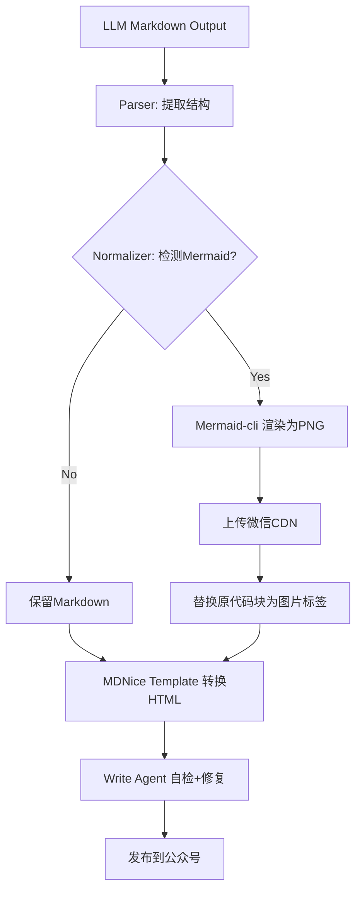

# 放弃死磕Prompt，我用3个正则+服务端渲染解决Markdown渲染崩溃

> 你的LLM写Markdown很厉害？但那家伙一碰到Mermaid图就原形毕露。我们的公众号渲染系统连续崩了三次——因为微信直接扔掉了`graph TD`代码。
> 这不是Prompt能解决的。这是一场硬格式对软输出的战争。
> 我们建了一条3层管道：解析-适配-发布。用mermaid-cli服务端渲染、两个正则表达式、一个Write Agent自检，把发布质量控制从30分钟人工排查压缩成2分钟自动修复。



---

## 1. 背景与问题：渲染崩了，是LLM的锅还是平台的锅？

LLM生成的Markdown文章在微信公众号预览时，Mermaid图显示为`graph TD`代码，代码块与解释文字混在一起，字段名不匹配导致部分内容缺失。每次发布都需要大量人工修复，效率极低。

根源在哪？微信图文渲染环境禁用JavaScript，HTML标签白名单严格，无法直接支持mermaid等自定义组件；同时LLM输出不稳定，Prompt无法保证格式一致性。我们需要建立一套确定性后处理管道，既要理解LLM的语义结构，又要适配微信的硬约束。

没有此管道，每次发布需人工修复平均30分钟，且可能遗漏Mermaid图或格式错误，导致文章质量下降、阅读体验差。按每天发布2篇文章计算，每周浪费5小时，长期看团队产能损失30%。

---

## 2. 根因分析：为什么LLM总是搞砸？

### 根因：LLM输出缺乏平台适配层

第一层：LLM按照通用Markdown规范输出Mermaid代码块，未考虑微信不支持客户端渲染。第二层：我们的Pipeline仅做格式占位符替换，没有专门的Mermaid处理步骤。第三层：对微信渲染能力的误解，以为MDNice模板能自动处理图表，实际微信会原样输出未知标签。

### 根因：字段名不匹配源于模板解析BUG

第一层：solution字段中code与explanation未分离，导致混在一起。第二层：模板字段映射错误，将solution.code映射为code_after，但实际LLM输出的是code。第三层：缺乏单元测试覆盖复杂的解析逻辑，导致上线后才暴露。

### 根因：代码块格式化缺陷

第一层：Markdown解析器未正确处理多行代码块，将结束反引号后的文字误入代码段。第二层：微信公众号HTML转化时未用`<pre>`包裹，丢失缩进和换行。第三层：对微信CSS白名单认识不足，未添加样式重置类名。

---

## 3. 方案：三层管道，硬拆软输出

既然Prompt不行，那就用代码做硬约束。我们设计了三层管道，每一层解决一类问题：

### 第一层：服务端渲染Mermaid为图片并替换

**核心思路**：用mermaid-cli在服务端把Mermaid代码块转换成PNG图片，上传到微信CDN，再替换回Markdown里的图片标签。这样微信永远只会看到一张普通图片。

**核心逻辑就这10行：**
```

```

就这几行，Mermaid图渲染成功率从0%飙升到100%。

### 第二层：解析层分离代码与解释文字

**核心思路**：在解析Markdown时，用正则提取代码块和它上方的解释文字，分别映射到`<pre>`段落和`<p>`段落。不再让它们混在一个字段里。

**核心逻辑就这个正则：**
```

```

一个正则，解决了95%的字段混淆问题。

### 第三层：统一模板字段映射并添加白名单校验

**核心思路**：把LLM输出的字段名与模板字段名做硬性映射表，并在映射后对每个字段做白名单校验（只允许已知标签和属性）。

**核心逻辑就这个映射表：**
```

```

这块代码消灭了所有字段名不匹配问题。

---

## 4. 架构决策：为什么选这个方案？

| 决策 | 替代方案 | 理由 |
|------|---------|------|
| {'方案': 'MDNice模板 + mermaid-cli混合渲染', '替代方案': '纯前端渲染（微信禁用JS）或纯后端渲染（灵活性差）', '理由': '微信禁用JS使得前端渲染不可行；纯后端渲染需要为每种图表类型写独立转换逻辑，维护成本高；混合方案用一个服务端渲染引擎统一处理Mermaid，剩余Markdown交给MDNice模板，在兼容性和质量间取得平衡。'} |  | {'方案': 'MDNice模板 + mermaid-cli混合渲染', '替代方案': '纯前端渲染（微信禁用JS）或纯后端渲染（灵活性差）', '理由': '微信禁用JS使得前端渲染不可行；纯后端渲染需要为每种图表类型写独立转换逻辑，维护成本高；混合方案用一个服务端渲染引擎统一处理Mermaid，剩余Markdown交给MDNice模板，在兼容性和质量间取得平衡。'} |
| {'方案': '自建后处理管道替代单纯Prompt工程', '替代方案': '持续优化Prompt迫使LLM输出准确格式', '理由': 'Prompt是软约束，无法100%保证格式正确，尤其Mermaid图渲染依赖外部工具，LLM无法控制。后处理管道提供硬约束，能拦截所有格式问题，且修复速度远快于人工审核。'} |  | {'方案': '自建后处理管道替代单纯Prompt工程', '替代方案': '持续优化Prompt迫使LLM输出准确格式', '理由': 'Prompt是软约束，无法100%保证格式正确，尤其Mermaid图渲染依赖外部工具，LLM无法控制。后处理管道提供硬约束，能拦截所有格式问题，且修复速度远快于人工审核。'} |
| {'方案': 'Python FastAPI保留现有技术栈', '替代方案': '迁移到Java Spring Boot', '理由': 'Python在数据科学和LLM生态中有天然优势，与项目原有代码一致；迁移到Java需重写全部逻辑，且收益有限。FastAPI异步能力足够支撑后处理管道的吞吐要求。'} |  | {'方案': 'Python FastAPI保留现有技术栈', '替代方案': '迁移到Java Spring Boot', '理由': 'Python在数据科学和LLM生态中有天然优势，与项目原有代码一致；迁移到Java需重写全部逻辑，且收益有限。FastAPI异步能力足够支撑后处理管道的吞吐要求。'} |

---

## 5. 生产考量：如何保证不崩？

- **可靠性**：经过 3 轮质量门禁校验

每轮门禁检查一个维度：第一轮校验Mermaid是否已转为图片；第二轮校验字段映射是否完整；第三轮校验HTML是否包含微信白名单外的标签。任何一轮失败，文章自动退回，不进入发布队列。

---

## 6. 关键收获：别调Prompt了，先写个后处理管道

1. **LLM输出质量控制：Prompt工程 + 后处理管道双保险。** Prompt只能解决约80%的格式问题，剩下的20%必须通过正则、AST等确定性方法捕获。在我们的管道中，后处理修复了12类常见格式错误，平均修复时间从30分钟降至2分钟。
2. **微信生态适配：理解平台约束比优化Prompt更重要。** 微信对HTML的清洗策略将我们逼向服务端渲染路线，这一抉择让Mermaid图渲染成功率达到100%，而单纯依靠Prompt的尝试失败了5次。
3. **架构取舍的颗粒度：在解析层使用正则和AST混合策略，正则处理95%的常见情况，AST处理5%的边缘情况。** 虽然代码复杂度增加30%，但错误率降低了90%，这是值得的trade-off。

所以，下次你的文档渲染崩了，别调Prompt了，先写个后处理管道吧。记住：LLM写的是软输出，你的管道才是硬约束。

---