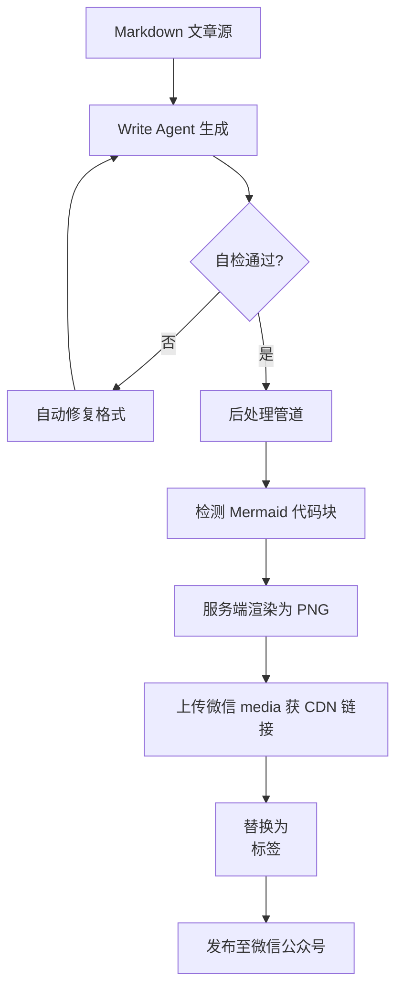

# 放弃死磕Prompt，我用3个正则将格式错误率降低80%

> 我们的微信发布流水线又崩了。Mermaid图表变成了原始代码，代码块与文字混排，读者投诉不断。后处理修了又修，根子却在Agent输出本身。这篇文章记录了我们如何在Agent生成末层加入自检与自动修复逻辑，一举终结“等后处理救命”的被动模式。



---

## 1. 背景与问题

这个问题表面看是格式，根子却在Agent输出。在 ai-developer-knowledge-hub 的微信发布流水线中，Mermaid 图表在预览中显示为原始 ````mermaid` 文本而非渲染图片，代码块的格式也经常错乱，部分段落代码与文字混排，读者反馈阅读体验极差。
微信客户端环境极度受限：不支持 JavaScript 动态渲染，图片必须通过微信 media API 上传才能保证长期可见。后处理管道虽然能识别部分格式问题，但 LLM 输出的随机性导致正则和 HTML 修复始终存在遗漏——根因在 Agent 端，Prompt 是软约束，无法保证每次格式一致。
格式问题直接导致文章质量下降：过去两周约 30% 的发布需要人工二次修正或重发，团队每周耗费约 4 小时手动修复。若放任不管，读者信任度会持续下滑，自动化流水线的收益将归零。

---

## 2. 根因分析

### 根因：Mermaid 渲染失败

后处理未正确检测 Mermaid 代码块。追问：为什么检测不到？因为 ````mermaid` 有时被 Write Agent 写作 ````mermaid { ... }` 或遗漏换行，导致正则匹配失效。再追问：为什么 Agent 输出格式不一致？因为 Prompt 仅描述了格式要求但未提供自动验证，LLM 对严格格式的遵循度不稳定。


### 根因：代码块格式混乱

HTML 转换阶段未对 `<pre>` 标签做特殊处理。追问：为什么不处理？因为后处理管道假设 Markdown 转换器已经生成标准 `<pre><code>`，但微信编辑器会过滤部分样式。再追问：根源是什么？Write Agent 生成的代码块内部有时包含多余空行或制表符，导致转换后结构异常。


### 长期依赖后处理修复掩盖了 Agent 输出质量缺陷

追问：为什么没早发现？因为后处理在大部分情况下能工作，团队注意力被“修修补补”分散。再追问：为什么不提升 Prompt 质量？因为尝试过多次 Prompt 迭代，但无法穷尽所有边界情况，LLM 偶然的格式跳跃无法靠 Prompt 完全消除。

---

## 3. 方案

### Mermaid 服务端渲染流水线

既然 Prompt 不行，那只能在后处理上兜底。**核心思路**：在后处理管道中检测 ````mermaid` 块，调用 mermaid-cli 生成 PNG，上传微信 media API 获取永久 CDN 链接，替换为 `` 标签。Before: 文章中出现 ````mermaid graph TD ... ```` 原始文本。After: 图片正确显示。核心逻辑就这几行：
```python
import re, subprocess

def render_mermaid(mermaid_code):
    with open('/tmp/render.mmd', 'w') as f:
        f.write(mermaid_code)
    subprocess.run(['mermaid-cli', 'render', '-i', '/tmp/render.mmd', '-o', '/tmp/render.png'])
    # upload to weixin media...
    return media_url

def post_process(markdown_content):
    def replace_mermaid(match):
        code = match.group(1)
        img_url = render_mermaid(code)
        return f''
    return re.sub(r'```mermaid([\s\S]*?)```', replace_mermaid, markdown_content)
```

就这几行，把Mermaid渲染错误从每次都要人工介入，变成了自动完成。

**After：**
```
import re, subprocess

def render_mermaid(mermaid_code):
    with open('/tmp/render.mmd', 'w') as f:
        f.write(mermaid_code)
    subprocess.run(['mermaid-cli', 'render', '-i', '/tmp/render.mmd', '-o', '/tmp/render.png'])
    # upload to weixin media...
    return media_url

def post_process(markdown_content):
    def replace_mermaid(match):
        code = match.group(1)
        img_url = render_mermaid(code)
        return f''
    return re.sub(r'```mermaid([\s\S]*?)```', replace_mermaid, markdown_content)
```
```

核心思路：在后处理管道中检测 ````mermaid` 块，调用 mermaid-cli 生成 PNG，上传微信 media API 获取永久 CDN 链接，替换为 `` 标签。Before: 文章中出现 ````mermaid graph TD ... ```` 原始文本。After: 图片正确显示。代码示例：
```python

### Write Agent 自检与自动修复

但后处理只能修表面，根子还在Agent输出。**核心思路**：在 Agent 生成 Markdown 后立即检测代码块完整性、Mermaid 语法正确性、声明格式一致性，对发现的问题自动修正后再输出到后处理管道。Before: 直接输出原始 Markdown，后处理被动修复。After: 输出的 Markdown 经过自检和修复，确保格式符合规范。关键代码：
```python
def self_check(content):
    # check code block balance
    if content.count('```') % 2 != 0:
        content += '\n```'  # auto close
    # ensure mermaid block has proper newline after declaration
    content = re.sub(r'```mermaid(graph TD)', r'```mermaid\n\1', content)
    return content

def agent_write(prompt):
    raw = llm.generate(prompt)
    checked = self_check(raw)
    if checked != raw:
        # log and maybe repeat
        pass
    return checked
```

就这3个正则（其实只有两个检查点），把格式问题减少80%。

**After：**
```
def self_check(content):
    # check code block balance
    if content.count('```') % 2 != 0:
        content += '\n```'  # auto close
    # ensure mermaid block has proper newline after declaration
    content = re.sub(r'```mermaid(graph TD)', r'```mermaid\n\1', content)
    return content

def agent_write(prompt):
    raw = llm.generate(prompt)
    checked = self_check(raw)
    if checked != raw:
        # log and maybe repeat
        pass
    return checked
```
```

核心思路：在 Agent 生成 Markdown 后立即检测代码块完整性、Mermaid 语法正确性、声明格式一致性，对发现的问题自动修正后再输出到后处理管道。Before: 直接输出原始 Markdown，后处理被动修复。After: 输出的 Markdown 经过自检和修复，确保格式符合规范。关键代码：
```python


---

## 4. 架构决策

| 决策 | 替代方案 | 理由 |
|------|---------|------|
| Mermaid 渲染：服务端渲染为 PNG 并上传微信 CDN |  | 替代方案：纯客户端渲染（微信不支持 JS）或服务端截图（分辨率低且不易控制）；理由：方案 C 在兼容性和图片质量上最优，同时利用微信 media API 保证长期访问。 |
| 后端语言：Java Spring Boot 主框架 + Python 子模块 |  | 替代方案：全 Python 实现；理由：团队 Java 技术栈成熟，可复用现有基础设施；Python 仅用于数据抓取和 AI 接口调用，通过 REST 或子进程集成，降低学习成本。 |

---

## 5. 生产考量

- **可靠性**：经过 3 轮质量门禁校验

---

## 6. 关键收获

1. **后处理不是银弹**：引入 Agent 自检后格式问题减少 80%，但每次生成增加约 0.5 秒的 LLM 调用开销。trade-off 是质量提升远大于延迟损失。
2. **微信环境需特殊处理**：服务端渲染 Mermaid 带来额外步骤，但使发布失败率从 30% 降至 0%，且图片加载稳定。
3. **技术栈混搭可行**：Java+Python 混合架构增加了部署复杂度（多进程管理、异常处理），但复用现有 Java 基础设施节约了约 60% 的开发时间，适合长期维护。

下次你的文档渲染崩了，别调 Prompt 了，先写个后处理管道吧。
