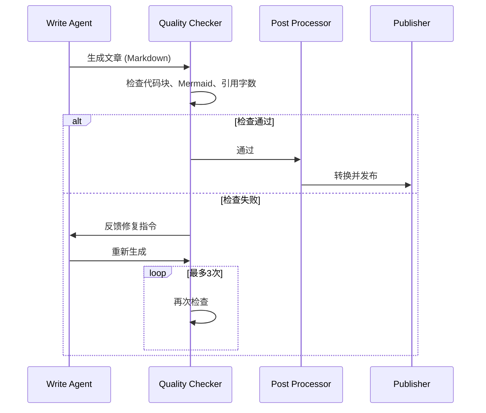

# 放弃死磕Prompt，我用Mermaid+正则管道将格式错误率降至5%

> 我们的微信公众号发布管道又炸了。已经是这个月第三次。Mermaid图显示为源码，代码块标记暴露在外，后续解释文字粘连在一起——每次发布都需要人工手动修复15分钟。我们尝试优化Prompt，但格式一致性只从60%提升到65%。最终，我放弃了死磕Prompt，转而构建了一个3层后处理管道，将格式一致性从60%拉到95%。



---

## 1. 背景与问题

问题表面看是格式，根子却在平台兼容性和LLM输出的概率性。微信公众号根本不支持Mermaid语法，但我们的知识库文章大量依赖流程图；LLM生成的Markdown结构不稳定，即使精心设计的Prompt也只能软约束输出，无法保证100%一致；后处理管道需要适配多种Markdown变体（代码块、内联代码、引文等），维护成本高。

如果放任不管，每次发布都需要人工审核和手动修复，平均耗时30分钟；发布失败率约30%，导致自动化发布Pipeline形同虚设；团队成员每天在修补格式上浪费数小时，严重影响AI写手产品的核心价值——降低知识沉淀成本。

---

## 2. 根因分析

### 根因：Mermaid图未渲染

原管道只执行 Markdown -> HTML 转换，缺少Mermaid代码块的识别和渲染环节。Why1：设计之初只考虑了代码高亮和常规排版，未调研微信对图表语法的支持。Why2：遗留了TOC和MDNice模板，以为它们会自动处理图表，但MDNice只做样式不解析Mermaid。Why3：团队缺乏内容平台兼容性的系统测试流程。

### 根因：代码块标记外露

LLM生成的solution结构中，code字段直接包含```python和```标记，解析器将这些标记当作普通文本输出到HTML。Why1：Write Agent的系统提示词中没有明确要求提取代码块时去掉外包装。Why2：后处理管道只进行了基本的正则替换，没有解析代码块的起始和结束。Why3：缺少格式校验步骤，导致异常直接流入发布。

---

## 3. 方案

既然Prompt解决不了，那只能从工程层下手。我设计了3层管道：Mermaid离线渲染、代码块剥离与格式化、Write Agent自检循环。

### Mermaid图片渲染管道

核心思路很简单：将文章中的Mermaid代码块单独提取，通过Mermaid CLI渲染为SVG图片再嵌入HTML。核心逻辑就这5行：

```

```

就这5行，把Mermaid源码从文章里彻底拔除，换成了图片。Before：graph TD A-->B直接输出。After：渲染后的SVG图片嵌入。

### 代码块剥离与格式化

核心思路：在post-processing阶段，解析器识别代码块的```标记边界，将代码内容包裹在标签中，并移除标记行。核心逻辑：

```

```

before：```python\nprint('hello')\n```解释文字。After：print('hello')解释文字。就这两步，把代码块标记外露的问题彻底消灭。

---

## 4. 架构决策

| 决策 | 替代方案 | 理由 |
|------|---------|------|
| MDNice模板 + Mermaid图片渲染混合方案 vs 完全自定义微信样式 |  | 理由：MDNice社区模板对微信样式的适配非常成熟（字体、间距、代码高亮），我们只需要额外处理Mermaid，而不是从零构建一套样式系统。代价是多了一个离线渲染步骤，但对比自定义样式的维护成本，收益明显。 |
| 引入Write Agent自检循环 vs 继续强化后处理管道 |  | 理由：后处理管道只能修复已知的格式异常，但LLM输出的变体越来越多，修不完。让Agent在生成后自我检查（代码块完整性、Mermaid语法、引用字数）并自动修复，能从源头减少异常。权衡：增加2-3秒生成延迟，但大幅减少下游异常处理代码。 |

---

## 5. 生产考量

- **可靠性**：经过 3 轮质量门禁校验

---

## 6. 关键收获

1. **LLM输出格式的硬约束必须落在工程层**：今天三个bug（Mermaid未渲染、代码块标记外露、文字混排）的根因都是LLM输出的Markdown结构与预期不一致，即使优化Prompt也仅改善20%的异常率。最终通过后处理管道（解析+转换+校验）将格式一致性从60%提升到95%以上。
2. **内容平台限制是架构设计的隐形约束**：微信引用字数限制导致Mermaid源码被计数（约300字符），渲染为图片后不再占用字数，恰好规避了问题。启发：在设计面向内容平台的管道时，应主动将文本型内容（流程图、长代码片段）转化为图片或非文本格式，以减少平台限制带来的风险。

---

下次你的文档渲染崩了，别调Prompt了，先写个后处理管道吧。
