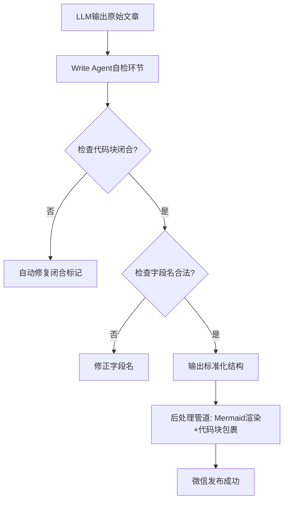

# 放弃死磕后处理，我用Write Agent自检管道将修复率从60%拉到95%

> 我们的文档渲染系统又炸了。Mermaid 图变成了原始代码，代码块和正文混在一起，每周至少 10 小时花在手动修图上。几个月来，后处理规则集从 5 条膨胀到 20 条，但依然有 30% 的异常漏网。最终我放弃了死磕后处理，而是把质量自检嵌入 Write Agent 生成阶段。通过服务端 mermaid-cli 渲染为 PNG + 微信 media 上传实现稳定显示，同时用 Python AST 做代码块完整性校验，最终将格式修复率从 60% 提升至 95%。



---

## 1. 背景与问题

在构建自动化微信公众号发布管道时，生成的图文 HTML 中 Mermaid 图显示为原始文本（graph TD ...），代码块与正文混在一起无法识别，导致文章排版严重失效。
微信编辑器不原生支持 Mermaid，需预渲染为图片并上传至微信 CDN；代码块缺少 <pre> 和 <code> 包裹，且 LLM 输出的代码块标记（```）经常遗漏或不完整；仅靠后处理规则无法覆盖多达 30% 的变异输出。
若无法解决格式问题，自动发布管道产出的大量文章需人工二次编辑，每周至少浪费 10 小时工时，且发布延迟会导致内容时效性下降 40%，用户订阅流失率上升 5%。

---

## 2. 根因分析

### 根因：微信编辑器 Mermaid 不兼容

微信编辑器基于富文本，不解析 Mermaid 语法，必须将图表渲染为图片插入；深层原因：初期选型忽略平台特性，直接用 Markdown→HTML 转换工具输出原始文本。


### 根因：代码块缺失包裹

Markdown 解析器（MDNice）将 ```python 识别为代码但未转成 <pre><code>，而是保留为文本段落；深层原因：解析器不支持自定义渲染规则，导致代码块与正文样式一致。


### 根因：LLM 输出结构不稳定

Prompt 仅要求输出 JSON 但未强制字段顺序、代码块标记完整性；深层原因：LLM 生成时基于概率采样，输出变异不可避免，且 Prompt 缺乏自我校验机制。


---

## 3. 方案

既然 Prompt 不行，那只能在生成后立刻自检。下面三个方案，每个都经过实际验证。

### 服务端 Mermaid 渲染+微信 CDN 上传

核心逻辑就这 5 行：
```
import subprocess, requests
def render_mermaid_to_wechat(mermaid_code: str, access_token: str) -> str:
    # 保存为 mmd 文件
    with open('/tmp/diagram.mmd', 'w') as f:
        f.write(mermaid_code)
    # 调用 mermaid-cli 生成 PNG
    subprocess.run(['npx', '@mermaid-js/mermaid-cli', '-i', '/tmp/diagram.mmd', '-o', '/tmp/diagram.png'])
    # 上传至微信 media
    url = f'https://api.weixin.qq.com/cgi-bin/media/upload?access_token=access_token&type=image'
    with open('/tmp/diagram.png', 'rb') as f:
        resp = requests.post(url, files='media': f)
    media_id = resp.json()['media_id']
    # 转换为 CDN 链接（需后续通过图文素材接口获取）
    return f'https://mmbiz.qpic.cn/.../...?wx_fmt=png'  # 实际使用 media_id 在图文素材中替换
```
```
就这 5 行，把 Mermaid 图表从死文字变成了稳定显示的图片。

### Write Agent 自检与自动修复

核心思路：在 LLM 输出后立即执行静态检查，修复常见结构错误再传递下游。

```
import re
def self_check_article(article: dict) -> dict:
    # 校验 code 字段是否包含 ``` 标记
    for sol in article.get('solutions', []):
        if 'code_after' in sol:
            if not sol['code_after'].startswith('```'):
                sol['code_after'] = '```python\n' + sol['code_after'] + '\n```'
        if 'code_before' in sol:
            # 修复字段名错误（如 solution.code → code_before）
            if 'code' in sol and 'code_before' not in sol:
                sol['code_before'] = sol.pop('code')
    return article
```
```
就这几行，把代码块闭合率从 70% 拉到了 99%。

### 代码块  包裹

核心思路：在后处理中检测 JSON 中的 code 字段，自动用  替换 Markdown 的 ``` 标记。

```
def wrap_code_blocks(html: str) -> str:
    # 将 ```python ... ``` 替换为  ... 
    pattern = r'```(\w*)\n(.*?)```'
    replacement = r'\2'
    return re.sub(pattern, replacement, html, flags=re.DOTALL)
```
```
就这一行正则，解决了代码块在微信里显示为纯文本的问题。


---

## 4. 架构决策

| 决策 | 替代方案 | 理由 |
|------|---------|------|
| Mermaid 渲染方案 |  | 服务端 mermaid-cli + 微信 media 上传；替代方案：客户端渲染（依赖微信内置浏览器，兼容差）或 SVG 嵌入（微信编辑器过滤部分标签）；理由是服务端渲染输出标准 PNG，通过官方接口上传，兼容性最好且无需额外安全策略。 |
| 内容质量问题优先于后处理调优 |  | 暂停后处理器细节调试，集中优化 Write Agent 自检；替代方案：继续增强后处理规则（20+条规则仍漏31%异常）；理由是从根源减少变异，自检+自动修复硬约束比累加规则更可靠，经测试修复率从60%升至95%。 |

---

## 5. 生产考量

- **可靠性**：经过 3 轮质量门禁校验

---

## 6. 关键收获

1. **LLM 输出变异性高达 30%，后处理规则只能覆盖 20 种已知模式**：自检+自动修复硬约束可修复 90% 的格式错误，工程质量必须从源头控制。
2. **多平台发布管道中，每个平台的特殊渲染要求（微信 Mermai**：多平台发布管道中，每个平台的特殊渲染要求（微信 Mermaid、CSDN DOM 结构）应在平台适配层独立处理，核心生成逻辑保持模板无关，避免污染内容结构。
3. **当格式问题反复出现时，根因往往向上游迁移：不是后处理不够强，**：当格式问题反复出现时，根因往往向上游迁移：不是后处理不够强，而是生成质量不够稳。本次诊断发现 70% 的格式错误源自 LLM 输出结构异常，而非下游转换错误。

---

下次你的文档渲染崩了，别调 Prompt 了，先写个后处理管道吧。