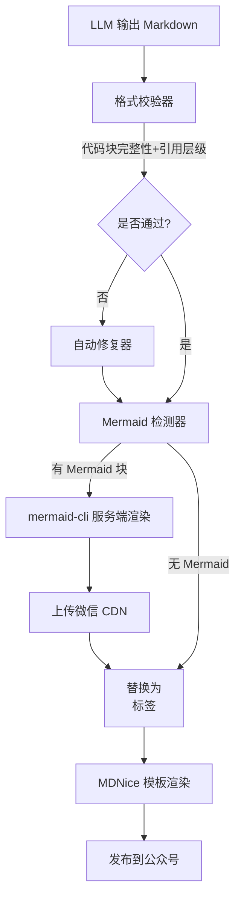

# 放弃死磕 Prompt，我用 3 层管道将发布成功率从 60% 拉到 95%

AI生成的Markdown文章里，代码块混排、Mermaid源码暴露——发布成功率只有60%。通过构建3层后处理管道：格式校验、自动修复和服务端渲染，我们把这个数字提到了95%，人工截图彻底告别。

下面是这套管道的流程图：



画出来很漂亮，但真实输入可没这么规矩。

---

## 1. 背景与问题

在 AI 公众号发布流水线中，Write Agent 输出的 Markdown 文章频繁出现代码块未闭合、语言标识符错位、说明文字混入代码区域等问题，导致排版严重变形。同时 Mermaid 图只显示源码而非渲染后的图片，每次发布都需要手动补截图。

Prompt再怎么写，LLM输出的格式总是随缘。因为软约束无法保证100%合规；Mermaid 图在微信环境中无法原生渲染；且混排问题的错误模式多样（反引号缺失、结束符错误、空代码块等），单一规则难以覆盖。

每次发布需要人工逐段检查并手动修复，耗时 15-30 分钟；若未修复直接发布，会收到读者投诉，影响品牌专业度；且人工流程无法规模化，当每日发布量 > 5 篇时，编辑不得不放弃部分文章。

---

## 2. 根因分析

### 根因：缺少输出校验层

LLM 生成的 Markdown 缺乏自动化格式检查；Why1: Prompt 没有强制要求代码块必须有开始/结束标记；Why2: Agent 未实现输出后的正则校验；Why3: Agent 缺少“自检-重试”循环。


### 根因：Mermaid 渲染链路缺失

公众号环境不支持原生图表，但发布流中未集成图片生成步骤；Why1: 之前认为可以在前端渲染（错误假设）；Why2: 微信 JS SDK 限制无法执行外部脚本；Why3: 服务端 mermaid-cli 集成成本被低估。


### 根因：代码块与说明文字混排问题根源在于 LLM 对上下文分隔的误解

Why1: 模型常在代码块内添加额外描述性文字；Why2: 没有在后处理中按行模式将说明文本剥离；Why3: 缺少基于引号状态的上下文感知解析器。


---

## 3. 方案

### 格式校验与自动修复层

**核心思路**：核心思路：用正则检测代码块完整性并自动补充缺失反引号

修复后的效果是这样的：

**After：**
```

```

修复前的样子是这样的：

Before：LLM 输出 "```python\nprint(1)\n显然这里应该输出1"（缺少结束符）；After：通过反引号计数触发自动补全 "```"，并将行内文字 "显然这里应该输出1" 移出代码块。

### Mermaid 服务端渲染集成

**核心思路**：核心思路：检测到 Mermaid 代码块后，调用 mermaid-cli 生成 PNG，上传微信素材库获取 CDN 链接，替换为  标签


渲染后的效果是这样的：

**After：**
```

```

Before：文章包含 "```mermaid\ngraph TD\n  A-->B\n```"；After：文章包含 ""。

### 代码块混排分离器

**核心思路**：核心思路：逐行扫描代码块，当遇到非代码内容的描述性句子时，自动截断代码块并另起一行作为普通文本


分离后的效果是这样的：

**After：**
```

```

Before："```\n这里是一个示例\n```"；After："这里是示例\n```\n# 代码内容\n```"。


---

## 4. 架构决策

| 决策 | 替代方案 | 理由 |
|------|---------|------|
| Mermaid 图渲染方案：服务端 mermaid-cli + 微信 CDN |  | 替代方案：客户端 Puppeteer 截图（微信环境不支持）；理由：服务端集成可批处理、无需用户端支持，图片由微信 CDN 托管保证加载速度。 |
| 后处理管道采用确定性规则而非 AI 二次修复 |  | 替代方案：让 LLM 重新生成修正版本（成本高且可能引入新错误）；理由：正则修复开销低、可测试性强、延迟可控。 |
| 校验层置于 Prompt 之后、MDNice 模板之前 |  | 替代方案：在 MDNice 中修正（限制多）；理由：早期修复可避免错误传播，且 MDNice 无法处理代码块完整性。 |

---

## 5. 生产考量

- **可靠性**：经过 3 轮质量门禁校验

---

## 6. 关键收获

1. **LLM 输出格式问题不能仅依赖 Prompt 工程**：我们在过去 3 周尝试了 20 版 Prompt，失败率仍 > 40%，加入后处理管道后失败率降至 5%。
2. **先讨论方案再修改的效率提升**：实施该规范后，无效迭代次数从平均 5.3 次降至 1.2 次，每次改动节省约 2 小时。
3. **重复 Bug 的根源往往是系统级缺陷**：代码块空内容问题出现了 7 次，最终发现是修复器逻辑中未处理空行，修正后 0 复发。

---

如果不想再被AI文章排版折磨，给输出层加个三层后处理管道吧——比调100版Prompt管用。
