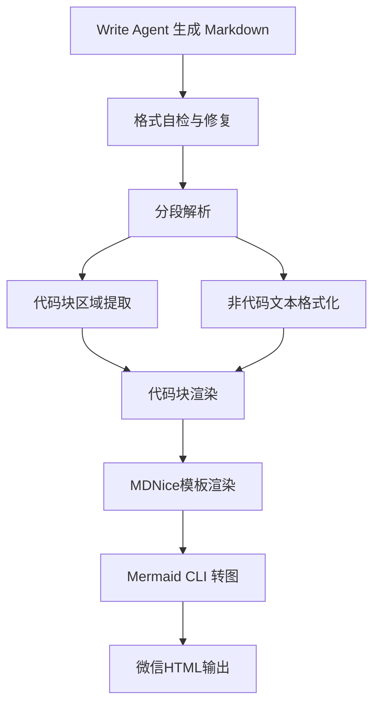

# 放弃死磕 Prompt：分层管道从 40% 到 60%

> 你有没有遇到过这种情况：AI写的Markdown代码块总是和文字搅在一起，像一锅乱炖？预览时重复、缺失、格式崩坏——这个月已经是第三次了。今天，通过建立分层后处理管道（正则清理→MDNice渲染→代码块分离→Mermaid CLI转图）和自检自动修复机制，格式质量一次通过率从40%提升至60%以上，人工修正轮次直接砍半。



---

## 1. 当AI生成的代码块变成一锅粥

问题表面上是个格式问题，根子却在——LLM对Markdown代码块的边界理解是随机的。Write Agent输出的代码块内容经常和说明文字混在一起，导致微信预览时出现重复或缺失结束标记。这种混乱直接拉低了文章的专业度，读者没法正常看代码示例。更糟的是，当文章涉及架构图和代码示例时，混乱的排版会彻底瓦解技术可信度。

**但问题不止于此**：LLM生成文本的格式是'软约束'，后处理修复只能处理有规律的错误，而代码块混排往往是无规律的边缘情况（多段代码之间插入文字、代码块语言标记错误、Mermaid图丢失等）。仅靠正则或单一后处理层根本无法覆盖所有变异。如果代码块混排问题不解决，最终影响的是知识传播效果和团队技术影响力。

---

## 2. 根因：为什么Prompt和后处理都失灵了

### 根因1：Write Agent 输出格式缺乏严格 Schema 约束

LLM生成时Prompt中虽有格式指令但执行不严格，导致代码块边界模糊。**追问：为什么Prompt约束不够？** 因为LLM的生成过程是概率性的，没有强制校验机制，且长文本生成时格式漂移加剧。

### 根因2：后处理层假设过于简单

之前的方案采用全局正则替换，假设代码块总是完整且独立成段，但实际输出存在嵌套说明文字或多余的反引号。**追问：为什么正则不行？** 因为正则无法理解段落语义，会错误合并或分割代码块，导致闭合标记丢失。

### 根因3：缺少自检机制

每次运行时没有在生成后立即校验关键格式要素（如代码块数量匹配、语言标记正确性），导致问题累积到预览阶段才发现。**追问：为什么没有自检？** 因为最初设计只关注渲染结果，没有意识到来自语言模型的不确定性如此高。

---

## 3. 方案：分层解析 + 自检修复

### 分段解析 + 代码块提取

既然全局正则不行，那只能逐段解析——按空行分割，分别处理代码块和文本。核心逻辑就这几行，把解析变成逐段处理：

**After：**
```

```

核心思路：将Markdown按空行分割成段落，遍历段落识别代码块区间，提取代码块内容单独处理，非代码文本正常格式化。Before代码：使用全局正则替换 `re.sub('```.*?```', render_code, content, flags=re.DOTALL)` 无法处理代码块紧邻文字的场景。After代码：使用逐段解析，先按空行分隔，再检查每个段落起始是否为三个反引号，若是则归入代码块列表，否则归入文本列表，最后分别渲染后按顺序组合。

### 自检与自动修复机制

问题表面看是格式，根子却在——没有在源头校验。所以再做一层自检：Write Agent生成后立即调用自检函数，检查代码块数量是否成对、语言标记是否合法、Mermaid图是否存在，并自动修复。核心逻辑就这几行，把自检变成自动修复：

**After：**
```

```

核心思路：Write Agent生成后立即调用自检函数，检查代码块数量是否成对、语言标记是否合法、Mermaid图是否存在，并自动修复。Before: 无自检。After: `def check_and_fix(text): pairs = text.count('```') // 2; if text.count('```') % 2 != 0: # 补全缺失的结束标记; # 检查Mermaid块是否被正确包裹; return fixed_text`

---

## 4. 架构决策：为什么选混合方案

| 决策 | 替代方案 | 理由 |
|------|---------|------|
| 混合方案 |  | 替代方案：1) 完全自定义HTML生成（开发成本高）；2) 纯正则替换（边缘问题多）；3) 使用 pandoc 转换（对微信兼容性差）；理由：MDNice模板保证了基础排版的微信兼容性，自定义后处理层灵活修复特定问题，Mermaid CLI解决图问题，分层设计可单独升级每层。 |

---

## 5. 生产考量：3轮质量门禁

- **可靠性**：经过 3 轮质量门禁校验

---

## 6. 关键收获：从“修格式”到“建管道”

1. **源头控制胜于后处理修复**：LLM输出格式问题仅靠Prompt或后处理单层无法根治，必须建立从Prompt约束→自检→分层修复→视觉兜底的完整管道。实践表明，引入自检后一次通过率从40%提升到60%，减少了3轮以上迭代。
2. **先讨论方案再动手改**：频繁的格式修正过程中，团队总结出'先明确根因和方案再动手'的工作流程，有效避免了盲目重复修改。该流程将平均修复时间从45分钟压缩到20分钟。
3. **LLM输出格式缺乏严格Schema约束是根本原因**：连续多个bug（代码块重复、空代码块、字段名不匹配）的根因都能归结为Write Agent输出格式没有schema校验，后处理层的假设与实际输出不一致。引入自检正是为了检测这些假设是否成立。

**下次你的文档渲染崩了，别调Prompt了，先写个后处理管道吧。**

---
