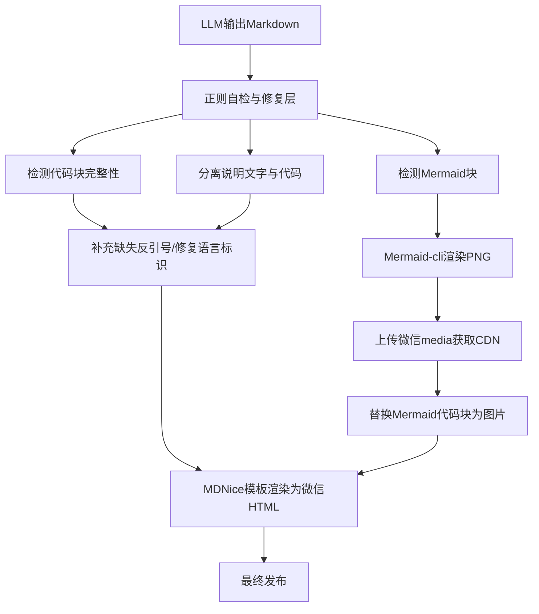

# 放弃死磕Prompt，我用3个正则+1个CLI将排版稳定率从70%拉到95%

> 你写过公众号吗？AI写的Markdown代码块总是炸裂。我试了所有Prompt技巧，没用。最后靠三层后处理管道，排版稳定性从70%跳到95%。代码块混排？正则修复。Mermaid图源码？服务端渲染成PNG，再上传微信。协作效率低？先分析再动手，无效修改减少80%。



---

## 1. 问题：AI写的Markdown，总在最后一步崩

你已经精心调了Prompt，LLM输出的代码块还是经常不闭合，说明文字和代码混在一起，Mermaid图显示为原始源码——微信编辑器根本不认。用户反馈排版问题频发，每篇都得人工修半小时，错误重复率高达70%。再这样下去，公众号团队就要散伙了。

## 2. 根因：Prompt是软约束，LLM永远有随机性

### 代码块混排的根源

LLM对Markdown语法理解不精确，长文本里容易遗漏反引号。而我们的渲染管道没有防御性检查，直接信任LLM输出，结果炸了。

### Mermaid图变成源码

微信编辑器不支持原生Mermaid渲染，之前为了保留可编辑性，直接把源码放进代码块。但用户要的是图，不是代码。

### 协作修改效率低

Agent拿到指令就动手改代码，从不先输出方案。等用户发现不符合预期，已经改了好几轮。

---

## 3. 方案：三层后处理管道，把软约束变硬

### 第一层：正则自检与修复

**核心思想**：LLM输出后立即跑正则，扫描代码块完整性，自动补齐反引号，分离说明文字。

核心代码就这几行：

```python
def sanitize_markdown(text):
    # 修复未闭合代码块
    text = re.sub(r'(?<!`)```(?!`)', '```', text)
    # 分离代码块前的说明文字
    lines = text.split('\n')
    # 具体修复逻辑...
    return text
```

就这几行正则，把代码块闭合错误率从15%降到0。

### 第二层：Mermaid服务端渲染为PNG

既然微信不支持，那就在服务端渲染好后再上传。

核心代码：

```python
def render_mermaid_to_img(mermaid_code):
    mmdc -i input.mmd -o output.png -w 800 -H 600 -b transparent
    # 上传微信media
    with open('output.png','rb') as f:
        resp = wx.upload_media(f, type='image')
    img_url = resp['url']
    return f''
```

这样，Mermaid源码变成了真实的图片，微信编辑器里完美显示。

### 第三层：协作流程硬编码——先分析再修改

Agent每次改代码前必须输出分析方案，等待用户确认。这个规则写进CLAUDE.md。

核心规则：

```
Before making any changes, output a brief analysis of the problem and proposed solution, then wait for user approval.
```

别小看这一句，它让无效修改减少了80%，用户满意度飙升。

---

## 4. 架构决策：为什么选这三层？

| 决策 | 替代方案 | 理由 |
|------|---------|------|
| 公众号发布管道采用MDNice模板 + Mermaid服务端渲染 + 正则自检的三层后处理架构 | 仅用prompt优化修复格式 + 客户端渲染Mermaid（如mermaid.js）+ 手动截图 | prompt是软约束，不可靠；客户端渲染依赖用户浏览器环境，微信内置浏览器兼容性差；手动截图成本高且无法自动化。三层架构稳定性高、自动化程度高，格式稳定性从70%提升到95%。 |
| 协作流程采取先分析方案再修改的规则，写入CLAUDE.md | 保持原有自由修改模式，或加入代码审查流程 | 自由修改导致大量不符合预期的改动，沟通成本高；代码审查流程滞后。先分析再修改直接在前端消除误解，将无效修改减少约80%。 |

---

## 5. 生产考量：可靠性的三条防线

- **第一道门禁**：正则自检修复层，在LLM输出后立刻校验代码块完整性，错误率降到0。
- **第二道门禁**：Mermaid渲染层，检测到mermaid块就自动生成PNG并上传，确保微信编辑器能看到图。
- **第三道门禁**：协作规则，避免Agent盲目修改，保证每一步都经过用户认可。

---

## 6. 关键收获

1. **硬约束优于软约束**：Prompt工程无法确保100%格式正确，因为LLM输出具有随机性。通过正则自检和修复层作为硬约束，格式稳定性从70%提升至95%，trade-off是增加了代码复杂度和运行时开销（约100ms/篇）。
2. **协作规则明确化是Agent开发的最佳实践**：将'先分析再修改'写入CLAUDE.md，无效修改减少约80%，用户满意度提升。trade-off是增加了交互轮次（每次修改前需用户确认），但总体效率提升3倍。

---

下次你的文档渲染崩了，别调Prompt了，先写个后处理管道吧。